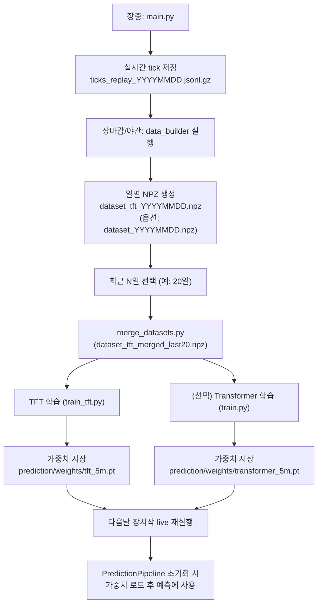

# 매일 틱데이터 저장 → 일별 NPZ 생성 → 최근 N일 merge → 재학습 → 가중치(.pt) 갱신 → 성능평가 런북

> 대상 프로젝트: `c:\Project\Transformer`
>
> 목표:
> - 매일 `main.py`로 **선물 + 옵션 틱 로그**(`ticks_replay_YYYYMMDD.jsonl.gz`)를 저장
> - 저장된 로그로 **일별 학습 데이터셋**(`dataset_tft_YYYYMMDD.npz`, `dataset_YYYYMMDD.npz`) 생성
> - 최근 N일(예: 20거래일) 데이터를 merge하여 **매일 재학습**
> - 학습된 가중치(`prediction/weights/transformer_5m.pt`, `prediction/weights/tft_5m.pt`)로 다음날 예측에 사용
> - 성능을 매일 평가하고 추세를 관리

---

## 0) 준비물 / 전제

- `config.json`에 eBest 키가 설정되어 있어야 합니다.
- 옵션 포함 저장을 하려면 `config.json`의 `options_subscription` 설정이 유효해야 합니다.
  - OTM 구독은 `t2301` open map 기준으로 동적으로 결정되며, open map 수신 실패 시 OTM=0으로 축소됩니다.
- 학습에는 `torch` 설치가 필요합니다.
- 아래 파일들이 존재해야 합니다.
  - `prediction/data_builder.py` (NPZ 생성)
  - `train.py` (Transformer 학습)
  - `train_tft.py` (TFT 학습)
  - `merge_datasets.py` (최근 N일 NPZ merge)

참고 문서:
- 학습(오프라인) 함수/클래스 레퍼런스: `docs/training/README.md`
- 런타임(실시간) 함수/클래스 레퍼런스: `docs/runtime/README.md`

테스트(권장):
- 전체 pytest: `python -m pytest -q`
- 전체 스모크(우산) 테스트: `python -m pytest -q tests/test_smoke.py`

---

## 1) 매일 저장되는 파일들(역할 구분)

### 1.1 원본 리플레이 로그(JSONL)
- 파일명 예시: `ticks_replay_20260217.jsonl.gz`
- 생성 주체: `main.py --mode live` 실행 중 `ebest_live.py`가 파일을 열고, `ebest_callbacks.py`가 JSONL로 틱을 기록
- 용도:
  - 나중에 `prediction.data_builder`로 학습용 NPZ를 만들기 위한 원본
  - 원본이므로 파일이 큼(옵션 포함 시 특히 큼)

참고:
- JSONL에는 `FC0/OC0/FH0/OH0` 외에 `JIF`(실시간 장운영 정보)도 기록될 수 있습니다.
- `JIF`는 모니터링 목적이며, 현행 데이터셋/피처 생성에는 사용하지 않습니다.

### 1.2 일별 학습 데이터셋(NPZ)
- Transformer용: `dataset_YYYYMMDD.npz`  (키: `X`, `y`)
- TFT용: `dataset_tft_YYYYMMDD.npz` (키: `X`, `y`, `past_known`, `future_known`)
- 생성 주체: `python -m prediction.data_builder ...`
- 용도:
  - 학습 스크립트가 직접 입력으로 사용
  - 원본 JSONL보다 훨씬 작고, 학습에 바로 사용 가능

### 1.3 학습된 가중치(PT)
- Transformer: `prediction/weights/transformer_5m.pt`
- TFT: `prediction/weights/tft_5m.pt`
- 생성 주체:
  - `train.py` / `train_tft.py` 학습 중 `val_acc`가 개선될 때 best checkpoint로 저장
- 용도:
  - 다음날(또는 다음 실행) `main.py`가 `PredictionPipeline` 초기화 시 로드해서 예측에 사용

---

## 2) Day 1(최초 1일)부터 시작하는 전체 루틴 개요

- Day 1:
  - live 실행으로 원본 로그 확보
  - 당일 로그로 일별 NPZ 생성
  - (선택) Day 1 데이터로 1차 학습(베이스라인)
- Day 2 ~ Day 19:
  - 매일 동일하게 로그 저장 → 일별 NPZ 생성
  - 최근 N일 merge(가능하면 최소 5일 이상부터 의미가 생김)
  - 매일 재학습하여 `.pt` 갱신
  - 성능평가(온라인/오프라인) 누적 관리
- Day 20 이후:
  - 최근 20일을 고정 윈도우로 유지하며 rolling 재학습

※ 예외(월물 롤오버): **만기 이후 첫 거래일(관측 기준)** 부터는 이전 20일 윈도우를 무효화하고,
해당 거래일 이후 누적된 데이터로 새 학습 루틴을 시작합니다.

### 2.1 학습 실행흐름(요약) — Mermaid



---

## 3) 매일 장중: 틱 로그 축적(저장)

### 3.1 실행 커맨드 (옵션 포함 저장)

프로젝트 루트에서 날짜별 파일명으로 저장:

```bash
python main.py --include-options --out-ticks ticks_replay_YYYYMMDD.jsonl
```

참고:
- 기본 설정(`--compress-ticks`=True)에서는 tick 파일이 `*.jsonl.gz`로 스트리밍 압축 저장됩니다.
- `prediction.data_builder`는 `.jsonl.gz`를 압축 해제 없이 입력으로 받을 수 있습니다.
- 원본 `.jsonl`로 저장하려면 `--no-compress-ticks`를 사용하세요.

- `--include-options`: 옵션 OC0/OH0까지 포함하여 저장
- `--out-ticks`: 저장 파일명을 고정(하루 단위 로테이션)

### 3.2 저장이 정상인지 확인(로그 체크)

정상 동작 시 로그에서 다음이 보입니다.

- 저장 시작:
  - `[TICKS] saving to: ticks_replay_YYYYMMDD.jsonl`
- 첫 틱 수신:
  - `[DBG][RT] first FC0 tick ...`
  - `[DBG][RT] first FH0 tick ...`
  - 옵션 포함 시:
    - `[DBG][RT] first OC0 tick ...`
    - `[DBG][RT] first OH0 tick ...`

### 3.3 (권장) 원본 JSONL 용량 절감을 위한 압축 보관

옵션까지 포함하면 `ticks_replay_*.jsonl` 파일이 매우 커질 수 있습니다. 운영상 압축 보관을 권장합니다.

현재 `main.py`는 **기본값으로 tick 파일을 `.jsonl.gz`로 스트리밍 압축 저장**합니다.

- 기본 동작: `.jsonl` → `.jsonl.gz`
- 비활성화(원본 `.jsonl` 저장): `--no-compress-ticks`

Windows 기본 PowerShell 기준 파일명 예시:

```powershell
$d=(Get-Date).ToString('yyyyMMdd')
$ticks=('ticks_replay_'+$d+'.jsonl.gz')
Write-Host $ticks
```

---

## 4) 매일 장 마감 후: 일별 NPZ 생성

원본 로그(`ticks_replay_YYYYMMDD.jsonl.gz`)를 학습 가능한 NPZ로 변환합니다.

### 4.1 TFT용 일별 NPZ 생성(추천)

```bash
python -m prediction.data_builder \
  --config config.json \
  --files ticks_replay_YYYYMMDD.jsonl.gz \
  --out dataset_tft_YYYYMMDD.npz \
  --seq-len 60 --horizon 5 --tft --tft-horizon-sec 300
```

생성 결과(개념):
- `X`: (N, 60, feature_dim)
- `past_known`: (N, 60, 11)
- `future_known`: (N, 300, 11)
- `y`: (N,)

> 참고: `config.json`의 `adaptive_indicator.enabled=true`이면 `feature_dim`은 47(OB+CD+OPT+ADAPT)로 확장됩니다.

> 참고: `config.json`의 `prediction.option_feature_set`이 `v2`이면 OPT 블록 차원이 확장되어 `feature_dim`이 추가로 증가합니다.
> (`v2`로 전환 시에는 dataset 재생성 + 재학습이 필요합니다.)

### 4.2 Transformer용 일별 NPZ 생성(옵션)

```bash
python -m prediction.data_builder \
  --config config.json \
  --files ticks_replay_YYYYMMDD.jsonl.gz \
  --out dataset_YYYYMMDD.npz \
  --seq-len 60 --horizon 5
```

---

## 5) 최근 20일치 merge (매일 재학습을 위한 입력 만들기)

Day가 쌓일수록 일별 NPZ가 많아집니다. 매일 최신 20일을 묶어 학습 입력으로 사용합니다.

### 5.1 TFT merge

```bash
python merge_datasets.py --tft \
  --pattern dataset_tft_*.npz \
  --last 20 \
  --out dataset_tft_merged_last20.npz
```

### 5.2 Transformer merge

```bash
python merge_datasets.py \
  --pattern dataset_*.npz \
  --last 20 \
  --out dataset_merged_last20.npz
```

> 참고: `merge_datasets.py`는 파일명에서 `YYYYMMDD`(8자리)를 찾아 날짜순으로 정렬한 뒤 최근 N개를 선택합니다.

---

## 6) 매일 재학습 (PT 파일 갱신)

### 6.1 TFT 재학습

```bash
python train_tft.py \
  --config config.json \
  --data dataset_tft_merged_last20.npz \
  --out prediction/weights/tft_5m.pt \
  --epochs 80 --batch-size 128 --lr 5e-4
```

### 6.2 Transformer 재학습

```bash
python train.py \
  --config config.json \
  --data dataset_merged_last20.npz \
  --out prediction/weights/transformer_5m.pt \
  --epochs 50 --batch-size 256 --lr 1e-3
```

### 6.3 언제 `.pt`가 실제로 생성/갱신되나?

- `train.py`, `train_tft.py`는 epoch마다 저장하지 않습니다.
- `val_acc`가 **이전 최고(best)** 보다 좋아졌을 때만 `model.save(--out)`을 호출합니다.
- 따라서 학습이 진행되어도 `val_acc`가 전혀 개선되지 않으면 `.pt`가 갱신되지 않을 수 있습니다.

---

## 7) 다음날 `.pt`가 `main.py`에서 사용되는 위치

- `main.py` → `PredictionPipeline(...)` 생성
- `prediction/pipeline.py`에서 `create_numeric_predictor(...)` 호출
- 선택한 predictor에 따라 가중치를 로드:
  - Transformer:
    - `prediction/predictor.py` → `TransformerPredictor` → `PriceTransformer.load()`
  - TFT:
    - `prediction/predictor.py` → `TFTPredictor` → `TemporalFusionTransformer.load()`
  - Ensemble:
    - 내부적으로 위 두 모델을 둘 다 로드하고 결과를 결합

즉, 전날에 생성된 `.pt`가 **다음날 live 실행 시작 시점에 로드되어** 예측에 사용됩니다.

---

## 8) 성능평가 방법 (온라인 평가: live 실행 중 자동 누적)

이 프로젝트의 live 루프(`ebest_live.py`)에는 간단한 온라인 평가가 내장돼 있습니다.

### 8.1 평가 방식(개념)

- 매 예측 시점에
  - `base_timestamp` / `base_price`를 기록하고
  - `target_timestamp = base_timestamp + prediction_minutes`를 계산
- 시간이 지나 minute bar가 target 시각을 넘으면
  - 실제 가격(`actual_price`)을 구하고
  - 예측 결과와 비교하여
    - 방향성 hit (BUY면 상승, SELL이면 하락)를 누적 집계

### 8.2 live 실행 중 result에 붙는 평가 지표

`ebest_live.py`의 `_append_eval_metrics()`가 result dict에 다음을 추가합니다.

- `eval_dir_hits`: 방향성 적중 횟수
- `eval_dir_total`: 방향성 평가 가능한 전체 횟수
- `eval_dir_rate`: 적중률(%)
- (가격 기반 예측이 있는 경우) `eval_mae`: 평균 절대 오차

> 참고: 현재 파이프라인은 주로 방향성(`signal`) 중심이므로, 실전에서는 `eval_dir_rate`가 핵심 지표입니다.

### 8.3 성능평가 운영 팁

- **최소 표본 수 확보**: `eval_dir_total`이 너무 작으면(예: <50) 변동이 커서 판단이 어렵습니다.
- **모델 교체 후 안정화 시간**: 새 `.pt`로 교체한 첫 날은 분포가 달라질 수 있으니 최소 하루 이상 관찰 권장
- **disagreement_hold 비율도 같이 보기**:
  - 앙상블에서 HOLD가 너무 많아지면 hit-rate가 좋아 보여도 실전 신호가 줄어듭니다.

---

## 9) 20일 동안의 “하루 루틴” 예시 (Day 1 → Day 20)

아래는 가장 단순한 운영 시나리오입니다.

### Day 1
1. live 저장
   - `python main.py --mode live --include-options --out-ticks ticks_replay_D1.jsonl`
2. 일별 NPZ 생성
   - `dataset_tft_D1.npz` 생성
3. (선택) Day1만으로 1차 학습
   - merge는 의미가 작으므로 생략 가능

### Day 2 ~ Day 4
- 매일 D2, D3, D4를 동일하게 수행
- 이 구간은 데이터가 아직 작아 학습 성능이 불안정할 수 있음

### Day 5 ~ Day 19
매일 다음 루틴 수행:
1. 당일 로그 저장(`ticks_replay_Dn.jsonl`)
2. 당일 TFT NPZ 생성(`dataset_tft_Dn.npz`)
3. 최근 N일 merge (N은 최대 20, 데이터가 부족한 초기에는 자동으로 available한 만큼만)

```bash
# 만기 이후 첫 거래일(관측 기준)에는 merge_datasets.py가 자동으로 학습 윈도우를 리셋합니다.
# - marker 파일(.rollover_start_YYYYMM.txt)에 리셋 시작일(YYYYMMDD)을 기록 (월물 사이클별 분리)
# - marker가 존재하면 그 날짜 이후의 dataset만 merge
python merge_datasets.py --tft --pattern "dataset_tft_*.npz" --last 20 --out dataset_tft_merged_last20.npz
```
4. TFT 재학습
   - `python train_tft.py --data dataset_tft_merged_last20.npz --out prediction/weights/tft_5m.pt ...`
5. 다음날 live에서 새 가중치가 로드되는지 확인
   - `[TFTPredictor] TFT weights loaded:` 같은 로드 로그 확인

### Day 20
- 최근 20일 window가 완성
- 이후부터는 **rolling 20일**로 유지 (D1이 window에서 빠지고 D21이 들어오는 방식)

---

## 10) 추천 파일 네이밍 규칙(실무용)

- 원본 로그:
  - `ticks_replay_YYYYMMDD.jsonl`
- 일별 TFT NPZ:
  - `dataset_tft_YYYYMMDD.npz`
- merge 결과:
  - `dataset_tft_merged_last20.npz`
- 가중치:
  - `prediction/weights/tft_5m.pt`

---

## 11) 자주 막히는 문제

### 11.1 `.pt`가 안 생김
- `torch` 미설치 / CUDA 이슈
- `dataset` 샘플 수(N)가 너무 적음
- `val_acc`가 best를 한 번도 갱신하지 못함

### 11.2 TFT 성능이 50% 근처에서 멈춤
- `past_known`/`future_known`가 전부 0이 되는 경우(타임스탬프 생성/기록 문제)
- 장세 다양성 부족(하루치/며칠치로는 편향이 심함)

### 11.3 옵션 포함 로그 파일이 너무 커짐
- 정상입니다(옵션 심볼이 많으면 급증)
- 운영상:
  - 일별 종료 후 압축 보관 권장

---

## 12) 다음 확장(선택)

- Windows 작업 스케줄러로:
  - 장 시작에 `main.py --mode live ...` 실행
  - 장 마감 후 `data_builder → merge → train` 배치 실행
- 성능 리포트 자동 생성:
  - 매일 `eval_dir_rate`를 파일로 남기고 20일 이동 평균을 표시

### 12.1 Windows 작업 스케줄러 구성 예시 (장 시작/장 마감 자동화)

아래 예시는 **프로젝트 루트(`c:\Project\Transformer`)에 모든 파일이 있고**, 매일 날짜별로 저장/학습을 돌리는 운영을 기준으로 합니다.

#### A) 작업 1: 장 시작(또는 장중) — 틱 로그 저장 시작

- **작업 이름(예시)**
  - `KOSPI200 Live Tick Logger`
- **트리거(예시)**
  - 매일 08:45 시작
- **동작(Action)**
  - 프로그램/스크립트: `powershell.exe`
  - 인수(Arguments):

```powershell
-NoProfile -ExecutionPolicy Bypass -Command "
  $d=(Get-Date).ToString('yyyyMMdd');
  $ticks=('ticks_replay_'+$d+'.jsonl');
  $log=('live_log_'+$d+'.txt');

  '=== LIVE START ===' | Out-File -FilePath $log -Encoding utf8;
  ('date='+ (Get-Date).ToString('s')) | Out-File -FilePath $log -Encoding utf8 -Append;
  ('out_ticks='+$ticks) | Out-File -FilePath $log -Encoding utf8 -Append;

  (& python main.py --mode live --include-options --out-ticks $ticks --duration-sec 25200) 2>&1 | Out-File -FilePath $log -Encoding utf8 -Append;
  if ($LASTEXITCODE -ne 0) { ('live failed exitcode='+$LASTEXITCODE) | Out-File -FilePath $log -Encoding utf8 -Append; exit $LASTEXITCODE }

  '=== LIVE END ===' | Out-File -FilePath $log -Encoding utf8 -Append;
"
```

- **시작 위치(Start in)**
  - `c:\Project\Transformer`

설명:
- `--duration-sec 25200`은 08:45~15:45(7시간) 기준입니다.
- `--out-ticks ticks_replay_YYYYMMDD.jsonl` 형태로 **날짜별 파일 로테이션**이 됩니다.
- `main.py`는 기본값으로 tick 로그를 `.jsonl.gz`로 스트리밍 압축 저장합니다.
  - 원본 `.jsonl`로 저장하려면 `--no-compress-ticks`를 추가하세요.

#### B) 작업 2: 장 마감 후(또는 야간) — 일별 NPZ 생성 → 최근 20일 merge → 재학습

- **작업 이름(예시)**
  - `KOSPI200 Daily Train TFT`
- **트리거(예시)**
  - 매일 16:30 실행 (장 마감 후)
- **동작(Action)**
  - 프로그램/스크립트: `powershell.exe`
  - 인수(Arguments):

```powershell
-NoProfile -ExecutionPolicy Bypass -Command "
  $d=(Get-Date).ToString('yyyyMMdd');
  $ticks=('ticks_replay_'+$d+'.jsonl');
  $zip=($ticks+'.zip');
  $npz=('dataset_tft_'+$d+'.npz');
  $log=('train_log_'+$d+'.txt');

  # zip에서 임시로 풀어 쓰는 경로 (필요할 때만 사용)
  $tmpDir=(Join-Path $env:TEMP ('ticks_tmp_'+$d));
  $ticksIn=$ticks;

  '=== DAILY TRAIN START ===' | Out-File -FilePath $log -Encoding utf8;
  ('date='+ (Get-Date).ToString('s')) | Out-File -FilePath $log -Encoding utf8 -Append;
  ('ticks='+$ticks) | Out-File -FilePath $log -Encoding utf8 -Append;

  # 1) 입력 ticks 파일 결정: jsonl이 없으면 zip을 풀어서 사용
  if (!(Test-Path $ticks)) {
    if (Test-Path $zip) {
      ('jsonl missing; extracting zip: '+$zip) | Out-File -FilePath $log -Encoding utf8 -Append;
      if (Test-Path $tmpDir) { Remove-Item -Recurse -Force $tmpDir }
      New-Item -ItemType Directory -Path $tmpDir | Out-Null;
      Expand-Archive -Path $zip -DestinationPath $tmpDir -Force;
      $ticksIn=(Join-Path $tmpDir $ticks);
      if (!(Test-Path $ticksIn)) { ('extracted file missing: '+$ticksIn) | Out-File -FilePath $log -Encoding utf8 -Append; exit 1 }
    } else {
      ('missing tick file: '+$ticks+' (and no zip)') | Out-File -FilePath $log -Encoding utf8 -Append; exit 1
    }
  }

  # 2) (선택) jsonl이 남아있으면 학습 이후 압축 보관
  $shouldCompress = (Test-Path $ticks);

  (& python -m prediction.data_builder --files $ticksIn --out $npz --seq-len 60 --horizon 5 --tft --tft-horizon-sec 300) 2>&1 | Out-File -FilePath $log -Encoding utf8 -Append;
  if ($LASTEXITCODE -ne 0) { ('data_builder failed exitcode='+$LASTEXITCODE) | Out-File -FilePath $log -Encoding utf8 -Append; exit $LASTEXITCODE }

  (& python merge_datasets.py --tft --pattern 'dataset_tft_*.npz' --last 20 --out 'dataset_tft_merged_last20.npz') 2>&1 | Out-File -FilePath $log -Encoding utf8 -Append;
  if ($LASTEXITCODE -ne 0) { ('merge failed exitcode='+$LASTEXITCODE) | Out-File -FilePath $log -Encoding utf8 -Append; exit $LASTEXITCODE }

  (& python train_tft.py --data 'dataset_tft_merged_last20.npz' --out 'prediction/weights/tft_5m.pt' --epochs 80 --batch-size 128 --lr 5e-4) 2>&1 | Out-File -FilePath $log -Encoding utf8 -Append;
  if ($LASTEXITCODE -ne 0) { ('train_tft failed exitcode='+$LASTEXITCODE) | Out-File -FilePath $log -Encoding utf8 -Append; exit $LASTEXITCODE }

  # 3) 임시 압축해제 파일 정리
  if (Test-Path $tmpDir) { Remove-Item -Recurse -Force $tmpDir }

  # 4) 원본 jsonl을 zip으로 압축 보관 (이미 zip이 있으면 갱신)
  if ($shouldCompress) {
    ('compressing ticks to zip: '+$zip) | Out-File -FilePath $log -Encoding utf8 -Append;
    Compress-Archive -Path $ticks -DestinationPath $zip -Force;
    Remove-Item -Force $ticks;
  }

  '=== DAILY TRAIN SUCCESS ===' | Out-File -FilePath $log -Encoding utf8 -Append;
"
```

- **시작 위치(Start in)**
  - `c:\Project\Transformer`

설명:
- 당일 JSONL이 존재할 때만 학습을 진행하도록 `Test-Path`로 방어합니다.
- merge는 파일명에 포함된 `YYYYMMDD`를 기준으로 최근 20개를 선택합니다.
- 학습이 끝나면 다음날 `main.py` 실행 시 `tft_5m.pt`가 로드됩니다.

#### C) (선택) 작업 3: Transformer도 같이 학습

TFT와 별개로 Transformer도 rolling 20일로 재학습하고 싶으면 장 마감 후 스텝에 아래를 추가합니다.

```powershell
python -m prediction.data_builder --files $ticks --out ('dataset_'+$d+'.npz') --seq-len 60 --horizon 5;
python merge_datasets.py --pattern 'dataset_*.npz' --last 20 --out 'dataset_merged_last20.npz';
python train.py --data 'dataset_merged_last20.npz' --out 'prediction/weights/transformer_5m.pt' --epochs 50 --batch-size 256 --lr 1e-3;
```

#### D) 작업 스케줄러 설정 팁(중요)

- **[권한]**
  - "사용자가 로그온되어 있지 않아도 실행" 체크(서버/항상 실행 환경이면)
  - 필요 시 "가장 높은 수준의 권한으로 실행"
- **[실행 조건]**
  - "전원 사용"(노트북이면 배터리/절전 조건 확인)
- **[중복 실행]**
  - 장중 작업이 아직 실행 중인데 다음 트리거가 걸리면 "새 인스턴스 실행 안 함" 권장
- **[로그]**
  - 작업 스케줄러 자체의 히스토리 + 프로젝트 로그 파일(또는 콘솔 출력)을 함께 확인

#### E) (추가) 작업 3: 야간 리스타트/정리 작업 — 새 모델 반영 보장

원칙적으로 이 프로젝트는 **`main.py --mode live` 프로세스 시작 시점에 가중치(`*.pt`)를 로드**합니다.

- 장중 작업(작업 1)이 `--duration-sec 25200`으로 **15:45에 정상 종료**된다면:
  - 다음날 08:45에 작업 1이 새로 시작하면서 **자동으로 최신 `.pt`를 로드**하므로, 별도 재시작 작업이 꼭 필요하진 않습니다.
- 다만 아래 상황을 대비해 야간 정리 작업을 추가하는 것을 권장합니다.
  - 장중 작업이 비정상 종료/정지하지 않고 **프로세스가 남아있는 경우**
  - 추후 `--duration-sec` 없이 상시 실행 형태로 바꿀 경우

**작업 이름(예시)**
- `KOSPI200 Nightly Cleanup`

**트리거(예시)**
- 매일 02:00 실행

**동작(Action)**
- 프로그램/스크립트: `powershell.exe`
- 인수(Arguments):

```powershell
-NoProfile -ExecutionPolicy Bypass -Command "
  $d=(Get-Date).ToString('yyyyMMdd');
  $log=('restart_log_'+$d+'.txt');
  '=== NIGHTLY CLEANUP START ===' | Out-File -FilePath $log -Encoding utf8;
  ('date='+ (Get-Date).ToString('s')) | Out-File -FilePath $log -Encoding utf8 -Append;

  # main.py --mode live 프로세스만 선별 종료 (오탐 방지를 위해 CommandLine 필터)
  $procs = Get-CimInstance Win32_Process | Where-Object {
    ($_.Name -match 'python') -and ($_.CommandLine -match 'main\.py') -and ($_.CommandLine -match '--mode\s+live')
  }

  if ($procs -and $procs.Count -gt 0) {
    ('found live processes: ' + $procs.Count) | Out-File -FilePath $log -Encoding utf8 -Append;
    foreach ($p in $procs) {
      ('killing pid=' + $p.ProcessId + ' cmd=' + $p.CommandLine) | Out-File -FilePath $log -Encoding utf8 -Append;
      Stop-Process -Id $p.ProcessId -Force -ErrorAction SilentlyContinue;
    }
  } else {
    'no live processes found' | Out-File -FilePath $log -Encoding utf8 -Append;
  }

  '=== NIGHTLY CLEANUP END ===' | Out-File -FilePath $log -Encoding utf8 -Append;
"
```

**시작 위치(Start in)**
- `c:\Project\Transformer`

설명:
- 이 작업은 **학습 후 새 모델을 반영하기 위한 사전 정리(프로세스 청소)** 목적입니다.
- 실제 “새 모델 반영”은 다음날 08:45 작업 1이 시작될 때 일어납니다(=가중치 로드 타이밍).
