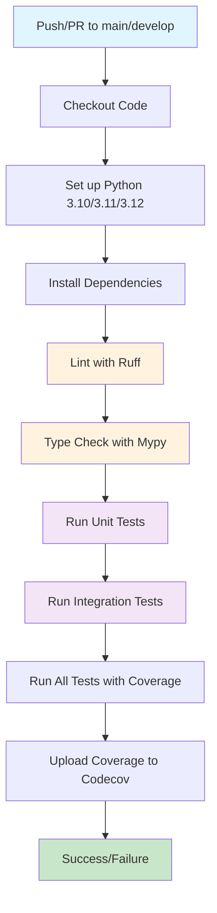
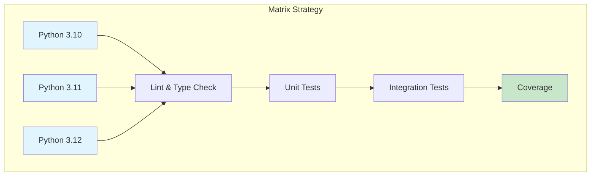
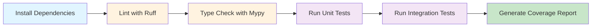

# GitHub Actions CI/CD 가이드

## 개요

SkyPredictor 프로젝트는 GitHub Actions를 사용하여 CI/CD 파이프라인을 자동화합니다. 이 가이드는 현재 구성된 워크플로우의 사용법과 커스터마이징 방법을 설명합니다.

## CI/CD 파이프라인 흐름



## 워크플로우 파일 위치

```
.github/workflows/ci.yml
```

## 현재 워크플로우 구조

### 트리거 조건

워크플로우는 다음 조건에서 자동으로 실행됩니다:

- **Push**: `main`, `develop` 브랜치에 코드 푸시 시
- **Pull Request**: `main`, `develop` 브랜치로 PR 생성 시

### 매트릭스 전략

워크플로우는 Python 여러 버전에서 테스트를 병렬로 실행합니다:



- Python 3.10
- Python 3.11
- Python 3.12

## 워크플로우 단계별 설명

### 1. 체크아웃 (Checkout)

```yaml
- uses: actions/checkout@v4
```

- 저장소 코드를 GitHub Actions 러너로 체크아웃합니다.
- `@v4`는 최신 안정 버전을 사용합니다.

### 2. Python 환경 설정

```yaml
- name: Set up Python ${{ matrix.python-version }}
  uses: actions/setup-python@v5
  with:
    python-version: ${{ matrix.python-version }}
```

- 지정된 Python 버전을 설치합니다.
- 매트릭스 전략에 따라 여러 버전이 병렬로 실행됩니다.

### 3. 의존성 설치

```yaml
- name: Install dependencies
  run: |
    python -m pip install --upgrade pip
    pip install -e ".[dev,all]"
```

- pip를 최신 버전으로 업그레이드합니다.
- 프로젝트를 편집 가능 모드(`-e`)로 설치합니다.
- 개발 및 모든 선택적 의존성을 설치합니다.

### 4. 코드 린트 (Ruff)

```yaml
- name: Lint with ruff
  run: |
    ruff check .
```

- Ruff를 사용하여 코드 스타일과 잠재적 문제를 검사합니다.
- `pyproject.toml`의 `[tool.ruff]` 설정을 따릅니다.

### 5. 타입 체크 (Mypy)

```yaml
- name: Type check with mypy
  run: |
    mypy . --ignore-missing-imports || true
```

- Mypy를 사용하여 정적 타입 검사를 수행합니다.
- `|| true`는 타입 체크 실패가 전체 파이프라인 실패를 유발하지 않도록 합니다.
- `pyproject.toml`의 `[tool.mypy]` 설정을 따릅니다.

### 6. 단위 테스트 실행

```yaml
- name: Run unit tests
  run: |
    pytest tests/ -m unit -v
```

- `@pytest.mark.unit` 마커가 있는 테스트만 실행합니다.
- `-v` 플래그로 상세 출력을 활성화합니다.

### 7. 통합 테스트 실행

```yaml
- name: Run integration tests
  run: |
    pytest tests/ -m integration -v
```

- `@pytest.mark.integration` 마커가 있는 테스트만 실행합니다.
- 단위 테스트와 분리하여 실행합니다.

### 8. 전체 테스트 및 커버리지

```yaml
- name: Run all tests with coverage
  run: |
    pytest tests/ --cov=. --cov-report=xml --cov-report=html
```

- 모든 테스트를 실행하고 커버리지를 측정합니다.
- XML과 HTML 형식으로 리포트를 생성합니다.

### 9. 커버리지 업로드 (Codecov)

```yaml
- name: Upload coverage to Codecov
  uses: codecov/codecov-action@v4
  with:
    file: ./coverage.xml
    flags: unittests
    name: codecov-umbrella
    fail_ci_if_error: false
```

- 생성된 `coverage.xml`을 Codecov에 업로드합니다.
- `fail_ci_if_error: false`로 설정하여 업로드 실패가 파이프라인 실패를 유발하지 않도록 합니다.

## 로컬에서 테스트하는 방법

### 로컬 테스트 흐름



### 1. 의존성 설치

```bash
pip install -e ".[dev,all]"
```

### 2. 린트 실행

```bash
ruff check .
```

### 3. 타입 체크 실행

```bash
mypy . --ignore-missing-imports
```

### 4. 단위 테스트 실행

```bash
pytest tests/ -m unit -v
```

### 5. 통합 테스트 실행

```bash
pytest tests/ -m integration -v
```

### 6. 전체 테스트 및 커버리지

```bash
pytest tests/ --cov=. --cov-report=html --cov-report=term
```

또는 제공된 스크립트 사용:

```bash
# Linux/Mac
bash scripts/run_coverage.sh

# Windows
scripts\run_coverage.bat
```

## 워크플로우 커스터마이징

### Python 버전 추가/제거

`.github/workflows/ci.yml`의 `matrix.python-version`을 수정:

```yaml
strategy:
  matrix:
    python-version: ['3.10', '3.11', '3.12', '3.13']  # 3.13 추가
```

### 테스트 마커 추가

`pyproject.toml`에 새로운 마커 정의:

```toml
[tool.pytest.ini_options]
markers = [
    "slow: marks tests as slow",
    "integration: marks tests as integration tests",
    "unit: marks tests as unit tests",
    "e2e: marks tests as end-to-end tests",  # 새 마커 추가
]
```

워크플로우에 새로운 테스트 단계 추가:

```yaml
- name: Run e2e tests
  run: |
    pytest tests/ -m e2e -v
```

### 의존성 그룹 변경

개발 의존성만 설치하려면:

```yaml
- name: Install dependencies
  run: |
    python -m pip install --upgrade pip
    pip install -e ".[dev]"  # dev만 설치
```

### Codecov 대신 다른 커버리지 서비스 사용

Coveralls를 사용하려면:

```yaml
- name: Upload coverage to Coveralls
  uses: coverallsapp/github-action@v2
  with:
    file: ./coverage.xml
```

## 문제 해결

### 워크플로우 실패 시 확인 사항

1. **의존성 설치 실패**
   - `pyproject.toml`의 의존성 버전 확인
   - Python 버전 호환성 확인

2. **테스트 실패**
   - 로컬에서 동일한 테스트 실행: `pytest tests/ -m unit -v`
   - 테스트 마커가 올바르게 적용되었는지 확인

3. **린트 실패**
   - 로컬에서 린트 실행: `ruff check .`
   - `pyproject.toml`의 Ruff 설정 확인

4. **타입 체크 실패**
   - 로컬에서 타입 체크 실행: `mypy . --ignore-missing-imports`
   - 타입 힌트 추가 또는 `# type: ignore` 사용

### 워크플로우 실행 시간 단축

1. **캐시 활용**

```yaml
- name: Cache pip packages
  uses: actions/cache@v4
  with:
    path: ~/.cache/pip
    key: ${{ runner.os }}-pip-${{ hashFiles('**/requirements.txt') }}
    restore-keys: |
      ${{ runner.os }}-pip-
```

2. **병렬 실행 최적화**

매트릭스 전략에서 불필요한 Python 버전 제거:

```yaml
strategy:
  matrix:
    python-version: ['3.10', '3.11']  # 3.12 제거
```

3. **테스트 병렬화**

```yaml
- name: Run tests with pytest-xdist
  run: |
    pip install pytest-xdist
    pytest tests/ -n auto
```

## 모니터링

### GitHub Actions 대시보드

1. 저장소의 **Actions** 탭으로 이동
2. 왼쪽 사이드바에서 워크플로우 선택
3. 각 실행의 상세 로그 확인

### 커버리지 리포트

1. **Codecov**: [codecov.io](https://codecov.io)에서 프로젝트 연동 후 확인
2. **로컬 HTML 리포트**: `htmlcov/index.html` 파일 브라우저에서 열기

## 보안

### 시크릿 관리

민감한 정보는 GitHub Secrets에 저장:

1. 저장소 설정 → Secrets and variables → Actions
2. New repository secret 클릭
3. 워크플로우에서 사용:

```yaml
- name: Run tests with secrets
  env:
    API_KEY: ${{ secrets.API_KEY }}
  run: |
    pytest tests/
```

### 의존성 보안 스캔

Dependabot 추가 (`.github/dependabot.yml`):

```yaml
version: 2
updates:
  - package-ecosystem: "pip"
    directory: "/"
    schedule:
      interval: "weekly"
```

## 추가 리소스

- [GitHub Actions 문서](https://docs.github.com/en/actions)
- [pytest 문서](https://docs.pytest.org/)
- [Ruff 문서](https://docs.astral.sh/ruff/)
- [Mypy 문서](https://mypy.readthedocs.io/)
- [Codecov 문서](https://docs.codecov.com/)
