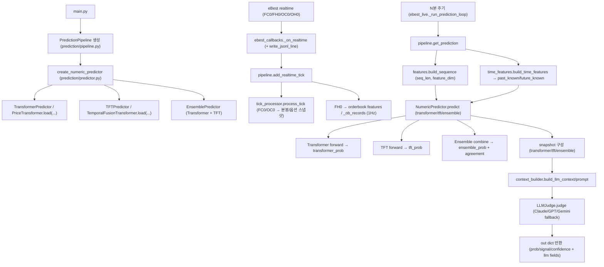

# Transformer + TFT 듀얼 모델 병행 운용 설계 가이드 (v2.3 갱신판)

> 기준 코드 버전: v2.0.0 → v2.1.0 → v2.2.0 → **v2.3.0**  
> 문서 작성일: 2026-02-15 → **갱신일: 2026-02-23**  
> v2.1 보완: 검토 결과 반영 (BUG-1~4, DEV-1~5 수정), 전체 처리 흐름 섹션 14 신규 추가  
> v2.2 보완: 매직 넘버 상수화 완료, `train_tft.py` 생성, 전체 체크리스트 검증 반영  
> **v2.3 보완: `dual_llm` 모드 반영, `basis`/`regime`/`model_outputs` 추가, `API_MAX_RETRIES` 미임포트 버그 등록, 부록 E 추가**  
> 대상: `prediction/` 패키지 전체

---

## 목차

| 섹션 | 내용 |
|------|------|
| **1** | 설계 개요 — 왜 TFT인가, 기존 Transformer와 역할 분담 |
| **2** | 아키텍처 다이어그램 — 전체 파이프라인 흐름 |
| **3** | TFT 입력 설계 — 피처 분류 체계 (past_known / past_unknown / future_known / static) |
| **4** | `TFTModel` 구현 명세 — 모듈 구조, 핵심 컴포넌트 |
| **5** | `ModelInput` 확장 — 기존 Transformer와 하위 호환 방법 |
| **6** | `predictor.py` 확장 — `TFTPredictor`, 앙상블 전략 |
| **7** | `pipeline.py` 변경 사항 — future_known 구성, 앙상블 결과 전달 |
| **8** | `data_builder.py` 확장 — TFT 학습 데이터 생성 |
| **9** | 학습 파이프라인 — 손실 함수, 시간순 분할, 체크포인트 |
| **10** | 앙상블 전략 상세 — 가중합, 신뢰도 기반 선택, disagreement 처리 |
| **11** | 운영 체크리스트 |
| **12** | 자주 발생하는 문제와 해결 방법 |
| **13** | 모델 출력 필드별 LLM 입력 사용 여부 — Transformer / TFT / 앙상블 |
| **14** | **[신규] 전체 처리 흐름 — 틱 수집 → LLM 결과 출력 단계별 상세** |
| **부록 A** | 파일 변경 요약 |
| **부록 B** | 스키마 버전 관리 |
| **부록 C** | v2.0 → v2.1 수정 사항 |
| **부록 D** | v2.1 → v2.2 수정 사항 |
| **부록 E** | **[신규] v2.2 → v2.3 수정 사항** |

---

## 1) 설계 개요

### 1.1 왜 TFT(Temporal Fusion Transformer)인가

기존 `PriceTransformer`는 `(seq_len, feature_dim)` 형태의 단일 시계열을 처리하며 **과거 데이터만** 사용합니다. 그러나 KP200 선물 예측에는 **미래에 확정적으로 알 수 있는 정보**(만기까지 남은 일수, 요일, 장 시간대 등)와 **시변(time-varying) 외생 변수**가 존재합니다. TFT는 이 두 범주를 명시적으로 구분하여 학습합니다.

`feature_dim`은 아래 설정 조합에 따라 달라집니다:

| option_feature_set | adaptive_indicator.enabled | feature_dim |
|---|---:|---:|
| `v1` | false | 19 |
| `v1` | true  | 51 |
| `v2` | false | 28 |
| `v2` | true  | 60 |

| 비교 항목 | PriceTransformer (기존) | TFT (추가) |
|-----------|------------------------|-----------|
| 입력 구조 | 단일 시계열 `(T, feature_dim)` | 4종 피처 분리 입력 |
| 미래 정보 활용 | ✗ | ✓ (future_known) |
| 피처 선택 | 없음 | Variable Selection Network |
| 해석 가능성 | 낮음 | Attention 가중치 시각화 가능 |
| 학습 데이터 요구량 | 중간 (~5,000샘플) | 높음 (~20,000샘플) |

### 1.2 두 모델의 역할 분담

```
[PriceTransformer]                  [TFT]
───────────────────────────────     ──────────────────────────────────
단기 오더북 패턴 포착                  중기 구조적 패턴 + 미래 정보 통합
입력: OB + CD + OPT (과거 60초)      입력: OB + CD + OPT + future_known
출력: P(up) — 빠르고 반응적          출력: P(up) — 완만하고 구조적
강점: 급격한 호가 변화               강점: 장 중반, 만기 주간, 요일 효과
약점: 미래 컨텍스트 없음             약점: 초기 데이터 부족, 학습 비용
```

최종 예측은 두 모델의 **앙상블 출력**을 사용합니다. LLM은 앙상블 결과와 각 모델의 개별 판단을 모두 컨텍스트로 받습니다.

---

## 2) 아키텍처 다이어그램

```
실시간 틱 스트림 (FC0 / FH0 / OC0)
           │
           ▼
  ┌─────────────────────────────────────────────────────┐
  │               PredictionPipeline                    │
  │                                                     │
  │  ┌─────────────┐   ┌───────────────────────────┐   │
  │  │tick_processor│   │  ob_records deque(60)     │   │
  │  │ (분봉 재구성) │   │  + candle_df 계산         │   │
  │  └─────────────┘   └───────────────────────────┘   │
  │         │                       │                   │
  │         ▼                       ▼                   │
  │  ┌─────────────────────────────────────────┐        │
  │  │          build_sequence()               │        │
  │  │  (seq_len, feature_dim) = OB(7)+CD(5)+OPT(7/16)+ADAPT(0/32)   │        │
  │  └──────────────┬──────────────────────────┘        │
  │                 │                                   │
  │    ┌────────────┴──────────────┐                    │
  │    │  past_known + future_known 생성                │
  │    │  past_known  : (seq_len, 11)                   │
  │    │  future_known: (tft_horizon, 11)               │
  │    │  build_time_features(dt) 로 생성               │
  │    └────────────┬──────────────┘                    │
  │                 │                                   │
  │     ┌───────────┼───────────┐                       │
  │     ▼           ▼                                   │
  │  ┌──────┐  ┌────────┐                               │
  │  │Trans-│  │  TFT   │                               │
  │  │former│  │Predictor│                              │
  │  └──┬───┘  └───┬────┘                               │
  │     │          │                                    │
  │     └────┬─────┘                                    │
  │          ▼                                          │
  │   ┌────────────────┐                               │
  │   │ EnsemblePredictor (가중합 or disagreement_hold)│
  │   └───────┬────────┘                               │
  │           │                                         │
  └───────────┼─────────────────────────────────────────┘
              │
              ▼
     ┌─────────────────┐
     │  context_builder │  (snapshot: transformer/tft/ensemble 블록)
     └────────┬─────────┘
              │
              ▼
     ┌─────────────────┐
     │    LLMJudge     │  (claude/gpt/gemini 중 가용한 provider)
     └────────┬─────────┘
              │
              ▼
         최종 출력 dict (prob, signal, llm_action, rationale, ...)
```

---

## 3) TFT 입력 설계

### 3.1 피처 분류표

| 범주 | 설명 | 현재 시스템 내 해당 피처 | shape |
|------|------|--------------------------|-------|
| **past_known** | 과거 시점에 관측되며 미래값을 사전에 아는 피처 | `dow_onehot`, `tod_sin`, `tod_cos`, `dte_scaled`, `is_expiry_week` | `(seq_len, 11)` |
| **past_unknown** | 과거에 관측되지만 미래값을 모르는 피처 | OB(7) + CD(5) + OPT(7/16) + ADAPT(0/32) — 기존 시퀀스 전체 | `(seq_len, feature_dim)` |
| **future_known** | 예측 지평(horizon) 동안 미리 알 수 있는 피처 | `dow_onehot`, `tod_sin`, `tod_cos`, `dte_scaled`, `is_expiry_week` | `(tft_horizon, 11)` |
| **static** | 시간과 무관한 고정 컨텍스트 (현재 미사용) | 예약 (심볼 ID, 만기 코드 등) | `(static_dim,)` |

> **`tft_horizon`**: `PredictionPipeline.__init__(tft_horizon=300)`으로 주입하며, `get_prediction()`의 `future_known` 생성에서 `horizon_steps = int(self._tft_horizon)`으로 사용합니다. `prediction_minutes * 60`을 직접 계산하면 10분/30분 모드에서 TFT 학습 horizon과 불일치가 발생하므로 반드시 `self._tft_horizon`을 참조해야 합니다.

### 3.2 feature_dim 상수 정의

`constants.py`에 다음 상수가 정의되어 있습니다. — **구현 완료 (v2.2)**

```python
# constants.py (현재 구현)
PAST_UNKNOWN_DIM = 47   # (참고: v1+ADAPT 조합의 기본 dim)
FUTURE_KNOWN_DIM = 11   # dte_scaled(1) + dow_onehot(7) + tod_sin(1) + tod_cos(1) + is_expiry_week(1)
STATIC_DIM       = 0    # 현재 미사용; 확장 시 변경
HORIZON_SEC      = 300  # 5분 × 60초

> 참고: 런타임/학습에서는 `option_feature_set` 및 `adaptive_indicator.enabled` 조합에 따라 실제 dim이 달라질 수 있습니다.
> dataset npz의 metadata에 `feature_dim`, `option_feature_set`, `adaptive_enabled` 등이 저장되며 학습 스크립트에서 불일치 검증을 수행합니다.
```

> **✅ v2.2 완료**: 모든 파일에서 매직 넘버를 상수 import로 교체 완료. 변경 대상:
> - `pipeline.py` — `FUTURE_KNOWN_DIM`, `HORIZON_SEC`
> - `predictor.py` — `PAST_UNKNOWN_DIM`, `FUTURE_KNOWN_DIM`, `HORIZON_SEC`
> - `tft_model.py` — `PAST_UNKNOWN_DIM`, `FUTURE_KNOWN_DIM`, `HORIZON_SEC`
> - `model.py` — `PAST_UNKNOWN_DIM`
> - `data_builder.py` — `FUTURE_KNOWN_DIM`, `HORIZON_SEC`
> - `main.py` — `HORIZON_SEC`

---

## 4) `TFTModel` 구현 명세

### 4.1 파일 위치

```
prediction/
├── model.py          ← 기존 PriceTransformer (수정 없음)
├── tft_model.py      ← 신규: TFT 구현 (현재 구현 완료)
└── ...
```

### 4.2 `tft_model.py` 핵심 구조 (현재 구현 기준)

```python
# prediction/tft_model.py

class _GatedResidualNetwork(nn.Module):
    """GRN — ELU + Gate + LayerNorm 잔차 연결."""

class _VariableSelectionNetwork(nn.Module):
    """VSN — 피처별 GRN 후 softmax 가중합으로 중요도 학습."""

class TemporalFusionTransformer(nn.Module):
    """
    입력:
      past_unknown  (B, seq_len, 16)  — OB+CD+OPT
      past_known    (B, seq_len, 11)  — 과거 시간 피처
      future_known  (B, horizon, 11)  — 미래 시간 피처
      static        None              — 현재 미사용

    처리 순서:
      1) VSN(past_unknown) + VSN(past_known)  → encoder LSTM input
      2) encoder_lstm → (enc_out, h, c)
      3) VSN(future_known) → decoder LSTM input
      4) decoder_lstm(init=(h,c)) → dec_out
      5) concat(enc_out, dec_out) → static_enrich GRN → Transformer
      6) attn[:, seq_len, :] → 분류 헤드 → P(up)

    출력:
      prob (B,) — float32, [0, 1]
    """
```

> **검증 로직**: `forward()` 진입 시 `seq_len`, `horizon` 불일치를 `ValueError`로 조기 감지합니다. `tft_horizon` 미일치 문제가 운영 중 조용히 지나가지 않도록 보장합니다.

---

## 5) `ModelInput` 확장

`prediction/predictor.py`의 `ModelInput` 데이터클래스에 TFT 전용 필드가 추가되어 있습니다. 기존 `sequence` 필드는 수정 없이 유지됩니다.

```python
# prediction/predictor.py

@dataclass
class ModelInput:
    # 기존 필드 (Transformer, 수정 없음)
    sequence:          Optional[np.ndarray] = None   # (seq_len, feature_dim)   past_unknown
    future_known:      Optional[np.ndarray] = None   # (tft_horizon, 11)
    feature_snapshot:  Dict[str, Any]       = None
    meta:              Dict[str, Any]       = None
    schema_version:    str                  = ""

    # TFT 전용 필드 (신규)
    past_known:        Optional[np.ndarray] = None   # (seq_len, 11)

    def __post_init__(self) -> None:
        if self.feature_snapshot is None:
            self.feature_snapshot = {}
        if self.meta is None:
            self.meta = {}
```

### `past_known` / `future_known` 생성 헬퍼

```python
# prediction/time_features.py — build_time_features() (현재 구현 완료)

from prediction.time_features import build_time_features

# build_time_features(dt) ->
#   [dte_scaled] + dow_onehot(7) + [tod_sin, tod_cos] + [is_expiry_week]
# (총 11차원, dte_scaled는 1.0 클램핑 포함)
```

> **⚠️ 주의 (BUG-4 수정)**: `dte_scaled`에 `min(..., 1.0)` 클램핑이 누락되면 만기 30일 초과 시 값이 1.0을 초과하여 학습-서빙 스큐(train-serve skew)가 발생합니다.

> 시간 피처 생성은 `prediction/time_features.py`로 분리되어 `pipeline.py` / `data_builder.py`가 공통으로 import합니다.

---

## 6) `predictor.py` 확장

### 6.1 `TFTPredictor` 클래스

```python
# prediction/predictor.py

class TFTPredictor:
    """TFT 기반 수치 예측기.

    ModelInput.past_known + future_known 을 사용.
    weights_path가 없거나 torch 없으면 is_available=False로 자동 비활성.
    """

    def __init__(self, weights_path=None, past_unknown_dim=16,
                 future_known_dim=11, seq_len=60, horizon=300, ...):
        # weights_path 존재 시 TemporalFusionTransformer.load() 호출
        # 실패 시 self._available = False (앙상블에서 자동 제외)
        ...

    def predict(self, *, input: ModelInput) -> TransformerPredictionResult:
        # seq, past_known, future_known 모두 None이면 HOLD 반환
        # 추론 성공 시 _classify()로 signal/confidence 결정
        ...
```

> **타입 참고**: `TFTPredictor.predict()`가 `TransformerPredictionResult`를 반환하는 것은 의미론적으로 부정확합니다. `EnsemblePredictor`가 `f_res.prob`를 float로만 사용하므로 런타임 오류는 없지만, 향후 `PredictionResult` Protocol 또는 공통 기반 타입으로 통일하는 것을 권장합니다.

### 6.2 앙상블 래퍼 — `EnsemblePredictor`

```python
@dataclass
class EnsemblePredictionResult:
    prob:             float
    signal:           str
    confidence:       str
    transformer_prob: float
    tft_prob:         Optional[float]
    ensemble_method:  str   # "weighted_avg" | "transformer_only" | "disagreement_hold"
    agreement:        bool
    feature_snapshot: Dict[str, Any]


class EnsemblePredictor:
    def __init__(self, transformer_predictor, tft_predictor,
                 transformer_weight=0.5, buy_threshold=0.62,
                 sell_threshold=0.38, disagreement_hold=True):
        ...

    def predict(self, *, input: ModelInput) -> EnsemblePredictionResult:
        t_res = self._transformer.predict(input=input)

        if self._tft.is_available:
            f_res    = self._tft.predict(input=input)
            ens_prob = w_t * t_res.prob + w_f * f_res.prob
            method   = "weighted_avg"
        else:
            ens_prob = t_res.prob
            method   = "transformer_only"

        # agreement 계산 (방향 일치 여부)
        agreement = (t_dir == f_dir)

        # disagreement_hold: 불일치 시 HOLD 강제
        if tft_prob is not None and not agreement and self._disagreement_hold:
            signal     = "HOLD"
            confidence = "LOW"
            method     = "disagreement_hold"   # ← ensemble_method 업데이트 필수

        return EnsemblePredictionResult(...)
```

### 6.3 `create_numeric_predictor()` 수정

```python
def create_numeric_predictor(
    *,
    numeric_predictor:  str   = "transformer",  # 앙상블 전환 시 "ensemble"로 변경 권장
    buy_threshold:      float = 0.62,
    sell_threshold:     float = 0.38,
    transformer_weight: float = 0.5,
    disagreement_hold:  bool  = True,
    **kwargs: Any,
) -> NumericPredictor:
    mode = str(numeric_predictor or "transformer").strip().lower()
    if mode == "combined":
        mode = "ensemble"   # 하위 호환 별칭

    if mode == "rule_based":   → RuleBasedPredictor
    if mode == "tft":          → TFTPredictor (단독)
    if mode == "ensemble":     → EnsemblePredictor(TransformerPredictor + TFTPredictor)
    # 기본 (transformer):      → TransformerPredictor
```

---

## 7) `pipeline.py` 변경 사항

### 7.1 `PredictionPipeline.__init__()` 수정

```python
def __init__(self,
    ...
    numeric_predictor: str = "transformer",
    transformer_weight: float = 0.5,
    transformer_weights_path: Optional[str] = None,
    tft_weights_path: Optional[str] = None,
    tft_horizon: int = 300,           # ← 신규: TFT horizon 별도 저장
    disagreement_hold: bool = True,
    ...
):
    self._tft_horizon = int(tft_horizon)   # ← get_prediction()에서 사용
    self.numeric_predictor = create_numeric_predictor(
        numeric_predictor=numeric_predictor,
        transformer_weight=transformer_weight,
        tft_horizon=tft_horizon,
        disagreement_hold=disagreement_hold,
        ...
    )
```

### 7.2 `get_prediction()` 내 `ModelInput` 생성 블록

```python
# horizon_steps는 self._tft_horizon 사용 (prediction_minutes * 60 직접 계산 금지)
horizon_steps = int(self._tft_horizon)   # ← DEV-3 수정

# past_known 생성
pk_arr = np.zeros((self._seq_len, 11), dtype=np.float32)
for i, rec in enumerate(list(self._ob_records)[-self._seq_len:]):
    ts = float(rec.get("_ts_epoch") or 0.0)
    dt = datetime.fromtimestamp(ts) if ts > 0 else now_dt
    pk_arr[start_idx + i] = build_time_features(dt)

# future_known 생성
fk_arr = np.zeros((horizon_steps, 11), dtype=np.float32)
for step in range(horizon_steps):
    fk_arr[step] = build_time_features(now_dt + timedelta(seconds=step))

model_input = ModelInput(
    sequence=seq,
    past_known=pk_arr,
    future_known=fk_arr,
    feature_snapshot=dict(self._last_ob_snapshot),
    meta={"prediction_minutes": self.prediction_minutes, ...},
    schema_version="v2_ob7_cd5_opt4_tft",
)
```

### 7.3 snapshot 구성 및 출력 dict

```python
# snapshot 구성 — LLM 입력의 유일한 제어 지점
def _prob_to_signal(p: float) -> str:
    if p >= self._buy_threshold: return "BUY"
    if p <= self._sell_threshold: return "SELL"
    return "HOLD"

snapshot = {
    "prediction_minutes": self.prediction_minutes,
    "transformer": {
        "prob":   transformer_prob,
        "signal": _prob_to_signal(transformer_prob),
    },
    "ensemble": {
        "prob":      prob,
        "signal":    signal,
        "method":    ensemble_method,   # "weighted_avg" | "transformer_only" | "disagreement_hold"
        "agreement": model_agreement,
    },
    "market": {"current_price": current_price},
}
if tft_prob is not None:
    snapshot["tft"] = {
        "prob":   tft_prob,
        "signal": _prob_to_signal(tft_prob),
    }
# background + orderbook + options 추가

# 출력 dict — LLM 호출 완료 후 조립
out = {
    "prob": prob, "signal": signal, "confidence": confidence,
    "transformer_prob": transformer_prob,
    "tft_prob": tft_prob,
    "ensemble_method": ensemble_method,
    "model_agreement": model_agreement,
    "llm_action": llm_action,
    "risk_level": risk_level,
    "rationale": rationale,
    "caution": caution,
    ...
}
```

---

## 8) `data_builder.py` 확장

TFT 학습 데이터는 기존 `(X, y)` 외에 `past_known`, `future_known` 배열을 추가로 저장합니다.

### 8.1 저장 포맷

```
dataset_tft_5m.npz
├── X             : (N, seq_len, 16)           float32 — past_unknown (기존)
├── y             : (N,)                        int64   — 레이블 (기존)
├── past_known    : (N, seq_len, 11)            float32 — 과거 구간 시간 피처 (신규)
└── future_known  : (N, tft_horizon, 11)       float32 — 미래 구간 시간 피처 (신규)
```

### 8.2 `data_builder.py` 수정 포인트

```python
# data_builder.py는 --tft 사용 시 past_known/future_known을 함께 생성해 NPZ에 저장합니다.

from prediction.time_features import build_time_features

# past_known 생성
pk_arr = np.zeros((seq_len, 11), dtype=np.float32)
tail_ob = list(ob_buf)[-seq_len:]
for i, rec in enumerate(tail_ob):
    try:
        ts  = float(rec.get("_ts_epoch") or 0.0)
        dt  = datetime.fromtimestamp(ts) if ts > 0 else cur_minute
        pk_arr[seq_len - len(tail_ob) + i] = build_time_features(dt)
    except Exception:
        pass

# future_known 생성
HORIZON_SEC = 300
fk_arr  = np.zeros((HORIZON_SEC, 11), dtype=np.float32)
for step in range(HORIZON_SEC):
    try:
        fdt = cur_minute + timedelta(seconds=step)
        fk_arr[step] = build_time_features(fdt)
    except Exception:
        pass

X_list.append(x)
PK_list.append(pk_arr)
FK_list.append(fk_arr)
y_list.append(int(label))

# 저장 (기존 np.savez 대체)
np.savez(
    str(args.out),
    X=np.stack(X_list).astype(np.float32),
    y=np.array(y_list, dtype=np.int64),
    past_known=np.stack(PK_list).astype(np.float32),
    future_known=np.stack(FK_list).astype(np.float32),
)
```

---

## 9) 학습 파이프라인

### 9.1 TFT 학습 스크립트 — `train_tft.py`

```bash
# Step 1) 데이터셋 생성 (TFT 확장 포맷)
python -m prediction.data_builder \
  --files ticks_replay_*.jsonl \
  --out dataset_tft_5m.npz \
  --seq-len 60 --horizon 5 --tft --tft-horizon-sec 300

# Step 2) 학습
python train_tft.py \
  --data dataset_tft_5m.npz \
  --out prediction/weights/tft_5m.pt \
  --epochs 80 --batch-size 128 --lr 5e-4
```

### 9.2 `train_tft.py` 핵심 구조 — **구현 완료 (v2.2)**

> `train_tft.py`가 프로젝트 루트에 생성되었습니다. 아래는 핵심 로직 요약입니다.

```python
# train_tft.py (실제 파일 — 주요 부분 발췌)

from config import FUTURE_KNOWN_DIM, HORIZON_SEC, PAST_UNKNOWN_DIM
from prediction.tft_model import TemporalFusionTransformer

# NPZ 로드 (X, past_known, future_known, y)
data = np.load("dataset_tft_5m.npz")
X   = torch.tensor(data["X"],            dtype=torch.float32)   # (N, seq_len, 16)
PK  = torch.tensor(data["past_known"],   dtype=torch.float32)   # (N, seq_len, 11)
FK  = torch.tensor(data["future_known"], dtype=torch.float32)   # (N, horizon, 11)
y   = torch.tensor(data["y"],            dtype=torch.float32)   # (N,)

N, seq_len, past_unknown_dim = X.shape
_, _, future_known_dim = PK.shape
_, horizon, _ = FK.shape

n_train = int(N * 0.8)   # 반드시 시간순 분할

# ✅ DataLoader 기반 학습/검증 루프
train_ds = TensorDataset(X[:n_train], PK[:n_train], FK[:n_train], y[:n_train])
val_ds   = TensorDataset(X[n_train:], PK[n_train:], FK[n_train:], y[n_train:])
train_loader = DataLoader(train_ds, batch_size=128, shuffle=True, drop_last=True)
val_loader   = DataLoader(val_ds,   batch_size=256, shuffle=False)

# ✅ 데이터에서 차원을 자동 추출 (매직 넘버 없음)
model = TemporalFusionTransformer(
    past_unknown_dim=past_unknown_dim, future_known_dim=future_known_dim,
    seq_len=seq_len, horizon=horizon
)

# ✅ pos_weight를 BCELoss에 실제로 전달
pos_rate   = float(y.mean())
pos_weight = torch.tensor([(1.0 - pos_rate) / max(pos_rate, 1e-9)])
criterion  = torch.nn.BCELoss(weight=pos_weight.to(device), reduction="mean")

optimizer = torch.optim.AdamW(model.parameters(), lr=5e-4, weight_decay=1e-4)
scheduler = torch.optim.lr_scheduler.CosineAnnealingLR(optimizer, T_max=80, eta_min=5e-5)

for epoch in range(80):
    model.train()
    for pu, pk, fk, labels in train_loader:
        optimizer.zero_grad(set_to_none=True)
        prob = model(pu.to(device), pk.to(device), fk.to(device))
        loss = criterion(prob, labels.to(device))
        loss.backward()
        torch.nn.utils.clip_grad_norm_(model.parameters(), 1.0)
        optimizer.step()
    scheduler.step()

    # ✅ DataLoader 기반 검증 루프
    model.eval()
    correct = total = 0
    with torch.no_grad():
        for vpu, vpk, vfk, vlabels in val_loader:
            preds = (model(vpu.to(device), vpk.to(device), vfk.to(device)) >= 0.5).float()
            correct += (preds == vlabels.to(device)).sum().item()
            total   += len(vlabels)
    val_acc = correct / total if total > 0 else 0.0

    if val_acc > best_val_acc:
        best_val_acc = val_acc
        model.save("prediction/weights/tft_5m.pt")
```

### 9.3 학습 데이터 권장 기준

| 항목 | 최소 | 권장 |
|------|------|------|
| 샘플 수 | 5,000개 | 20,000개 이상 |
| 거래일 수 | 10일 | 40일 이상 |
| 시장 상황 | — | 상승/하락/횡보/고변동성 포함 |
| pos rate | 45~55% | 48~52% |

---

## 10) 앙상블 전략 상세

### 10.1 가중 평균 (기본)

```
ensemble_prob = w_transformer × transformer_prob + (1 - w_transformer) × tft_prob
```

| 기간 | Transformer 적중률 | TFT 적중률 | 권장 w_transformer |
|------|-------------------|------------|-------------------|
| 초기 (데이터 부족) | 알 수 없음 | 낮음 | 0.8 |
| 안정 운영 | 유사 | 유사 | 0.5 |
| TFT 성능 우세 | 낮음 | 높음 | 0.3 |

### 10.2 disagreement 처리

`EnsemblePredictor`의 `disagreement_hold=True` (기본값) 적용 시:

```python
if tft_prob is not None and not agreement and self._disagreement_hold:
    signal     = "HOLD"
    confidence = "LOW"
    method     = "disagreement_hold"   # ← ensemble_method에 반영 (중요)
```

LLM 시스템 프롬프트에 다음 지침을 포함합니다.

```
- transformer와 tft의 방향이 다를 경우(agreement=false) risk_level을 HIGH로 올리고
  rationale에 모델 불일치 원인을 추론하세요.
- tft_prob이 없으면(transformer_only) Transformer 결과만으로 판단하세요.
- ensemble.method가 "disagreement_hold"이면 두 모델이 상충하고 있음을 명시하세요.
```

---

## 11) 운영 체크리스트

### 11.1 코드 구현

- [x] `constants.py`에 `FUTURE_KNOWN_DIM = 11`, `HORIZON_SEC = 300`, `PAST_UNKNOWN_DIM = 47` 추가 — **v2.2 완료**
- [x] 모든 파일에서 매직 넘버를 상수 import로 교체 (`pipeline.py`, `predictor.py`, `tft_model.py`, `model.py`, `data_builder.py`, `main.py`) — **v2.2 완료**
- [x] `prediction/time_features.py` 신규 생성 — `build_time_features(dt)` 공유 헬퍼
- [x] `prediction/tft_model.py` 신규 생성 (섹션 4 참조)
- [x] `ModelInput`에 `past_known` 필드 추가
- [x] `pipeline.py` 시간 피처 생성이 `build_time_features()`를 사용하도록 변경
- [x] `pipeline.py` `horizon_steps = self._tft_horizon` 으로 수정
- [x] `predictor.py` `_rule_based()` 변수명 오류 수정 (`seq` → `sequence`)
- [x] `predictor.py` disagreement_hold 시 `ensemble_method = "disagreement_hold"` 반영
- [x] `data_builder.py` `past_known`/`future_known` 생성 및 NPZ 저장
- [x] `context_builder.py` 한글 인코딩 검증 — UTF-8 정상 확인 (이중 인코딩 0건) — **v2.2 검증 완료**
- [x] `main.py` `--numeric-predictor`, `--transformer-weight`, `--tft-horizon`, `--disagreement-hold` CLI 인자 추가
- [x] `main.py` 틱 로그 압축 옵션 추가 — `--compress-ticks` 기본값 True, `--no-compress-ticks`로 비활성화 가능
- [x] `config.json` TFT 파라미터 키 등록 (`numeric_predictor`, `transformer_weight`, `tft_horizon`, `tft_weights_path`, `disagreement_hold`) — **v2.2 검증 완료**
- [x] `train_tft.py` 신규 생성 — TFT 전용 학습 스크립트 (DataLoader 검증 루프, pos_weight, CosineAnnealingLR) — **v2.2 완료**

### 11.2 학습 데이터 생성 전

- [x] `data_builder.py` `--tft` 플래그 추가
- [ ] 생성된 NPZ 검증: `past_known.std() > 0` 확인 (`_ts_epoch` 정상 첨부 여부) — 학습 데이터 생성 후 확인

### 11.3 학습 완료 후

- [ ] `prediction/weights/tft_5m.pt` 생성 확인 — 현재 미생성 (학습 데이터 필요)
- [ ] `[TFTPredictor] TFT weights loaded:` 로그 확인
- [x] `train_tft.py` 검증 루프: DataLoader 기반 확인 — **v2.2 구현 완료**
- [ ] `val_acc > 53%` 달성 여부 확인

### 11.4 서빙 중 확인

- [ ] `model_agreement = true` 비율 ≥ 70%
- [ ] `tft_prob`이 null이 아닌지 확인
- [ ] LLM `rationale`에 "모델 불일치" 언급 빈도 모니터링

---

## 12) 자주 발생하는 문제와 해결 방법

| 증상 | 원인 | 해결 |
|------|------|------|
| `tft_prob = null` | `tft_5m.pt` 없음 | `train_tft.py` 실행 또는 `numeric_predictor="transformer"` 임시 사용 |
| `ValueError: horizon mismatch` | `pipeline.py`에서 `prediction_minutes * 60` 사용 | `self._tft_horizon` 사용으로 수정 |
| `NameError: seq` | `predictor.py` `_rule_based()` 버그 | `sequence` 파라미터명으로 통일 |
| LLM 응답이 깨진 문자 | `context_builder.py` 이중 인코딩 | 파일 UTF-8 재저장 |
| TFT `val_acc ≈ 50%` | `past_known` 전부 0 (`_ts_epoch` 미첨부) | `data_builder.py` `_ts_epoch` 기록 확인 |
| `model_agreement` 낮음 (<60%) | 두 모델 분포 상이 | `w_transformer` 조정 또는 캘리브레이션 |
| `AttributeError: past_known` | `ModelInput` 필드 미추가 | 섹션 5 데이터클래스 수정 적용 |
| Transformer weights 로드 실패 | `schema_version` 혼동 | 가중치 경로 분리 확인 (`transformer_5m.pt` vs `tft_5m.pt`) |

---

## 13) 모델 출력 필드별 LLM 입력 사용 여부

### 13.1 데이터 흐름 요약

```
numeric_predictor.predict()          LLM judge.judge()
────────────────────────────         ──────────────────
EnsemblePredictionResult
         │
         ▼
   snapshot 딕셔너리 구성           ← LLM에 들어가는 데이터의 유일한 경로
   (pipeline.py get_prediction() 내 snapshot 블록)
         │
         ▼
   build_llm_context(snapshot, ob_records)
         │
         ▼
   [PIPELINE_INPUT] / [ORDERBOOK_SUMMARY_LAST_60S] / [OPTIONS_SNAPSHOT]
         │
         ▼
   build_llm_prompt(context, prediction_minutes)
         │
         ▼
   LLMJudge.judge(system, user)

   ↓ (LLM 응답 파싱 후)
   out dict 조립 (LLM 출력 + 진단 필드)
```

### 13.2 TFT 병행 (v2.1) — 필드 LLM 사용 여부

| 필드 | LLM 입력 | snapshot 키 | LLM 미사용 시 용도 |
|------|:---:|---|---|
| `ensemble.prob` | ✅ | `snapshot["ensemble"]["prob"]` | `out["prob"]` |
| `ensemble.signal` | ✅ | `snapshot["ensemble"]["signal"]` | `out["signal"]` |
| `ensemble.method` | ✅ | `snapshot["ensemble"]["method"]` | `out["ensemble_method"]` |
| `ensemble.agreement` | ✅ | `snapshot["ensemble"]["agreement"]` | `out["model_agreement"]` |
| `transformer.prob` | ✅ | `snapshot["transformer"]["prob"]` | `out["transformer_prob"]` |
| `tft.prob` | ✅ | `snapshot["tft"]["prob"]` (None이면 키 제외) | `out["tft_prob"]` |
| `prediction_time` | ❌ | — | 호출자 로그·UI 타임스탬프 |
| `target_time` | ❌ | — | 예측 만료 시각 |
| `ob_records_len` | ❌ | — | FH0 버퍼 충분도 진단 |
| `fo0_age_sec` | ❌ | — | FH0 실시간성 감시 |
| `llm_action` | ❌ | — | LLM 출력 결과 저장 |
| `rationale` | ❌ | — | LLM 출력 결과 저장 |
| `consensus` | ❌ | — | signal == llm_action 일치 여부 |

### 13.3 snapshot vs out 경계

```
                          snapshot            out
필드                      (LLM 입력)         (호출자 반환)
─────────────────────     ──────────         ─────────────
prediction_minutes        ✅                 ✅
transformer.prob          ✅                 ✅
tft.prob                  ✅                 ✅
ensemble.prob             ✅                 ✅ (as "prob")
ensemble.agreement        ✅                 ✅ (as "model_agreement")
ensemble.method           ✅                 ✅ (as "ensemble_method")
market.current_price      ✅                 ✅ (as "current_price")
market_background         ✅                 ❌  LLM에만 주입
orderbook                 ✅                 ✅
options                   ✅ (별도 블록)     ✅
ob_records 통계 요약       ✅ (별도 블록)     ❌
prediction_time           ❌                 ✅
llm_action / risk_level   ❌                 ✅
rationale / caution       ❌                 ✅
consensus                 ❌                 ✅
```

---

## 14) [신규] 전체 처리 흐름 — 틱 수집부터 LLM 예측 결과 출력까지

이 섹션은 **선물/옵션 틱 데이터가 수신되는 순간부터 LLM 예측 결과가 딕셔너리로 반환되는 순간까지** 각 단계를 담당 파일과 함수명을 명기하여 추적합니다.

### 14.0 (요약) 예측 실행흐름 — Mermaid



---

### STAGE 1. 실시간 틱 수신

**담당 파일**: `ebest_live.py` → `ebest_callbacks.py`

```
[eBest 실시간 구독]
  FC0 (선물 체결)
  FH0 (선물 호가 5단계)   ← 오더북 피처의 원천
  OC0 (옵션 체결)
        │
        ▼
  ebest_callbacks._make_realtime_callback()
        │
        ├─ normalize_realtime_tick()           [tick_normalizer.py]
        │     FC0/OC0 → price, cvolume, bid1, ask1, k200jisu, ...
        │     FH0/OH0 → offerhos[], bidhos[], offerrems[], bidrems[], tot*
        │
        ├─ write_jsonl_line()                  [utils.py]
        │     ticks_fh (파일 핸들)에 JSONL 기록 (--out-ticks 옵션)
        │     live 종료 후: `main.py --compress-ticks`(기본값 True)이면 `.jsonl`을 `.zip`으로 압축하고 원본을 삭제
        │
        └─ predictor.add_realtime_tick(payload)
```

> 콜백은 `_make_realtime_callback(predictor, state, ticks_fh)`로 생성되며, `trcode`가 `FC0 / FH0 / OC0 / OH0`인 경우에만 처리합니다.

---

### STAGE 2. 틱 → 파이프라인 내부 버퍼링

**담당 파일**: `pipeline.py` — `PredictionPipeline.add_realtime_tick()`

```python
def add_realtime_tick(self, tick_data: Dict[str, Any]) -> None:
```

```
tick_data (trcode, symbol, tick, tick_norm)
        │
        ├─ tick_processor.process_tick(tick_data)   [tick_processor.py]
        │     FC0: 분봉 OHLCV 재구성 (1분 단위 누적)
        │     OC0: call_options / put_options dict 업데이트
        │
        └─ trcode == "FH0" 분기
              │
              ├─ tick_norm 배열(offerhos 등)을 raw tick에 언패킹
              │     (tick_norm 리스트 → offerho1~5 키로 변환)
              │
              ├─ calc_orderbook_features(tick)    [features.py]
              │     obi, spread, level1_ratio, bid_slope, offer_slope,
              │     totbidrem, totofferrem 계산
              │     invalid 시 return (버퍼에 추가하지 않음)
              │
              ├─ 1Hz 다운샘플링 (sec_key 기준 초당 1개 유지)
              │     동일 초 + 동일 sig → 중복 스킵
              │     동일 초 + 다른 sig → ob_records[-1] 교체 (최신 우선)
              │
              └─ self._ob_records.append(ob)      [deque(maxlen=seq_len)]
                    ob["_ts_epoch"] = sec_key      ← past_known 시간 피처 계산에 사용
```

---

### STAGE 3. 예측 요청

**담당 파일**: `pipeline.py` — `PredictionPipeline.get_prediction()`

```python
def get_prediction(self, *args, **kwargs) -> Dict[str, Any]:
```

#### 3-1. 데이터 충분도 검증

```
current_price = tick_processor.get_current_price()     [tick_processor.py]
  └─ 0이면 → {"error": "insufficient_data"} 반환

df = tick_processor.get_futures_minute_df(120)         [tick_processor.py]
  └─ None 또는 len(df) < min_minute_bars_required
       → {"error": "insufficient_minutes"} 반환
```

#### 3-2. 옵션 스냅샷 계산

```
build_option_snapshot(                                 [option_features.py]
    tick_processor.call_options,
    tick_processor.put_options,
    current_price
)
  ├─ calc_pcr()        → pcr_volume, pcr_oi
  ├─ calc_iv_skew()    → iv_skew, atm_call_iv, atm_put_iv, atm_strike
  └─ calc_max_pain()   → max_pain_price, max_pain_dist_pct
```

#### 3-3. 피처 엔지니어링

```
# 분봉 피처 (캔들 특징)
calc_candle_features(df)                               [features.py]
  → ret1, ret3, slope3, vol_accel, range_pct

# 시퀀스 조립: (seq_len, feature_dim)
build_sequence(                                        [features.py]
    ob_records=list(self._ob_records),
    candle_df=candle_df,
    seq_len=self._seq_len,
    opt_features=opt_features_for_seq
)
  ├─ ob_arr  : (seq_len, 7)  ← ob_records에서 OB_KEYS 추출
  ├─ cd_arr  : (seq_len, 5)  ← candle_df에서 CD_KEYS 추출 (_ts_epoch 기반 정렬)
  ├─ opt_arr : (seq_len, 7)  ← OPT_KEYS 스칼라 타일
  └─ adapt_arr: (seq_len, 28) ← ADAPT_KEYS 스칼라 타일 (adaptive_indicator)
```

#### 3-4. 시간 피처 생성 (TFT 전용)

```
build_time_features(dt)                                [prediction/time_features.py]
  ├─ get_expiry_week_info(dt)   [utils.py]
  │     → days_to_expiry, is_expiry_week
  ├─ dte_scaled = min(days_to_expiry / 30.0, 1.0)    ← 클램핑 필수
  ├─ dow_onehot  [0]*7, dow[weekday]=1.0
  ├─ tod_sin = sin(2π × (dt - 09:00) / (15:30 - 09:00))
  └─ tod_cos = cos(...)

# past_known (seq_len, 11): ob_records._ts_epoch → 각 시점의 시간 피처
pk_arr = [build_time_features(datetime.fromtimestamp(rec["_ts_epoch"])) ...]

# future_known (tft_horizon, 11): 현재 시각부터 horizon초 후까지
fk_arr = [build_time_features(now_dt + timedelta(seconds=s)) for s in range(tft_horizon)]
```

---

### STAGE 4. 수치 예측 (Transformer / TFT / 앙상블)

**담당 파일**: `predictor.py`

```python
t_res = self.numeric_predictor.predict(input=model_input)
```

#### numeric_predictor = "ensemble" 경우

```
EnsemblePredictor.predict(input)                       [predictor.py]
  │
  ├─ TransformerPredictor.predict(input)
  │     └─ PriceTransformer(seq[np.newaxis])           [model.py]
  │           input_proj → CLS token concat → pos_enc
  │           → TransformerEncoder → head → sigmoid
  │           → transformer_prob
  │
  ├─ TFTPredictor.predict(input)  (is_available=True 시)
  │     └─ TemporalFusionTransformer(pu, pk, fk)       [tft_model.py]
  │           VSN(past_unknown) + VSN(past_known) → encoder LSTM
  │           VSN(future_known) → decoder LSTM
  │           concat → static_enrich GRN → TransformerEncoder
  │           → attn[:, seq_len, :] → head → sigmoid
  │           → tft_prob
  │
  ├─ ens_prob = w_t * transformer_prob + w_f * tft_prob
  │
  ├─ agreement = (t_dir == f_dir)
  │
  ├─ disagreement_hold=True + not agreement
  │     → signal="HOLD", confidence="LOW", method="disagreement_hold"
  │
  └─ return EnsemblePredictionResult(
         prob, signal, confidence,
         transformer_prob, tft_prob,
         ensemble_method, agreement, feature_snapshot
     )
```

---

### STAGE 5. LLM 컨텍스트 구성

**담당 파일**: `pipeline.py` → `context_builder.py`

```
# snapshot 구성 (LLM 입력의 유일한 제어 지점)
snapshot = {
    "prediction_minutes": ...,
    "transformer": {"prob": ..., "signal": ...},
    "tft":         {"prob": ..., "signal": ...},     # tft_prob 있을 때만
    "ensemble":    {"prob": ..., "signal": ..., "method": ..., "agreement": ...},
    "market":      {
        "current_price": ...,
        "spot_index": ...,    # IJ_ 실시간 지수 (없으면 null)
        "basis": ...,         # current_price - spot_index (없으면 null)
    },
    "market_background": {
        "t2101": {...}, "t2301": {...}, "ij_": {...}   # 있을 때만
    },
    "orderbook":   {...},
    "options":     {...},
    "adaptive":    {...},     # adaptive_indicator.enabled=true 시
}

# model_outputs (get_prediction() 반환 dict에 포함; snapshot과 별도)
model_outputs = {
    "heuristic": {             # adaptive_indicator.enabled=true 시
        "action": "BUY|SELL|HOLD",
        "provider": "adaptive_indicator",
        "is_ready": True,
        "supertrend_state": {...},
        "zigzag_state": {...},
    },
    "gpt": {...},              # dual_llm=true 시
    "gemini": {...},           # dual_llm=true 시
}

# regime: _compute_regime()가 adaptive_supertrend_state/features에서 산출
# "STRONG_UP" | "WEAK_UP" | "RANGE" | "WEAK_DOWN" | "STRONG_DOWN" | None

build_llm_context(snapshot, ob_records)               [context_builder.py]
  ├─ _summarize_orderbook(ob_records)
  ├─ [PIPELINE_INPUT]           ← snapshot JSON (options 블록 제거 후)
  ├─ [ORDERBOOK_SUMMARY_LAST_60S] ← ob_records 요약
  ├─ [OPTIONS_SNAPSHOT]         ← options 별도 블록
  └─ [ADAPTIVE_INDICATORS]      ← adaptive_context 있을 때

build_llm_prompt(context, prediction_minutes)         [context_builder.py]
  → (system_str, user_str)
```

---

### STAGE 6. LLM 판단

**담당 파일**: `pipeline.py` → `llm_judge.py`

```python
# 단일 모드 (dual_llm=false, 기본)
judgment, timed_out, err = self._judge_with_timeout(system=system, user=user)

# dual_llm 모드 (dual_llm=true)
gpt_j, gpt_to, gpt_err   = self._judge_provider_with_timeout(provider="gpt", ...)
gem_j, gem_to, gem_err   = self._judge_provider_with_timeout(provider="gemini", ...)
# → model_outputs["gpt"], model_outputs["gemini"] 각각 저장
# → dual_llm_primary_provider 결과를 최종 llm_action에 반영
```

```
_judge_with_timeout()                                  [pipeline.py]
  └─ ThreadPoolExecutor.submit(judge.judge, system, user, timeout=8s)
        └─ fut.result(timeout=8s)   ← 외부 타임아웃

_judge_provider_with_timeout()                         [pipeline.py]
  ├─ max_retries = API_MAX_RETRIES  ⚠️ constants에서 import 필요
  ├─ delay      = API_RETRY_DELAY_SECONDS
  └─ backoff    = API_BACKOFF_MULTIPLIER

LLMJudge.judge(system, user)                           [llm_judge.py]
  ├─ _provider_order()   preferred_provider 우선, 나머지 fallback
  │
  ├─ _call_provider("claude")
  │     anthropic.messages.create(model, system, user, max_tokens=512)
  │     → CLAUDE_MODEL → CLAUDE_FALLBACK_MODELS 순 재시도
  │
  ├─ _call_provider("gpt")
  │     openai.chat.completions.create(model, messages)
  │
  ├─ _call_provider("gemini")
  │     gemini.models.generate_content(model, contents)
  │     → GEMINI_MODEL → GEMINI_FALLBACK_MODELS 순 재시도
  │
  └─ parse_json(raw_text)                              [llm_judge.py 내]
        1) 펜스 코드 블록 추출
        2) json.loads 직접 시도
        3) raw_decode 첫 {
        4) 브레이스 슬라이싱 fallback
        → {"action": ..., "risk_level": ..., "rationale": ..., "caution": ...}
```

---

### STAGE 7. 최종 결과 dict 조립 및 반환

**담당 파일**: `pipeline.py`

```python
out = {
    # 예측 메타
    "prediction_time":  now_dt.isoformat(),
    "target_time":      (now_dt + timedelta(minutes=prediction_minutes)).isoformat(),
    "prediction_minutes": prediction_minutes,
    "current_price":    current_price,

    # 현물/괴리 (IJ_ 수신 시)
    "spot_index":       spot_index,     # float | None
    "basis":            basis,          # float | None

    # 시장 국면
    "regime":           _compute_regime(),  # "STRONG_UP" | "WEAK_UP" | "RANGE" | ... | None

    # 앙상블 수치 결과
    "prob":             prob,
    "signal":           signal,         # BUY / SELL / HOLD
    "confidence":       confidence,     # HIGH / MEDIUM / LOW
    "transformer_prob": transformer_prob,
    "tft_prob":         tft_prob,       # None if TFT 비활성
    "ensemble_method":  ensemble_method,
    "model_agreement":  model_agreement,

    # 모델별 개별 출력
    "model_outputs": {
        "heuristic": {...},   # adaptive_indicator.enabled=true 시
        "gpt":       {...},   # dual_llm=true 시
        "gemini":    {...},   # dual_llm=true 시
    },

    # 오더북 진단
    "orderbook":       last_ob_snapshot,
    "ob_records_len":  len(ob_records),
    "fo0_age_sec":     fo0_age_sec,

    # LLM 판단 결과
    "llm_action":      llm_action,
    "llm_provider":    llm_provider,    # "claude" / "gpt" / "gemini" / "timeout" / "error"
    "llm_timed_out":   llm_timed_out,
    "risk_level":      risk_level,
    "rationale":       rationale,
    "caution":         caution,
    "consensus":       signal == llm_action,

    # 옵션 스냅샷
    "options":         opt_snap,

    # 디버그 (llm_raw 있을 때만 포함)
    "llm_raw":         llm_raw,
}
```

---

## 부록 A — 파일 변경 요약

| 파일 | 변경 종류 | 핵심 내용 | 상태 |
|------|-----------|-----------|------|
| `prediction/tft_model.py` | **신규** | GRN, VSN, TemporalFusionTransformer 구현 | ✅ 완료 |
| `prediction/predictor.py` | **수정** | TFTPredictor, EnsemblePredictor 추가; 매직 넘버 → 상수 import | ✅ 완료 |
| `prediction/model.py` | **수정 (v2.2)** | `feature_dim=16` → `PAST_UNKNOWN_DIM` 상수 import | ✅ 완료 |
| `prediction/features.py` | **무수정** | OB_KEYS/CD_KEYS/OPT_KEYS 유지 | — |
| `prediction/time_features.py` | **신규** | `build_time_features(dt)` 공유 헬퍼 | ✅ 완료 |
| `prediction/data_builder.py` | **수정** | past_known/future_known 생성; 매직 넘버 → 상수 import | ✅ 완료 |
| `prediction/pipeline.py` | **수정** | `self._tft_horizon` 저장; 매직 넘버 → 상수 import | ✅ 완료 |
| `prediction/context_builder.py` | **검증 완료** | UTF-8 정상 (이중 인코딩 0건 확인) | ✅ 정상 |
| `train_tft.py` | **신규 (v2.2)** | TFT 전용 학습 스크립트 (DataLoader, pos_weight, CosineAnnealingLR) | ✅ 완료 |
| `constants.py` | **수정 완료** | `FUTURE_KNOWN_DIM`, `PAST_UNKNOWN_DIM`, `HORIZON_SEC` 정의 | ✅ 완료 |
| `config.json` | **수정 완료** | TFT 파라미터 키 등록 (`numeric_predictor`, `transformer_weight`, `tft_horizon` 등) | ✅ 완료 |
| `main.py` | **수정 완료** | `--numeric-predictor`, `--transformer-weight` 등 CLI 인자; `HORIZON_SEC` import | ✅ 완료 |

---

## 부록 B — 스키마 버전 관리

```
schema_version = "v2_ob7_cd5_opt4_tft"
                       ↑          ↑
                  기존 Transformer TFT 추가 표시
```

`ModelInput.meta["schema_version"]`을 통해 운영 중 어떤 입력 구조가 사용되는지 추적합니다. 로그에서 이 값을 모니터링하면 train-serve skew를 조기에 감지할 수 있습니다.

---

## 부록 C — v2.0 → v2.1 수정 사항

| ID | 파일 | 수정 내용 | 상태 |
|----|------|-----------|------|
| BUG-1 | `predictor.py` | `_rule_based()` 파라미터 `sequence`, 내부 `seq` 참조 → `sequence`로 통일 | ✅ |
| BUG-2 | `context_builder.py` | 시스템/유저 프롬프트 한글 이중 인코딩 → UTF-8 재저장 | ✅ 검증 완료 (정상) |
| BUG-3 | `data_builder.py` | TFT 학습 데이터(`past_known`, `future_known`) 생성 코드 추가 | ✅ |
| BUG-4 | `pipeline.py` | `dte_scaled = days / 30.0` → `min(days / 30.0, 1.0)` 클램핑 추가 | ✅ |
| DEV-1 | `pipeline.py` | `snapshot["ensemble"]`에 `confidence` 포함 — 현재 포함됨 | ✅ |
| DEV-3 | `pipeline.py` | `horizon_steps = prediction_minutes * 60` → `self._tft_horizon` 사용 | ✅ |
| DEV-5 | `predictor.py` | disagreement_hold 시 `method = "disagreement_hold"` 반영 | ✅ |
| IMP-1 | 신규 | `prediction/time_features.py` 분리로 `pipeline.py` / `data_builder.py` / `train_tft.py` 공유 | ✅ |
| IMP-2 | `constants.py` | `FUTURE_KNOWN_DIM`, `PAST_UNKNOWN_DIM`, `HORIZON_SEC` 상수 추가 | ✅ |
| 섹션 14 | 신규 | 틱 수집 → LLM 출력 전체 처리 흐름 상세 기술 | ✅ |

---

## 부록 D — v2.1 → v2.2 수정 사항

| ID | 파일 | 수정 내용 |
|----|------|-----------|
| CONST-1 | `pipeline.py` | 매직 넘버 `11` → `FUTURE_KNOWN_DIM`, `300` → `HORIZON_SEC` import 교체 (6곳) |
| CONST-2 | `predictor.py` | 매직 넘버 `16` → `PAST_UNKNOWN_DIM`, `11` → `FUTURE_KNOWN_DIM`, `300` → `HORIZON_SEC` import 교체 (4곳) |
| CONST-3 | `tft_model.py` | 매직 넘버 `16` → `PAST_UNKNOWN_DIM`, `11` → `FUTURE_KNOWN_DIM`, `300` → `HORIZON_SEC` import 교체 (6곳) |
| CONST-4 | `model.py` | 매직 넘버 `16` → `PAST_UNKNOWN_DIM` import 교체 (2곳) |
| CONST-5 | `data_builder.py` | 매직 넘버 `11` → `FUTURE_KNOWN_DIM`, `300` → `HORIZON_SEC` import 교체 (9곳) |
| CONST-6 | `main.py` | 매직 넘버 `300` → `HORIZON_SEC` import 교체 (2곳) |
| TRAIN-1 | `train_tft.py` | **신규 생성** — TFT 전용 학습 스크립트 (DataLoader 기반 학습/검증, pos_weight BCELoss, CosineAnnealingLR, gradient clipping) |
| VERIFY-1 | `context_builder.py` | UTF-8 바이트 레벨 검증 — 이중 인코딩 0건, 한글 6라인 정상 확인 |
| VERIFY-2 | `config.json` | TFT 파라미터 키 전체 등록 확인 (`numeric_predictor`, `transformer_weight`, `tft_horizon`, `tft_weights_path`, `disagreement_hold`) |
| DOC-1 | 본 문서 | v2.2 갱신 — 체크리스트 검증 반영, 부록 D 추가, 상수화 완료 기술 |

---

## 부록 E — v2.2 → v2.3 수정 사항

| ID | 파일 | 수정 내용 |
|----|------|-----------|
| FEAT-1 | `pipeline.py` | `dual_llm` 모드 추가: GPT + Gemini 동시 호출, `dual_llm_primary_provider`(기본 `"gpt"`) 결과를 최종 판단에 반영 |
| FEAT-2 | `pipeline.py` | `basis` 가드레일 추가: `IJ_` 실시간 지수로 `spot_index/basis` 계산, 절대값 초과 시 confidence 하향 또는 HOLD 강제 |
| FEAT-3 | `pipeline.py` | `regime` 계산 추가: `_compute_regime()`가 `STRONG_UP/WEAK_UP/RANGE/WEAK_DOWN/STRONG_DOWN` 산출 |
| FEAT-4 | `pipeline.py` | `model_outputs` dict 추가: `heuristic`(adaptive_indicator), `gpt`, `gemini` 각 모델 개별 판단 저장 |
| FEAT-5 | `pipeline.py` | `dump_llm_prompt` 옵션 추가: 첫 번째 LLM 호출 시 user 프롬프트를 로그에 1회 덤프 |
| BUG-NEW | `pipeline.py:336-338` | `API_MAX_RETRIES` 등 미임포트 — dual_llm 모드의 재시도 로직 무력화 (미해결, P0 수정 필요) |
| DOC-1 | 본 문서 | v2.3 갱신 — dual_llm/basis/regime/model_outputs 반영, STAGE 5~7 갱신, 부록 E 추가 |
| DOC-2 | `Architecture.md` | v2.3.0 갱신 — 동일 내용 반영 |
| DOC-3 | `LLM_INPUT_TABLE.md` | v3 갱신 — `market.spot_index/basis`, `ij_` 스냅샷, dual_llm 주의사항 추가 |

---

*문서 갱신일: 2026-02-23 (v2.3 — dual_llm/basis/regime/model_outputs 반영) | 기준 코드 버전: v2.3.0*
