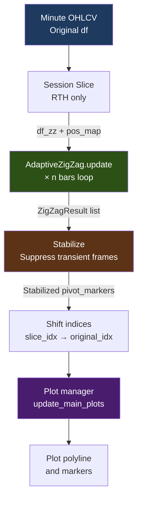

# ZigZag 피봇 종합 가이드

> 대상 코드: `indicators/adaptive_zigzag.py`  
> 최종 수정: 2026-06-16  
> 병합 대상: zigzag_pivot_improvement.md, zigzag_pivot_logic.md, zigzag_pivot_configuration_guide.md

---

## 목차

1. [개요](#개요)
2. [전체 구조](#전체-구조)
3. [피봇 로직 상세](#피봇-로직-상세)
4. [파라미터 설정 가이드](#파라미터-설정-가이드)
5. [알고리즘 보완 설계](#알고리즘-보완-설계)
6. [시장 레짐 기반 적응형 파라미터](#시장-레짐-기반-적응형-파라미터)
7. [실전 활용 가이드](#실전-활용-가이드)

---

## 개요

AdaptiveZigZag는 ATR(Average True Range) 기반 동적 임계값을 사용하여 피봇을 결정합니다. 기본적으로 다음 3단계 생애주기를 따릅니다:

1. **후보 등록**: 신고점/신저점 형성 시 후보 등록
2. **pending_confirm**: 확인 봉수 동안 추세 유지 확인
3. **확정**: 확인 봉수 경과 후 피봇 확정

### 핵심 설계 원칙

- **동적 임계값**: ATR 비율로 임계값 결정 (고정 퍼센트 미사용)
- **다층 적응**: ER(추세 강도) + DER(방향 불일치) + 시간대 + 감쇄 4층 적용
- **H/L 교번 강제**: 연속된 동일 타입 피봇 자동 병합
- **캐싱**: 동일 데이터 서명 시 ZigZag 상태 재사용

---

## 전체 구조

### 전체 파이프라인



### 세션 슬라이스

ZigZag 엔진은 **정규 거래 시간 구간만** 입력으로 받습니다. 프리마켓·장외 구간을 포함하면 스윙 기준이 왜곡됩니다.

| 종목 | 슬라이스 시작 | 슬라이스 종료 |
|------|-------------|-------------|
| KOSPI (001) | 09:00 KST | 15:30 KST |
| KP200 (선물) | 08:45 KST | 15:30 KST |
| 옵션 | 08:45 KST | 15:30 KST |

---

## 피봇 로직 상세

### 1. 현행 알고리즘 요약

```
FC0 틱 수신
    ↓
update(high, low, close, bar_time)
    ↓
[1] True Range → ATR (RMA)
    ↓
[2] _calc_threshold_pct()
      ATR/close × mult(ER 기반) → thr_pct [0.3% ~ 3.0%]
      장초반(09:00~09:30): atr_multiplier_max=8.0 적용
    ↓
[3-a] pending_confirm 처리
      remaining 카운트다운 → 0이 되면 확정
      freeze_on_confirm=True: 대기 중 추가 갱신 차단
      max_wait_bars > 0: 초과 시 자동 취소
    ↓
[3-b] 방향 결정 / 전환
      current_direction: 0(초기) / +1(상승) / -1(하락)
      임계값 돌파 시 반대 방향으로 전환 + pending 등록
    ↓
[4] 파동 크기, Fibonacci, S/R, 구조 분석
```

### 2. 임계값 계산

```python
def _calc_threshold_pct(self):
    # ATR 기반 기본 임계값
    base_threshold = (self.atr / self.close) * self.atr_multiplier
    
    # ER(Efficiency Ratio) 기반 보정
    er = self._calc_efficiency_ratio()
    er_multiplier = self._interpolate_er_multiplier(er)
    
    # DER(Direction Error Ratio) 기반 보정
    der = self._calc_direction_error_ratio()
    der_multiplier = self._interpolate_der_multiplier(der)
    
    # 시간대 보정
    time_multiplier = self._get_time_multiplier()
    
    # 감쇠 보정
    decay_multiplier = self._get_decay_multiplier()
    
    # 최종 임계값
    threshold = base_threshold * er_multiplier * der_multiplier * time_multiplier * decay_multiplier
    
    # 범위 제한
    threshold = max(self.pivot_threshold_min_pct, 
                   min(self.pivot_threshold_max_pct, threshold))
    
    return threshold
```

### 3. 피봇 확정 로직

```python
def _process_pending_confirm(self):
    if self._pending_confirm is None:
        return
    
    self._pending_confirm['remaining'] -= 1
    
    if self._pending_confirm['remaining'] <= 0:
        # 확정
        self._confirm_pending()
    elif self._max_wait_bars > 0:
        waited = self._pending_confirm.get('waited', 0)
        if waited >= self._max_wait_bars:
            # 취소
            self._cancel_pending()
```

---

## 파라미터 설정 가이드

### 기본 파라미터

| 파라미터 | 타입 | 기본값 | 설명 |
|----------|------|--------|------|
| `atr_period` | int | 14 | ATR 계산 기간 (봉) |
| `atr_multiplier` | float | 1.5 | ATR 배수 기본값 (임계값 = ATR × 배수) |
| `atr_multiplier_min` | float | 1.0 | ATR 배수 최소값 |
| `atr_multiplier_max` | float | 4.0 | ATR 배수 최대값 |
| `confirmation_bars` | int | 2 | 피봇 확정 확인 봉수 |
| `pivot_threshold_min_pct` | float | 0.3 | 피봇 임계값 최소 퍼센트 |
| `pivot_threshold_max_pct` | float | 3.0 | 피봇 임계값 최대 퍼센트 |
| `max_swings` | int | 20 | 유지할 최대 스윙 수 |
| `freeze_on_confirm` | bool | true | 확정 시 극값 동결 여부 |

### config.json 설정 예시

```json
{
  "adaptive_indicator": {
    "zigzag": {
      "atr_period": 14,
      "atr_multiplier": 1.5,
      "atr_multiplier_min": 1.0,
      "atr_multiplier_max": 4.0,
      "confirmation_bars": 2,
      "pivot_threshold_min_pct": 0.3,
      "pivot_threshold_max_pct": 3.0,
      "max_swings": 20,
      "freeze_on_confirm": true
    }
  }
}
```

---

## 알고리즘 보완 설계

### 보완 항목 상세

#### 3-1. confirmation_bars 동적 조절 (즉시)

**문제**: 고정 confirmation_bars로는 변동성 장에서 과도한 지연 발생

**해결**: ER 기반 동적 조절
```python
if er > 0.8:  # 강한 추세
    confirmation_bars = 1
elif er > 0.5:  # 중간 추세
    confirmation_bars = 2
else:  # 약한 추세
    confirmation_bars = 3
```

#### 3-2. min_wave_pct 하한 설정 (즉시)

**문제**: 너무 작은 파동이 피봇으로 인식됨

**해결**: ATR 기반 동적 하한
```python
min_wave_pct = max(0.3, (atr / close) * 0.5)
```

#### 3-3. structure 다수결 판정 (즉시)

**문제**: 단일 structure 점수로는 오인식 가능

**해결**: 다수결 판정
```python
structure_score = (
    structure_up * 0.4 + 
    structure_down * 0.4 + 
    trend * 0.2
)
```

#### 3-4. 피봇 클러스터링 실제 적용 (단기)

**문제**: 근접 피봇 중복

**해결**: 거리 기반 클러스터링
```python
if abs(pivot1.price - pivot2.price) < atr * 0.5:
    merge_pivots(pivot1, pivot2)
```

#### 3-5. bars_since 기반 임계값 decay (단기)

**문제**: 장기 횡보에서 민감도 과다

**해결**: 시간 기반 감쇠
```python
decay = max(0.5, 1.0 - bars_since / 100)
threshold *= decay
```

#### 3-6. pending 피봇을 잠정 SR에 포함 (단기)

**문제**: pending 피봇이 SR 계산에서 제외됨

**해결**: 잠정 SR 포함
```python
support_resistance = confirmed_pivots + [pending_pivot]
```

#### 3-7. is_major 파동 비율 기준 (중기)

**문제**: 주요 파동 기준 모호

**해결**: ATR 기준 정의
```python
is_major = wave_size > atr * 2.0
```

#### 3-8. 방향 ER (Directional ER) (중기)

**문제**: ER만으로는 방향성 판단 부족

**해결**: 방향성 ER 추가
```python
directional_er = abs(up_moves - down_moves) / total_moves
```

#### 3-9. 시간대별 min_wave_bars 테이블 (SESSION-MW) (즉시)

**문제**: 장초반 노이즈 과다

**해결**: 시간대별 최소 파동 설정
```python
session_min_wave_bars = {
    "09:00-09:30": 5,
    "09:30-11:30": 3,
    "11:30-13:00": 4,
    "13:00-15:30": 3
}
```

---

## 시장 레짐 기반 적응형 파라미터

### 레짐별 파라미터 설정

| 레짐 | atr_multiplier | confirmation_bars | min_wave_pct |
|------|----------------|-------------------|--------------|
| 강한 상승 | 1.2 | 1 | 0.4 |
| 약한 상승 | 1.5 | 2 | 0.3 |
| 횡보 | 2.0 | 3 | 0.5 |
| 약한 하락 | 1.5 | 2 | 0.3 |
| 강한 하락 | 1.2 | 1 | 0.4 |

### config.json 설정 예시

```json
{
  "adaptive_indicator": {
    "zigzag": {
      "regime_params": {
        "strong_uptrend": {
          "atr_multiplier": 1.2,
          "confirmation_bars": 1,
          "min_wave_pct": 0.4
        },
        "weak_uptrend": {
          "atr_multiplier": 1.5,
          "confirmation_bars": 2,
          "min_wave_pct": 0.3
        },
        "sideways": {
          "atr_multiplier": 2.0,
          "confirmation_bars": 3,
          "min_wave_pct": 0.5
        }
      }
    }
  }
}
```

---

## 실전 활용 가이드

### 파라미터 튜닝 팁

1. **고변동성 장**: `atr_multiplier` 낮추기 (1.0~1.2)
2. **저변동성 장**: `atr_multiplier` 높이기 (2.0~3.0)
3. **빠른 진입**: `confirmation_bars` 낮추기 (1)
4. **신뢰성 우선**: `confirmation_bars` 높이기 (3~4)
5. **노이즈 필터**: `min_wave_pct` 높이기 (0.5~1.0)

### 백테스트 검증 항목

- 피봇 확정 래그 (평균 봉수)
- 오탐률 (False Positive Rate)
- 미탐률 (False Negative Rate)
- 피봇 분포 (고가/저가 균형)
- 스윙 크기 분포

---

**문서 버전**: 1.0  
**작성일**: 2026-06-16  
**마지막 수정**: 2026-06-16  
**병합 대상**: zigzag_pivot_improvement.md, zigzag_pivot_logic.md, zigzag_pivot_configuration_guide.md
