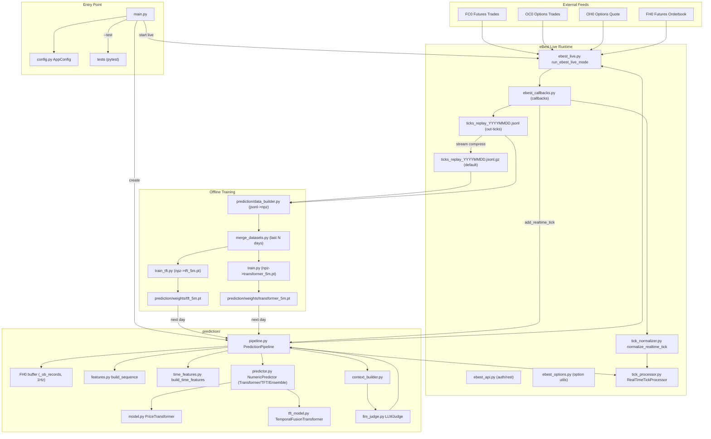
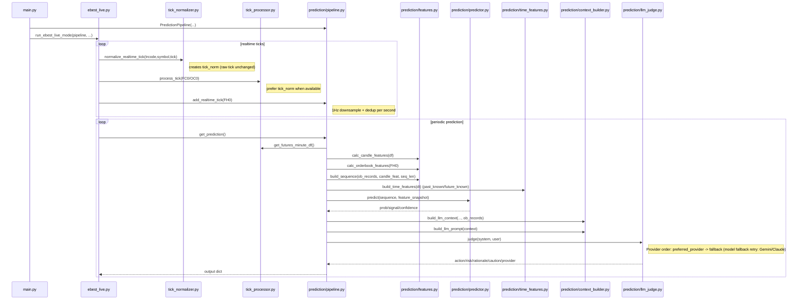
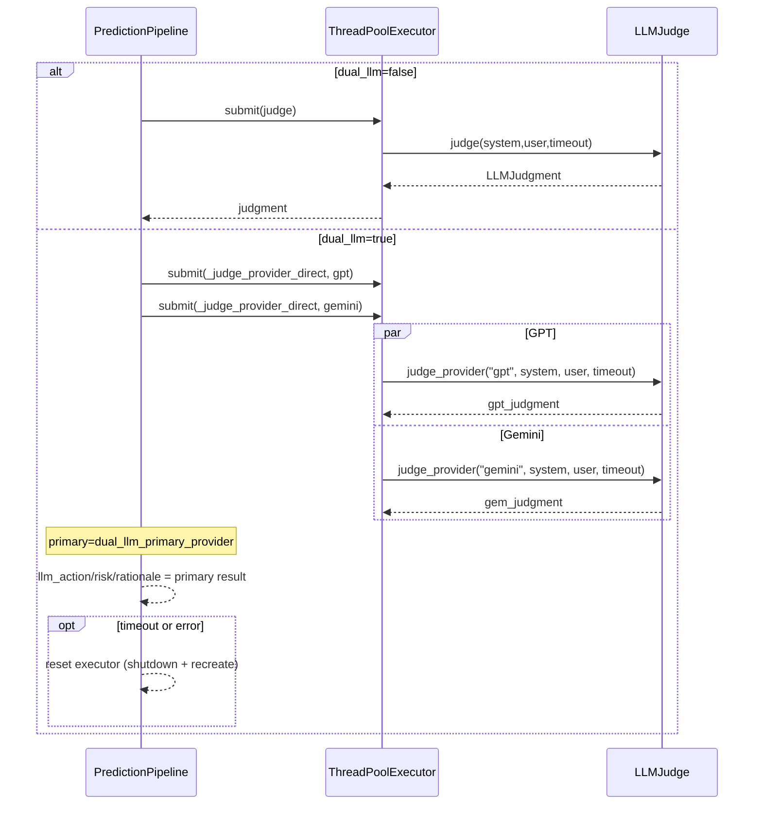
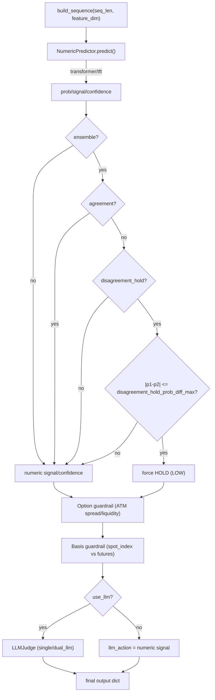
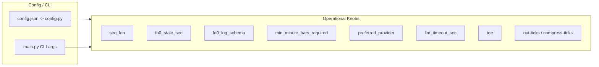
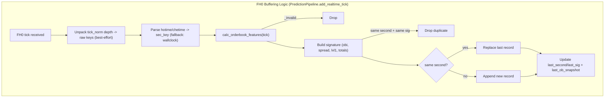

# KP200 선물 실시간 예측 시스템 — 전체 동작 로직

> 버전: 2.3.0 | 기준 코드: `main.py`, `ebest_live.py`, `ebest_api.py`, `ebest_options.py`, `ebest_callbacks.py`, `tick_normalizer.py`, `tick_processor.py`, `prediction/pipeline.py`, `prediction/features.py`, `prediction/predictor.py`, `prediction/model.py`, `prediction/tft_model.py`, `prediction/time_features.py`, `prediction/option_features.py`, `prediction/option_flow_features.py`, `prediction/context_builder.py`, `train.py`, `train_tft.py`, `merge_datasets.py`, `prediction/data_builder.py`, `adaptive_indicator/`

테스트 실행(권장): `python -m pytest -q`

전체 스모크(우산) 테스트: `python -m pytest -q tests/test_smoke.py`

관련 문서:
- 런타임 레퍼런스: `docs/runtime/README.md`
- 학습 레퍼런스: `docs/training/README.md`

---

## 목차

1. [시스템 개요](#1-시스템-개요)
2. [모듈 구조](#2-모듈-구조)
3. [전체 데이터 흐름](#3-전체-데이터-흐름)
4. [단계별 동작 로직](#4-단계별-동작-로직)
   - 4.1 [시작 및 설정 초기화](#41-시작-및-설정-초기화)
   - 4.2 [eBest API 연결 및 구독](#42-ebest-api-연결-및-구독)
   - 4.3 [실시간 틱 수신 및 정규화](#43-실시간-틱-수신-및-정규화)
   - 4.4 [틱 분류 및 저장](#44-틱-분류-및-저장)
   - 4.5 [FH0 오더북 버퍼링](#45-fh0-오더북-버퍼링)
   - 4.6 [피처 엔지니어링](#46-피처-엔지니어링)
   - 4.7 [Transformer 수치 예측](#47-transformer-수치-예측)
   - 4.8 [LLM 판단 (단일 / dual_llm 모드)](#48-llm-판단)
   - 4.9 [결과 출력 및 평가](#49-결과-출력-및-평가)
5. [핵심 내부 상태](#5-핵심-내부-상태)
6. [예측 결과 스키마](#6-예측-결과-스키마)
7. [현재 알려진 버그 / 잔존 이슈](#7-현재-알려진-버그)
8. [보완 및 개선 방향](#8-보완-및-개선-방향)

---

## 1. 시스템 개요

본 시스템은 eBest OpenAPI의 실시간 WebSocket 스트림(선물/옵션 체결 + 호가)을 수신하고,
**(Transformer + TFT) 수치 예측**과 **LLM 전략 판단**을 결합하여 KP200 선물의
N분 후 방향성(BUY/SELL/HOLD)을 예측합니다.

```
eBest WebSocket
    │
    ▼
실시간 콜백 (_on_realtime)
    │  tick 정규화 (tick_normalizer)
    ▼
PredictionPipeline.add_realtime_tick()
    ├─ FC0/OC0 → RealTimeTickProcessor (분봉 + 옵션 스냅샷)
    └─ FH0     → _ob_records 오더북 버퍼 (1Hz)
    
    [N분 주기]
    ▼
PredictionPipeline.get_prediction()
    ├─ features: 캔들 피처 + 오더북 시퀀스
    ├─ NumericPredictor
    │     ├─ TransformerPredictor → prob / signal / confidence
    │     ├─ TFTPredictor         → tft_prob / signal / confidence
    │     └─ EnsemblePredictor    → ensemble_prob / agreement / method
    ├─ AdaptiveIndicatorManager  → heuristic action + ADAPT_KEYS(28)
    ├─ regime 계산               → STRONG_UP/WEAK_DOWN/RANGE 등
    ├─ basis 가드레일             → spot_index vs futures (IJ_ 실시간 지수)
    ├─ LLMJudge (단일 모드)       → action / risk_level / rationale
    │   또는 dual_llm 모드
    │     ├─ GPT                 → model_outputs["gpt"]
    │     └─ Gemini              → model_outputs["gemini"]
    └─ 최종 결과 dict 반환
```

**예측 주기**: `prediction_minutes` (5/10/30분 중 선택, 기본 5분)  
**최소 요구 분봉**: `min_minute_bars_required` (기본 20개)  
**오더북 버퍼**: 최근 `seq_len`초 분량 (기본 60초, 1Hz)  
**dual_llm 모드**: `prediction.dual_llm=true` 시 GPT + Gemini 동시 호출, `dual_llm_primary_provider`(기본 `gpt`) 결과를 최종 판단으로 사용  
**basis 가드레일**: `IJ_` 실시간 지수로 `spot_index` 수신 시 선물-현물 괴리 계산 → 이상 시 confidence 하향 또는 HOLD 강제

추가 운영 임계값(`config.json`의 `prediction.*`):

- `confidence_high_margin`, `confidence_mid_margin`, `confidence_spread_max_for_high`
- `disagreement_hold_prob_diff_max`
- `guard_basis_hold_thr`, `guard_basis_downgrade_thr`
- `guard_atm_spread_pct_thr`, `guard_atm_liq_log_thr`

---

## 2. 모듈 구조

```
프로젝트 루트
├── main.py                  진입점, CLI 파싱, 모드 분기
├── config.py                설정 로드 (config.json + 환경변수)
├── config.json              설정 파일(선택)
├── config.secrets.json      민감 설정 파일(선택, gitignore 권장)
├── constants.py             전역 상수 (TRCode, 모델명, 임계값 등)
├── logging_utils.py         구조화 로깅, stdout/stderr tee
├── utils.py                 타입변환, 날짜/시간, 옵션 유틸
├── tick_normalizer.py       eBest raw tick → 표준 tick_norm 변환
├── tick_processor.py        틱 분류, 분봉 집계, 옵션 스냅샷 저장
├── adaptive_indicator/       adaptive 지표 모듈(슈퍼트렌드/지그재그 + 통합)
│   ├── adaptive_supertrend.py
│   ├── adaptive_zigzag.py
│   ├── indicator_integration.py
│   └── __init__.py
├── ebest_live.py            eBest 실시간 예측 루프 오케스트레이션
├── ebest_api.py             eBest 인증/REST 요청 헬퍼
├── ebest_options.py         옵션 심볼 필터링/ATM 유틸
├── ebest_callbacks.py       realtime/message callback + ACK 판별
└── prediction/              예측 패키지
    ├── __init__.py          PredictionPipeline re-export
    ├── pipeline.py          예측 오케스트레이터 (핵심)
    ├── features.py          피처 엔지니어링 (오더북 + 캔들)
    ├── option_features.py   옵션 지표 계산 (PCR / IV Skew / Max Pain)
    ├── context_builder.py   LLM 컨텍스트/프롬프트 빌더
    ├── llm_judge.py         LLM 호출 추상화 (Claude/GPT/Gemini)
    ├── predictor.py         Transformer/TFT/Ensemble 예측기 (가중치 있으면 torch inference, 없으면 rule-based)
    ├── model.py             PriceTransformer (PyTorch) 구현
    ├── tft_model.py          TemporalFusionTransformer (PyTorch) 구현
    ├── time_features.py      TFT time features (past_known/future_known)
    ├── data_builder.py       학습 데이터셋 생성 (JSONL → npz)
    ├── weights_selector.py   weights 경로/선택 로직
    └── weights/              가중치 저장 디렉토리 (transformer_5m.pt, tft_5m.pt)
├── train.py                  오프라인 학습 스크립트 (npz → transformer_5m.pt)
├── train_tft.py              오프라인 학습 스크립트 (TFT npz → tft_5m.pt)
├── merge_datasets.py         최근 N일 npz merge (rolling 재학습용)
├── tests/                    pytest 테스트
├── tests.py                  (호환) main.py --test용 pytest wrapper
└── requirements.txt          의존성 목록
```

### 모듈 의존 관계

```
main.py
  ├── config.py
  ├── logging_utils.py
  ├── ebest_live.py
  │     ├── tick_normalizer.py
  │     └── utils.py
  ├── prediction/weights_selector.py
  └── prediction/pipeline.py
        ├── tick_processor.py
        │     └── utils.py
        ├── prediction/features.py
        ├── prediction/option_features.py
        ├── prediction/time_features.py
        ├── prediction/context_builder.py
        ├── prediction/llm_judge.py
        │     └── constants.py (모델명)
        ├── prediction/predictor.py
        │     ├── prediction/model.py
        │     └── prediction/tft_model.py
        └── adaptive_indicator/
              ├── adaptive_supertrend.py
              ├── adaptive_zigzag.py
              └── indicator_integration.py

 (offline)
 prediction/data_builder.py
   ├── config.py
   ├── tick_processor.py
   ├── prediction/features.py
   ├── prediction/option_features.py
   └── adaptive_indicator/ (enabled 시)

 train.py / train_tft.py
   ├── config.py
   └── prediction/features.py (OB/CD/OPT/ADAPT 키 기반 입력 dim 검증)
```

---

## 3. 전체 데이터 흐름

## 3.1 Mermaid Diagrams

아래 다이어그램은 `mermaid.md`에 있던 내용을 본 문서로 통합한 것입니다.

### 3.1.1 End-to-End Architecture (Live + Offline Training)



### 3.1.2 Runtime Sequence (Realtime Ticks + Periodic Prediction)



### 3.1.5 Dual LLM Execution (Parallel + Timeout Defense)



### 3.1.6 Decision Flow (Numeric -> Disagreement -> Guardrails -> LLM)



### 3.1.3 Config / CLI Operational Knobs



### 3.1.4 FH0 Buffering Logic (1Hz Downsample + Dedup)



```
[1] eBest WebSocket
     FC0 선물 체결  ──────────────────────────────────────┐
     OC0 옵션 체결  ──────────────────────────────────────┤
     FH0 선물 5단계 호가  ────────────────────────────────┤
     OH0 옵션 5단계 호가  ────────────────────────────────┘
                                                          │
[2] _on_realtime() 콜백                                  │
     tick_normalizer.normalize_realtime_tick()            │
     → tick_norm 생성 (표준 스키마)                       │
     payload = {trcode, symbol, tick, tick_norm}          │
                                                          ▼
[3] PredictionPipeline.add_realtime_tick(payload)
     │
     ├─ tick_processor.process_tick(payload)
     │    ├─ FC0: process_futures_tick()
     │    │    tick_norm 우선 → tick fallback
     │    │    → futures_ticks (deque)
     │    │    → futures_minute_data[minute_key] (분봉 집계)
     │    │    → 2시간 초과 데이터 자동 삭제
     │    │
     │    └─ OC0: process_option_tick()
    │         (옵션 분봉 OHLCV: option_minute_ohlcv.enabled=True 시, 콜/풋 ATM±N 심볼만 best-effort로 집계)
     │         tick_norm 우선 → tick fallback
     │         → call_options[symbol] or put_options[symbol]
     │         (최신 스냅샷으로 덮어쓰기)
     │
     └─ FH0 처리 (pipeline 자체 버퍼)
          raw tick 또는 tick_norm 배열에서 orderbook 형태 감지
          tick_norm(offerhos/bidhos/offerrems/bidrems 등)이 있으면 offerho1~5/bidho1~5/...로 언패킹
          hotime/chetime으로 초 단위 키 생성 (`hotime` 우선)
          calc_orderbook_features(tick)
          → _ob_records deque (maxlen=seq_len, 1Hz 다운샘플)
          → _last_ob_snapshot 갱신

[3.5] ticks_replay 저장 및 압축 (운영/학습용)
     - `main.py --out-ticks ticks_replay_YYYYMMDD.jsonl`
     - 실시간 콜백(`ebest_callbacks.py`)이 JSONL 한 줄씩 append 기록
     - `main.py --compress-ticks` (기본값 True)이면 `.jsonl.gz`로 스트리밍 압축 저장
       (압축 비활성화: `--no-compress-ticks`)

[4] _run_prediction_loop() — N분 주기
     get_futures_minute_df(adaptive_indicator.warmup_bars) → OHLCV DataFrame
     bar_count >= min_minute_bars_required ?
          ↓ YES
[5] PredictionPipeline.get_prediction()
     │
     ├─ [피처] calc_candle_features(df)
     │         → ret1, ret3, slope3, vol_accel, range_pct
     │
     ├─ [피처] build_sequence(_ob_records, candle_df, seq_len)
     │         → ndarray (seq_len, feature_dim)
     │           (feature_dim은 option_feature_set(v1/v2) 및 adaptive_indicator.enabled에 따라 달라짐)
     │
     ├─ [예측] TransformerPredictor.predict(seq, snapshot)
     │         → prob, signal, confidence
     │
     ├─ [컨텍스트] build_llm_context(snapshot, ob_records)
     │            build_llm_prompt(context, prediction_minutes)
     │            → (system_str, user_str)
     │
     ├─ [LLM] LLMJudge.judge(system, user)
     │         preferred_provider 순서로 시도
     │         → LLMJudgment(action, risk_level, rationale, caution)
     │
     └─ 결과 dict 반환
          prediction_time, target_time, current_price
          prob, signal, confidence
          llm_action, risk_level, rationale, caution
          consensus (signal == llm_action)

[6] _try_evaluate_pending() — 주기적 평가
     target_timestamp 도달 시 실제 가격 조회
     → 방향 적중률, MAE 계산
     → state.eval_dir_rate, eval_mae 갱신

[7] (오프라인) 학습 데이터셋 생성 및 rolling 재학습
     - `python -m prediction.data_builder --config config.json --files ticks_replay_*.jsonl.gz ...`
     - TFT 학습용(`--tft`): `dataset_tft_YYYYMMDD.npz` 생성
     - 최근 N일 merge: `python merge_datasets.py --tft --pattern dataset_tft_*.npz --last 20 --out dataset_tft_merged_last20.npz`
     - TFT 학습: `python train_tft.py --config config.json --data dataset_tft_merged_last20.npz --out prediction/weights/tft_5m.pt ...`
     - 다음날 live 실행 시 새 `tft_5m.pt`가 로드되어 예측에 사용

     참고:
     - `adaptive_indicator.enabled=true`인 경우, `prediction.data_builder`가 offline에서도 ADAPT(28) 피처를 계산해
       dataset `X`에 채웁니다(학습/서빙 피처 정합 목적).
     - `adaptive_indicator.enabled=false`면 ADAPT 블록 없이 dataset이 생성됩니다.
```

---

## 4. 단계별 동작 로직

### 4.1 시작 및 설정 초기화

`main.py` → `parse_arguments()` → `load_config(config.json)`

우선순위: CLI 인자 > 환경변수 > config.secrets.json > config.json > 기본값

참고:
- `config.py`는 `config.json`을 읽은 뒤, 같은 폴더의 `config.secrets.json`이 존재하면 이를 병합(deep-merge)하여 최종 설정을 구성합니다.
- `config.secrets.json` 경로는 환경변수 `APP_SECRETS_CONFIG`로 오버라이드할 수 있습니다.

```
config.json 주요 키
├── ai_providers.anthropic.api_key   (환경변수 ANTHROPIC_API_KEY 우선; 없으면 config.secrets.json)
├── ai_providers.openai.api_key      (환경변수 OPENAI_API_KEY 우선; 없으면 config.secrets.json)
├── ai_providers.gemini.api_key      (환경변수 GEMINI_API_KEY 우선; 없으면 config.secrets.json)
├── ebest.appkey / ebest.appsecretkey (환경변수 EBEST_APPKEY/EBEST_APPSECRET 우선; 없으면 config.secrets.json)
├── prediction_minutes               (5 | 10 | 30)
├── min_minute_bars_required         (기본 20)
├── seq_len                          (기본 60)
├── fo0_stale_sec                    (기본 10; FH0 오더북 버퍼 stale 경고 — 명칭은 과거 호환 용어)
├── preferred_provider               (claude | gpt | gemini)
├── prediction.numeric_predictor      (transformer | tft | ensemble | combined | rule_based)
├── prediction.buy_threshold / prediction.sell_threshold
├── prediction.confidence_high_margin / prediction.confidence_mid_margin / prediction.confidence_spread_max_for_high
├── prediction.transformer_weight     (ensemble 내 Transformer 가중치)
├── prediction.tft_weights_path       (TFT weights path)
├── prediction.tft_horizon            (TFT horizon; 학습/서빙 일치)
├── prediction.disagreement_hold      (ensemble disagreement 시 HOLD 강제)
├── prediction.disagreement_hold_prob_diff_max (disagreement 시 HOLD 강제 여부를 결정하는 prob 차이 임계값)
├── prediction.guard_basis_hold_thr / prediction.guard_basis_downgrade_thr
├── prediction.guard_atm_spread_pct_thr / prediction.guard_atm_liq_log_thr
├── adaptive_indicator
     enabled / symbol / warmup_bars / supertrend / zigzag
      ├── supertrend
      │     atr_min_period / atr_max_period
      │     multiplier_min / multiplier_max
      │     er_period / adx_period
      │     use_bb_correction / bb_period / bb_std
      │     smooth_period
      └── zigzag
            atr_multiplier / atr_period
            min_threshold_pct / max_threshold_pct
            major_swing_ratio / max_swings
            confirmation_bars / cluster_tolerance_pct
└── options_subscription
      itm / otm_open_min / max_otm_calls / max_otm_puts / wait_sec
└── option_minute_ohlcv
      enabled / atm_window
```

`PredictionPipeline` 초기화 시 `LLMJudge`가 가용 API키로 Claude/GPT/Gemini 클라이언트를 순서대로 초기화합니다.

---

### 4.2 eBest API 연결 및 구독

`_initialize_api()` 순서:

```
1. _get_ebest_keys()          환경변수 또는 config.json에서 키 로드
2. api.login(appkey, secret)  eBest OpenApi 인증
3. t8432 요청                 KP200 선물 심볼(futcode) 조회
4. t8415 요청                 최신 분봉 종가로 현재가 초기화
5. t2101 요청                 선물 현재가/Greeks 스냅샷 (로깅용)
6. FC0 구독                   선물 실시간 체결
   FH0 구독                   선물 실시간 5단계 호가
   JIF 구독                   실시간 장운영 정보(장구분/장상태; 모니터링용)
7. (include_options=True 시)
   t2301 요청                 옵션 IV/체인 스냅샷
   t8433 요청                 옵션 심볼 목록 조회
   옵션 필터링                ITM/ATM 유지 + OTM는 t2301 시가(open) 기준 동적 선택
                              (open map 미가용 시 OTM=0으로 축소)
   OC0 구독                   각 옵션 실시간 체결
   OH0 구독                   각 옵션 실시간 5단계 호가
```

옵션 구독 범위는 `config.json`의 `options_subscription`으로 제어:
- `itm`: ATM 기준 ITM 쪽 개수 (기본 6)
- `otm_open_min`: OTM 구독 조건 — 옵션 시가(open) 하한 (기본 0.30)
- `max_otm_calls`: OTM 콜 구독 상한 (0이면 무제한)
- `max_otm_puts`: OTM 풋 구독 상한 (0이면 무제한)

---

### 4.3 실시간 틱 수신 및 정규화

eBest API 이벤트 → `_on_realtime(trcode, symbol, tick)` 콜백 실행

```python
# tick_normalizer.normalize_realtime_tick() 호출
tick_norm = normalize_realtime_tick(trcode=trcode_s, symbol=symbol_s, tick=tick)

payload = {"trcode": trcode_s, "symbol": symbol_s, "tick": tick}
if tick_norm:
    payload["tick_norm"] = tick_norm   # 표준 스키마 첨부

predictor.add_realtime_tick(payload)
```

`tick_norm` 표준화 내용:

| TR | 주요 정규화 |
|----|------------|
| FC0 | price/open/high/low (float), cvolume/volume (int), bid1/ask1, k200jisu, futcode |
| OC0 | FC0 공통 + optcode/impv/timevalue/eqva |
| FH0 | offerhos/bidhos (list[float] 길이5), offerrems/bidrems, totofferrem/totbidrem, hotime |
| OH0 | FH0 공통 + optcode |
| JIF | jangubun/jstatus |

---

### 4.4 틱 분류 및 저장

`tick_processor.process_tick()` — trcode 기반 라우팅:

```
FC0 → process_futures_tick()
  tick_norm 우선, 없으면 raw tick
  timestamp = parse_chetime(chetime)  # HHMMSS → datetime
  minute_key = timestamp(초/마이크로초 제거)
  futures_ticks.append(tick_record)
  futures_minute_data[minute_key].append(tick_record)
  2시간 초과 틱 deque에서 삭제

OC0 → process_option_tick()
  tick_norm 우선, 없으면 raw tick
  symbol[0]로 콜(B)/풋(C) 구분
  parse_option_code()로 만기월·행사가 파싱
  call_options[symbol] 또는 put_options[symbol]에 덮어쓰기

FH0 → pipeline에서 처리 (tick_processor는 무시)
OH0 → tick_processor에서 무시
JIF → 모니터링/로그 목적(현행 구현에서 예측 입력으로 사용하지 않음)
```

**분봉 집계 (`get_futures_minute_df`):**

같은 `minute_key`에 속한 틱들로 OHLCV를 생성합니다.
`volume`은 FC0의 누적 거래량이므로 직전 분봉 대비 증분으로 변환합니다.

```
분봉 거래량 = max(cumvol_in_minute) - prev_minute_max_cumvol
             (음수이면 cumvol 그대로 사용 — 장 재개/데이터 리셋 대응)
```

---

### 4.5 FH0 오더북 버퍼링

`pipeline.add_realtime_tick()` — FH0 전용 경로:

```
1. orderbook 키 존재 확인 (raw depth 키 또는 tick_norm 배열)
2. tick_norm이 존재하면 offerhos/bidhos/offerrems/bidrems 등을 offerho1~5/bidho1~5/... 로 언패킹
3. hotime/chetime으로 초(second) 키 생성 (`hotime` 우선)
4. calc_orderbook_features(tick) 호출
   → {obi, spread, level1_ratio, bid_slope, offer_slope,
      totbidrem, totofferrem}
4. _invalid=True이면 버림
5. 시그니처(obi+spread+level1_ratio+totbidrem+totofferrem) 동일하면 중복 스킵
6. 같은 초 내: 마지막 레코드를 현재 값으로 교체 (1Hz 다운샘플)
   다른 초: _ob_records.append(ob)
7. _last_ob_snapshot 갱신
```

`_ob_records`는 `deque(maxlen=seq_len)`으로 자동 슬라이딩 윈도우 유지.

---

### 4.6 피처 엔지니어링

`get_prediction()` 내부에서 매 예측 시 실행:

**캔들 피처 (`calc_candle_features`)**

| 피처 | 설명 |
|------|------|
| `ret1` | 전 봉 대비 수익률 (1분) |
| `ret3` | 3봉 전 대비 수익률 |
| `slope3` | 3봉 평균 기울기 |
| `vol_accel` | 현재 거래량 / 5봉 평균 거래량 |
| `range_pct` | (고가 - 저가) / 종가 (변동폭) |

**오더북 피처 (`calc_orderbook_features`)**

| 피처 | 계산식 | 의미 |
|------|--------|------|
| `obi` | (totbidrem - totofferrem) / total | 주문 불균형 지수 |
| `spread` | offerho1 - bidho1 | 매도-매수 스프레드 |
| `level1_ratio` | (bidrem1 - offerrem1) / (bidrem1 + offerrem1) | 1단계 수량 비율 |
| `bid_slope` | (bidrem5 - bidrem1) / 4 | 매수 호가 깊이 기울기 |
| `offer_slope` | (offerrem5 - offerrem1) / 4 | 매도 호가 깊이 기울기 |
| `totbidrem` | 매수 총잔량 합 | |
| `totofferrem` | 매도 총잔량 합 | |

**시퀀스 빌드 (`build_sequence`)**

```
shape: (seq_len, feature_dim)
  option_feature_set=v1:
    adaptive_indicator.enabled=true  → feature_dim=47 = 오더북(7) + 캔들(5) + 옵션(7) + adaptive_indicator(28)
    adaptive_indicator.enabled=false → feature_dim=19 = 오더북(7) + 캔들(5) + 옵션(7)
  (즉 47은 v1+ADAPT 조합일 때의 값이며, 설정에 따라 19/28/47/56이 될 수 있음)
  
  option_feature_set=v2:
    adaptive_indicator.enabled=true  → feature_dim=56 = 오더북(7) + 캔들(5) + 옵션(16) + adaptive_indicator(28)
    adaptive_indicator.enabled=false → feature_dim=28 = 오더북(7) + 캔들(5) + 옵션(16)
  열 0~6:    오더북 피처 7개 (OB_KEYS)
  열 7~11:   캔들 피처 5개 (CD_KEYS)
  열 12~:    옵션 스칼라 (OPT_KEYS; option_feature_set에 따라 dim 상이, 전 행 복제)

  (adaptive_indicator.enabled=true 일 때)
  열 (OB+CD+OPT 이후): adaptive indicator 28개 (ADAPT_KEYS; 전 행 복제)

ob_records가 seq_len보다 짧으면 앞쪽 행을 0으로 패딩
```

**Adaptive Indicator (`AdaptiveIndicatorManager`)**

`adaptive_indicator.enabled=true`인 경우, 예측 시점마다 분봉 OHLCV를 기반으로 adaptive indicator를 업데이트하고,
그 결과를 **Transformer/TFT 입력(ADAPT_KEYS 28개)** 및 **LLM 컨텍스트**로 제공합니다.

- **입력 데이터**
  - `RealTimeTickProcessor.get_futures_minute_df(adaptive_indicator.warmup_bars)`
  - OHLCV DataFrame의 최근 `warmup_bars` 구간을 사용(지표 워밍업 + 최신 봉 업데이트)

- **처리 흐름(개념)**
  - 초기화: `PredictionPipeline.__init__`에서 `AdaptiveIndicatorManager` 생성(설정은 `config.json`의 `adaptive_indicator.supertrend/zigzag`)
  - 워밍업: `warmup_bars` 구간을 순차 업데이트하여 내부 상태를 안정화
  - 매 예측: 최신 분봉 1개를 반영하여 adaptive feature를 산출

분봉 DF가 리셋/되감기되는 상황을 감지하면(마지막 완성 분봉 timestamp 기준),
adaptive manager를 reset하고 재웜업하여 내부 상태가 stale해지지 않도록 합니다.

- **출력 데이터**
  - **수치 피처**: `ADAPT_KEYS` 28개를 `build_sequence(..., adaptive_features=...)`로 전달 (전 행 복제)
  - **LLM 텍스트 컨텍스트**: `prediction/context_builder.py`에서 `adaptive_context`가 주어지면 `[ADAPTIVE_INDICATORS]` 블록으로 프롬프트 컨텍스트에 포함

---

### 4.7 Transformer 수치 예측

`TransformerPredictor.predict(sequence, feature_snapshot)`:

```python
# sequence[-1] 에서 최신 피처 추출
obi, spread, lvl1 = last[0], last[1], last[2]
ret3 = last[8]       # candle index 7+1
vol_accel = last[10] # candle index 7+3

pressure_ob = 0.75 * obi + 0.25 * lvl1
mom = clip(ret3 * 50, -1, 1)
pressure = pressure_ob + 0.10 * mom * (0.5 + 0.5 * vol_boost)
spread_penalty = clip(spread / 5.0 * 0.25, 0, 0.25)

prob = clip(0.5 + pressure - spread_penalty, 0, 1)

signal:
  prob >= 0.62 → BUY
  prob <= 0.38 → SELL
  else         → HOLD

confidence:
  |prob - 0.5| >= confidence_high_margin AND spread <= confidence_spread_max_for_high → HIGH
  |prob - 0.5| >= confidence_mid_margin                                         → MEDIUM
  else                                                                          → LOW
```

가중치(`prediction/weights/transformer_5m.pt`)가 존재하면 `PriceTransformer`를 로드해 torch inference를 수행합니다.
가중치가 없거나 로드 실패 시에는 기존 rule-based 로직으로 fallback 합니다.

---

### 4.8 LLM 판단

**프롬프트 구성 (`build_llm_context`, `build_llm_prompt`)**

```
[PIPELINE_INPUT]
{
  "prediction_minutes": 5,
  "transformer": { "prob": 0.63, "signal": "BUY", "confidence": "HIGH" },
  "market": { "current_price": 430.50, "spot_index": 429.80, "basis": 0.70 },
  "orderbook": { "obi": 0.12, "spread": 0.10, ... }
}

[ORDERBOOK_SUMMARY_LAST_60S]
{
  "count": 58,
  "last": { "obi": 0.12, ... },
  "mean": { "obi": 0.08, ... },
  "delta": { "obi": 0.04, ... }   ← last - first (방향성)
}

[OPTIONS_SNAPSHOT]
{ "pcr_volume": 1.1, "iv_skew": 1.05, "max_pain_dist_pct": 0.3, ... }

[ADAPTIVE_INDICATORS]   ← adaptive_indicator.enabled=true 시
AdaptiveIndicatorManager 자연어 요약 (SuperTrend + ZigZag + Cross)
```

**단일 LLM 모드 (`dual_llm=false`, 기본)**

```
LLMJudge._provider_order() 순서로 시도
  1. preferred_provider (config 또는 CLI)가 초기화된 경우 우선
  2. claude → gpt → gemini 순 자동 fallback
  3. 타임아웃/실패 시 Transformer signal로 안전 fallback
```

**dual_llm 모드 (`dual_llm=true`)**

```
GPT + Gemini 동시 호출 (병렬; executor 기반)
  fut_gpt = executor.submit(_judge_provider_direct, provider="gpt", ...)
  fut_gem = executor.submit(_judge_provider_direct, provider="gemini", ...)
  → model_outputs["gpt"]   : action/risk/rationale/caution/provider
  → model_outputs["gemini"]: action/risk/rationale/caution/provider

primary = dual_llm_primary_provider (기본 "gpt")
  → primary 결과를 최종 llm_action/risk_level/rationale/caution에 반영
  → 둘 다 실패 시 Transformer signal로 fallback

timeout/예외 시:
  - 타임아웃 발생 또는 provider 호출 에러 시 executor를 reset(shutdown 후 재생성)하여
    pending task 큐 적체가 누적되지 않도록 방어합니다.
```

**출력 파싱 (`LLMJudge.parse_json`)**

JSON 추출 4단계 전략:
1. Markdown 코드 블록 (` ```json`) 내부 추출
2. 전체 문자열 직접 `json.loads`
3. 첫 번째 `{` 위치부터 `raw_decode`
4. 정규식으로 최외곽 `{...}` 추출 (4096자 제한)

**정규화**:
- action: BUY/SELL/HOLD (LONG→BUY, SHORT→SELL, WAIT→HOLD 등 alias 처리)
- risk_level: LOW/MEDIUM/HIGH

**`use_llm=False` 시**: Transformer signal을 그대로 llm_action으로 사용하고 LLM 호출 생략.

---

### 4.9 결과 출력 및 평가

`ebest_live._run_prediction_loop()`가 매 `prediction_minutes * 60`초마다 실행:

```
1. get_prediction() 호출
2. state.pending_evals에 등록
   {base_price, base_timestamp, target_timestamp, signal}
3. _log_model_outputs(result) — 콘솔/로그 출력
   ├── [PIPELINE] 블록: current_price, prob, signal, confidence, llm_action, risk_level
   ├── [HEURISTIC]/[GPT]/[GEMINI] 블록 (model_outputs 있을 때)
   └── [DIR_SUMMARY] 각 모델 방향 + 컨센서스

4. _try_evaluate_pending() — target_timestamp 도달 시
   DF에서 target_time의 실제 종가 조회
   direction hit: signal vs (actual - base) 방향 비교
   eval_dir_rate = hit_count / total_count * 100

5. --show-metrics 시 get_metrics() 출력
   {predictions, prediction_failures, ticks_processed, last_latency_ms}
```

**틱 저장**: `--out-ticks` 경로에 JSONL 형식으로 저장 (replay 목적)
```json
{"ts": "2025-02-14T13:04:30", "trcode": "FC0", "symbol": "101W3000", "tick": {...}}
```

---

## 5. 핵심 내부 상태

| 객체 | 위치 | 설명 |
|------|------|------|
| `futures_ticks` | `RealTimeTickProcessor` | FC0 틱 deque (최근 2시간) |
| `futures_minute_data` | `RealTimeTickProcessor` | `{minute_key: [tick_record...]}` defaultdict |
| `call_options` / `put_options` | `RealTimeTickProcessor` | 옵션 심볼별 최신 스냅샷 dict |
| `_ob_records` | `PredictionPipeline` | 오더북 피처 deque (최근 seq_len초) |
| `_last_ob_snapshot` | `PredictionPipeline` | 가장 최신 오더북 피처 dict |
| `_last_fo0_seen_epoch` | `PredictionPipeline` | 마지막 FH0 수신 Unix 타임 |
| `pending_evals` | `LiveState` | 평가 대기 예측 목록 |
| `tick_counts` | `LiveState` | TR별 수신 틱 카운터 |

---

## 6. 예측 결과 스키마

`get_prediction()` 반환 dict:

```json
{
  "prediction_time":  "2025-02-14T13:04:30",
  "prediction_minutes": 5,
  "target_time":      "2025-02-14T13:09:30",
  "current_price":    430.50,
  "spot_index":       429.80,
  "basis":            0.70,
  "regime":           "WEAK_UP",
  "prob":             0.6300,
  "signal":           "BUY",
  "confidence":       "HIGH",
  "transformer_prob": 0.6300,
  "tft_prob":         0.6100,
  "ensemble_method":  "weighted_avg",
  "model_agreement":  true,
  "model_outputs": {
    "heuristic": {
      "action": "BUY",
      "provider": "adaptive_indicator",
      "is_ready": true,
      "supertrend_state": {...},
      "zigzag_state": {...}
    },
    "gpt": {
      "action": "BUY", "risk_level": "MEDIUM",
      "rationale": "...", "caution": "...", "provider": "gpt"
    },
    "gemini": {
      "action": "HOLD", "risk_level": "LOW",
      "rationale": "...", "caution": "...", "provider": "gemini"
    }
  },
  "orderbook": {
    "obi": 0.12, "spread": 0.10, "level1_ratio": 0.08,
    "bid_slope": -2.5, "offer_slope": 3.0,
    "totbidrem": 1500.0, "totofferrem": 1200.0
  },
  "ob_records_len":   58,
  "fo0_age_sec":      0.82,
  "options": {
    "pcr_volume": 1.1, "iv_skew": 1.05, "max_pain_dist_pct": 0.3,
    "atm_call_iv": 0.18, "atm_spread_pct": 0.5, "atm_orderbook_imb": 0.03
  },
  "llm_action":       "BUY",
  "llm_provider":     "gpt",
  "llm_timed_out":    false,
  "risk_level":       "MEDIUM",
  "rationale":        "OBI 강세 + 거래량 가속",
  "caution":          "만기주 변동성 주의",
  "consensus":        true,
  "llm_raw":          "{...}"
}
```

> `model_outputs`는 활성화된 구성 요소만 포함됩니다.
> - `heuristic`: `adaptive_indicator.enabled=true` 시
> - `gpt` / `gemini`: `dual_llm=true` 시
> - `regime`: `STRONG_UP` / `WEAK_UP` / `RANGE` / `WEAK_DOWN` / `STRONG_DOWN` / `null`
> - `spot_index` / `basis`: IJ_ 실시간 지수 수신 시 (없으면 `null`)

오류 반환 예시:
```json
{"error": "insufficient_minutes", "message": "분봉 데이터 부족 (현재: 12개, 필요: 20개)"}
```

---

## 7. 현재 알려진 버그 / 잔존 이슈

### B-1 `pipeline.py` L170 — FH0 시간 필드 오류 🔴 (해결)

FH0의 1Hz 다운샘플 키를 `chetime`으로 읽고 있으나 FH0 스키마의 시간 필드는 `hotime`입니다.
`chetime`이 없으면 `int(time.time())`으로 fallback되어 같은 초 안에 여러 FH0 레코드가
버퍼에 중복 저장될 수 있습니다.

`hotime` 우선(`tick.get("hotime") or tick.get("chetime")`)으로 수정되어 해결되었습니다.

### B-2 `tick_processor.py` L333~337 — Greeks 키 이름 오류 🔴 (해결)

OC0 체결 틱의 Greeks를 읽을 때 eBest 스키마 키(`delt`, `gama`, `ceta`, `rhox`)가 아닌
일반 영어명(`delta`, `gamma`, `theta`, `rho`)으로 읽어서 값이 항상 0.0이 됩니다.

OC0 Greeks는 raw tick의 `delt/gama/ceta/vega/rhox`를 사용하도록 수정되어 해결되었습니다.

### B-3 `context_builder.py` L82 — 시스템 프롬프트 인코딩 손상 🟡 (해결)

`system` 프롬프트가 정상 한국어 문자열로 복구되어 해결되었습니다.

### B-4 `pipeline.py:336-338` — `API_MAX_RETRIES` NameError 🔴 (미해결)

`dual_llm` 모드 활성화 시 `_judge_provider_with_timeout()`에서 `API_MAX_RETRIES`,
`API_RETRY_DELAY_SECONDS`, `API_BACKOFF_MULTIPLIER`를 `constants`에서 import하지 않고 참조.
`try/except`로 묵살되어 재시도 로직이 **완전 무력화**됨.

**수정 방법**:
```python
from config import (
    FUTURE_KNOWN_DIM, HORIZON_SEC, TRCode,
    API_MAX_RETRIES, API_RETRY_DELAY_SECONDS, API_BACKOFF_MULTIPLIER
)
```

### B-5 `_ob_records` 복합 연산 — 스레드 안전성 🟠 (잠재적)

`add_realtime_tick()`(콜백 스레드)과 `get_prediction()`(예측 루프)이
`_ob_records`, `_last_fo0_second`, `_last_ob_snapshot`을 동시에 읽고 씀.
`threading.Lock`으로 복합 연산 보호 권장.

---

## 8. 보완 및 개선 방향

### 8.1 Transformer 모델 — 구현 완료 ✅

`prediction/model.py`에 `PriceTransformer`(PyTorch)를 구현했고,
`prediction/predictor.py`는 가중치 파일이 존재할 때 torch inference를 수행합니다.

오프라인 학습 파이프라인:
- `prediction/data_builder.py`: ticks_replay JSONL → dataset npz
- `train.py`: npz → 학습 → `prediction/weights/transformer_5m.pt`

잔여 TODO(모델 품질 개선):
- candle/option 블록을 학습 데이터에도 반영(현재 data_builder는 0 패딩)
- 시계열 split(시간순 train/val) 및 walk-forward 평가
- feature 정규화/스케일링(훈련/서빙 일치)

### 8.2 옵션 데이터 활용 ✅

옵션 스냅샷(`call_options`/`put_options`)에서 다음 지표를 계산해 pipeline에 주입합니다.
- PCR (volume/oi)
- IV Skew (ATM put/call)
- Max Pain (괴리율 포함)

해당 값은:
- Transformer 입력(OPT/ADAPT 블록; option_feature_set/adaptive_indicator 설정에 따라 feature_dim이 달라질 수 있음)
- LLM 컨텍스트의 `[OPTIONS_SNAPSHOT]`
- 최종 결과 dict의 `options` 필드
에 포함됩니다.

```
활용 가능한 옵션 지표
├── PCR (Put/Call Ratio)
│    = sum(put_volumes) / sum(call_volumes)
│    → 1.0 이상 = 하방 헤지 강화, 시장 약세 신호
├── Max Pain
│    = 옵션 매도자 손실이 최소인 행사가
│    → 만기 수렴 경향 이용 가능
├── IV Skew
│    = put_atm_iv / call_atm_iv
│    → skew 높을수록 하방 리스크 프리미엄 증가
└── 만기주(is_expiry_week) 보정
     utils.get_expiry_week_info() 이미 구현됨
     → 만기주에는 변동성 파라미터 조정 필요
```

```python
# pipeline.py get_prediction()에 추가 예시
calls = self.tick_processor.call_options
puts  = self.tick_processor.put_options

call_vol = sum(v.get("volume", 0) for v in calls.values())
put_vol  = sum(v.get("volume", 0) for v in puts.values())
pcr = put_vol / call_vol if call_vol > 0 else 1.0

snapshot["options"] = {
    "pcr": round(pcr, 4),
    "call_count": len(calls),
    "put_count":  len(puts),
}
```

### 8.3 LLM 컨텍스트 보강 ✅

현재 LLM 컨텍스트는 아래 블록을 포함합니다.
- `[PIPELINE_INPUT]` (transformer 출력 + market + orderbook + market_background)
- `[ORDERBOOK_SUMMARY_LAST_60S]`
- `[OPTIONS_SNAPSHOT]` (PCR / IV Skew / Max Pain)

`market_background`에는 초기화 시 best-effort로 수집한 스냅샷이 포함됩니다.
- `market_background.t2101` (basis/theoryprice/kospijisu/greeks 등)
- `market_background.t2301` (cimpv/pimpv/histimpv/jandatecnt 및 샘플 체인 등)

잔여 TODO:
- `market_background`를 `context_builder.py`에서 별도 섹션(예: `[MARKET_BACKGROUND]`)으로 분리해 가독성 개선
- 만기 정보(days_to_expiry/is_expiry_week) 및 분봉 추세 요약(MA5/MA20) 등 추가 요약 피처 보강

```
LLM 컨텍스트 보강 권장 항목
├── 만기 정보: days_to_expiry, is_expiry_week
├── 옵션 IV: cimpv, pimpv (t2301 데이터)
├── 선물 basis, 이론가 괴리율 (t2101 데이터)
└── 분봉 추세 요약: MA5/MA20 크로스 여부
```

### 8.4 평가(Evaluation) 루프 제한 🟡

`_try_evaluate_pending()`은 인메모리 DataFrame에서 `target_timestamp`의 가격을 조회합니다.
분봉 데이터가 메모리에서 삭제(4시간 TTL)된 후에는 평가 불가능하며,
방향 적중률(`eval_dir_rate`)이 런타임 상태에만 존재하고 영속화되지 않습니다.

```
개선 방향
├── 예측 결과를 JSONL 파일에 저장 (prediction_log_YYYYMMDD.jsonl)
├── 종료 후 별도 eval_runner.py로 offline 평가
└── eval_dir_rate, MAE를 Prometheus/InfluxDB 등에 push (선택)
```

### 8.5 OB/캔들 피처 시퀀스 정렬 개선 ✅

`build_sequence()`는 캔들 피처를 `seq_len` 구간에 선형 매핑해 시계열 정렬합니다.

```
개선 방향
├── 캔들 피처도 ob_records와 동기화하여 시간축으로 배열
│    (분봉 해상도 vs 초 해상도 불일치는 interpolation 또는
│     가장 최근 완성 봉으로 채우는 방식으로 처리)
└── 피처 정규화 추가 (분봉별 z-score 또는 min-max)
```

### 8.6 tick_norm 우선 원칙 일관성 ✅

FH0 수신 경로에서 `tick_norm`이 존재하면 list 기반 depth를 raw-key 형식으로 언패킹하여
`calc_orderbook_features()`가 올바르게 depth를 해석하도록 수정되어 해결되었습니다.

```python
# tick_norm → calc_orderbook_features 어댑터 예시
def _expand_tick_norm_fh0(tick_norm: dict) -> dict:
    """tick_norm의 offerhos 배열을 offerho1~5 키로 변환"""
    expanded = dict(tick_norm)
    for i, v in enumerate(tick_norm.get("offerhos") or [], 1):
        expanded[f"offerho{i}"] = v
    for i, v in enumerate(tick_norm.get("bidhos") or [], 1):
        expanded[f"bidho{i}"] = v
    for i, v in enumerate(tick_norm.get("offerrems") or [], 1):
        expanded[f"offerrem{i}"] = v
    for i, v in enumerate(tick_norm.get("bidrems") or [], 1):
        expanded[f"bidrem{i}"] = v
    return expanded
```

### 8.7 주간 옵션(Weekly) 미지원 🟢

`tick_processor.parse_option_code()`의 `is_weekly` 필드가 항상 `False`로 반환됩니다.
t2301 요청 시 `gubun="W"` 처리는 `ebest_live.py`에 있지만,
심볼 파싱 단계에서 주간 옵션과 월간 옵션을 구분하지 않아
만기 계산이 부정확합니다.

### 8.8 비동기/타임아웃 LLM 호출 ✅

LLM 호출이 예측 루프를 과도하게 블로킹하지 않도록,
`PredictionPipeline.get_prediction()` 내부에서 `LLMJudge.judge()`를 **스레드 풀로 분리**하고
**타임아웃**을 적용합니다.

- 타임아웃 설정: `PredictionPipeline(..., llm_timeout_sec=8.0)`
- 타임아웃/에러 발생 시: LLM 결과 대신 **Transformer 결과로 안전 fallback**
- 결과 출력: `llm_timed_out` 필드로 타임아웃 여부를 함께 반환

```
개선 방향
├── asyncio.to_thread()로 LLM 호출을 별도 스레드 풀로 분리
└── 타임아웃 설정 (현재 없음)
     claude: anthropic SDK timeout 파라미터 활용
     gpt:    openai SDK timeout 파라미터 활용
```

---

*문서 생성일: 2026-02-14 | 최종 갱신: 2026-02-23 (v2.3.0 — dual_llm/basis/regime/model_outputs 반영, B-4/B-5 신규 버그 추가)*
