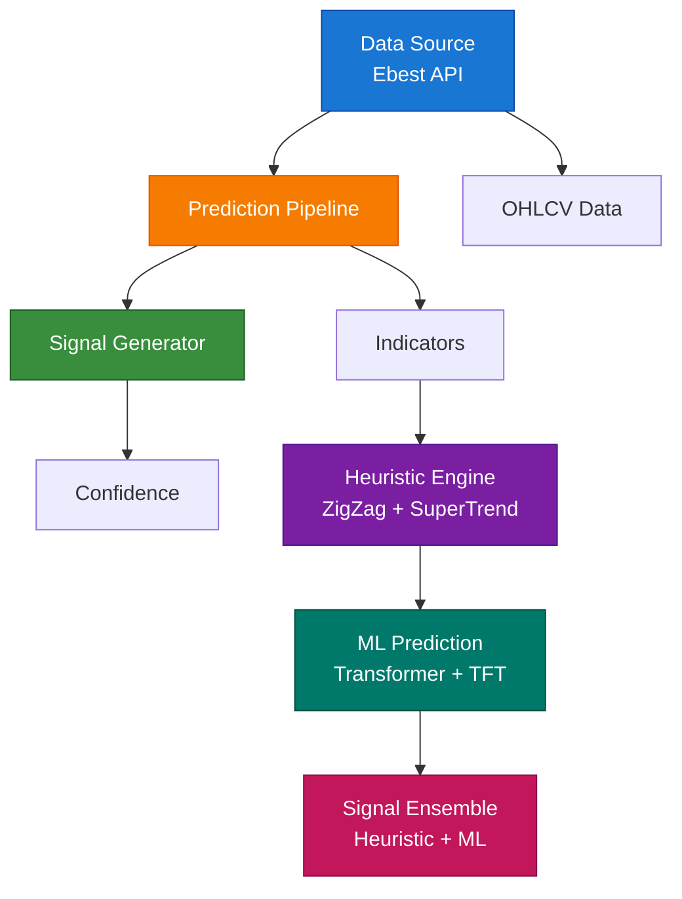
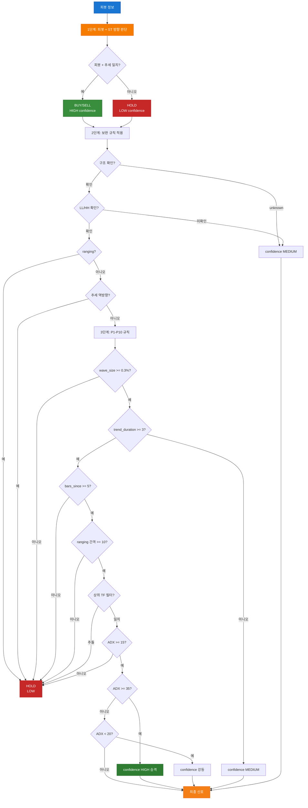
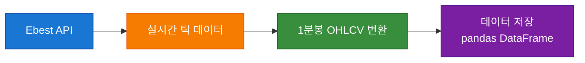
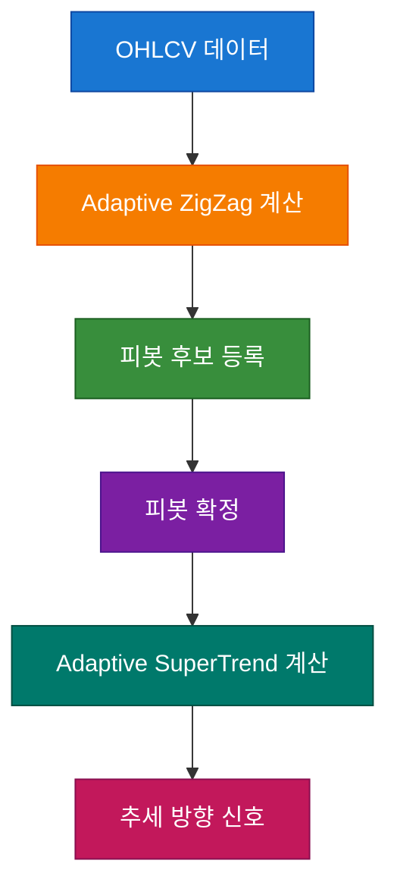
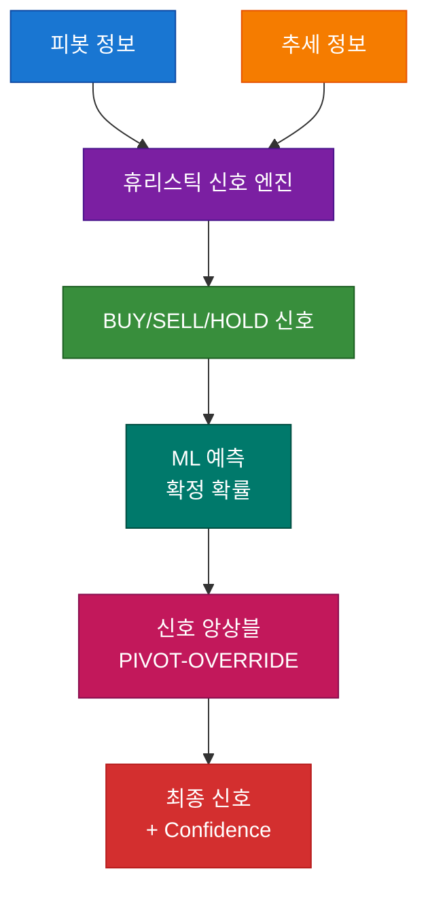
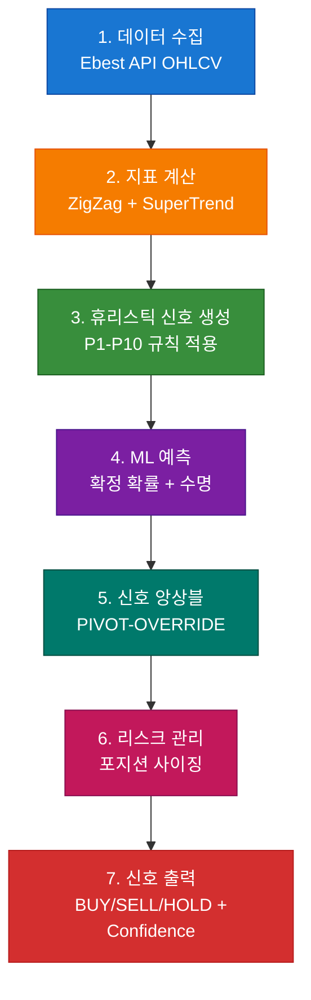
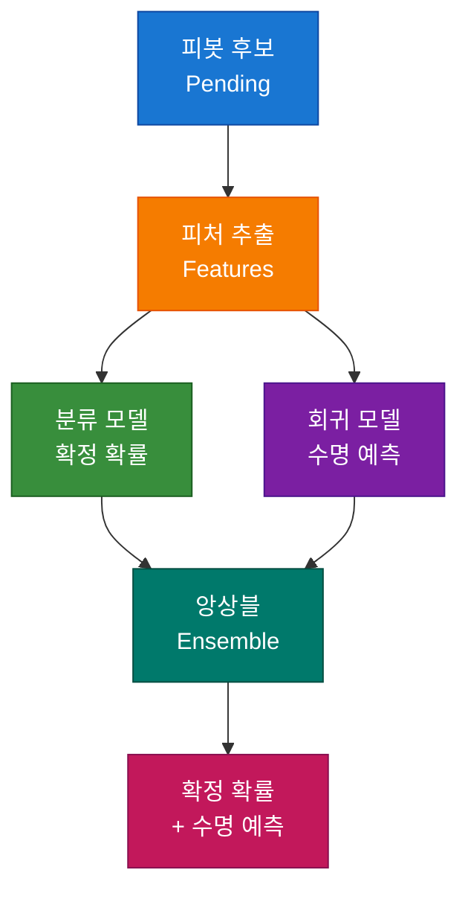
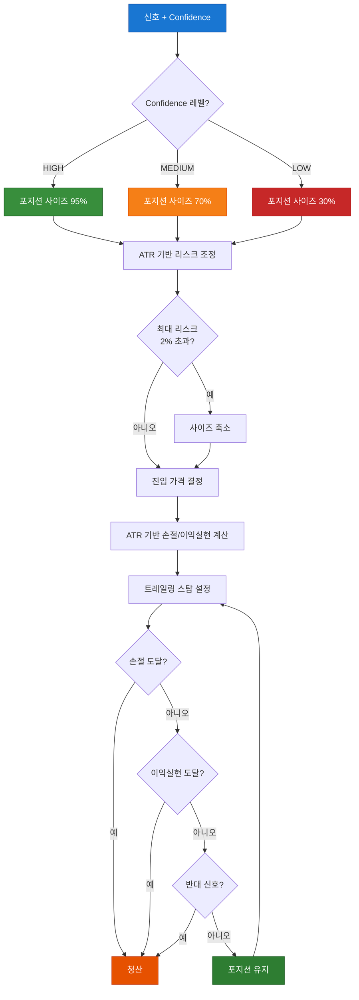
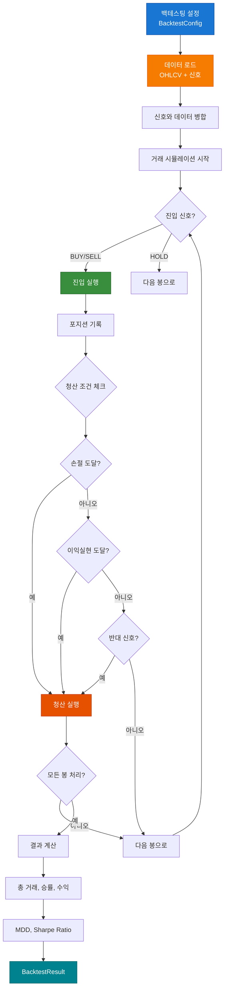
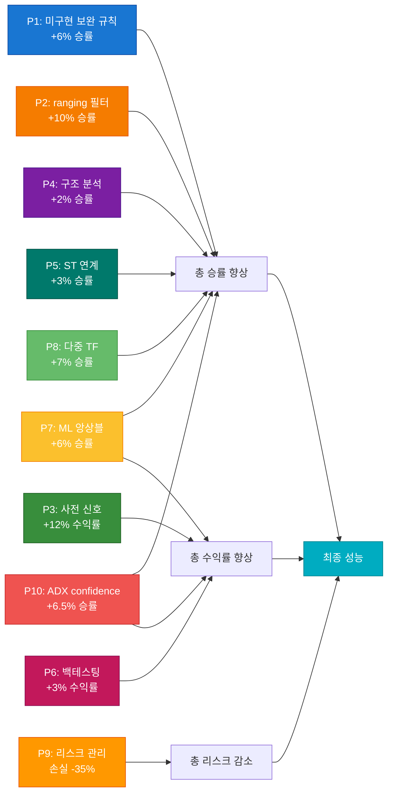

# SkyPredictor 시스템 알고리즘 설명

**버전:** 2026-04-25  
**파일:** `docs/SYSTEM_ALGORITHM_OVERVIEW.md`

---

## 목차

1. [시스템 개요](#1-시스템-개요)
2. [시스템 아키텍처](#2-시스템-아키텍처)
3. [핵심 알고리즘](#3-핵심-알고리즘)
4. [데이터 흐름](#4-데이터-흐름)
5. [신호 생성 프로세스](#5-신호-생성-프로세스)
6. [피봇 예측 파이프라인](#6-피봇-예측-파이프라인)
7. [리스크 관리](#7-리스크-관리)
8. [백테스팅 프레임워크](#8-백테스팅-프레임워크)
9. [개선점 적용 현황](#9-개선점-적용-현황)

---

## 1. 시스템 개요

### 1.1 시스템 목적

SkyPredictor는 지그재그 피봇 기반 매매 신호 시스템으로, 다음 기능을 제공합니다:

- **피봇 감지**: Adaptive ZigZag 알고리즘으로 시장 피봇(고점/저점) 감지
- **추세 필터링**: Adaptive SuperTrend로 추세 방향 필터링
- **신호 생성**: 피봇과 추세를 기반으로 BUY/SELL/HOLD 신호 생성
- **피봇 예측**: ML 모델로 피봇 확정 확률 및 수명 예측
- **리스크 관리**: 동적 포지션 사이징 및 손절/이익실현
- **백테스팅**: 체계적인 성능 검증 프레임워크

### 1.2 지원 시장

- **주요 시장**: KP200 선물
- **확장 가능**: S&P 500, 나스닥, 골드, 유로 선물 등

### 1.3 기술 스택

- **언어**: Python 3.8+
- **프레임워크**: PyTorch (ML 모델)
- **데이터**: pandas, numpy
- **GUI**: finplot, PySide6
- **API**: Ebest (KP200 선물 거래)

---

## 2. 시스템 아키텍처

### 2.1 전체 구조



### 2.2 주요 모듈

| 모듈 | 파일 | 설명 |
|---|---|---|
| **데이터 수집** | `data/ebest_api.py` | Ebest API에서 OHLCV 데이터 수집 |
| **지표 계산** | `indicators/adaptive_zigzag.py` | Adaptive ZigZag 피봇 감지 |
| | `indicators/adaptive_supertrend.py` | Adaptive SuperTrend 추세 필터 |
| **예측 파이프라인** | `prediction/pipeline.py` | 메인 예측 파이프라인 |
| | `prediction/pivot_pipeline.py` | 피봇 예측 파이프라인 |
| | `prediction/adaptive_mixin.py` | 휴리스틱 신호 엔진 |
| | `prediction/prediction_mixin.py` | ML 예측 엔진 |
| **리스크 관리** | `prediction/pivot_risk_manager.py` | 리스크 관리 시스템 |
| **백테스팅** | `prediction/backtest_pivot_signals.py` | 백테스팅 프레임워크 |
| **GUI** | `gui/chart_viewer.py` | 차트 뷰어 |

---

## 3. 핵심 알고리즘

### 3.0 휴리스틱 신호 엔진 전체 흐름



### 3.1 Adaptive ZigZag

#### 목적

동적 임계값 기반 피봇(고점/저점) 감지

#### 알고리즘

```python
# 1. ATR 계산
atr = AverageTrueRange(period=14)

# 2. 동적 임계값 계산
threshold = atr * atr_multiplier

# 3. Efficiency Ratio (ER) 기반 멀티플라이어 조정
er = EfficiencyRatio(period=10)
if er > 0.5:
    multiplier = min_multiplier + (max_multiplier - min_multiplier) * er
else:
    multiplier = min_multiplier

# 4. 피봇 감지
if price_change > threshold * multiplier:
    # 상승 피봇 후보 등록
elif price_change < -threshold * multiplier:
    # 하락 피봇 후보 등록

# 5. 피봇 확정
if 후보가 지속됨 (confirmation_bars):
    피봇 확정
```

#### 특징

- **동적 임계값**: 시장 변동성에 따라 자동 조정
- **ER 적응**: 추세 효율성에 따라 민감도 조정
- **구조 분석**: HH/LL/HL/LH 패턴 분석
- **세션 적응**: 장 시작/종료 시간별 파라미터 조정

---

### 3.2 Adaptive SuperTrend

#### 목적

추세 방향 및 강도 필터링

#### 알고리즘

```python
# 1. ATR 계산
atr = AverageTrueRange(period=14)

# 2. SuperTrend 라인 계산
if close > previous_st_line:
    st_line = close - (atr * multiplier)
else:
    st_line = close + (atr * multiplier)

# 3. ADX 기반 멀티플라이어 조정
adx = ADX(period=14)
if adx > 40:
    multiplier = min_multiplier  # 강한 추세: 민감도 낮춤
elif adx < 20:
    multiplier = max_multiplier  # 약한 추세: 민감도 높임
else:
    multiplier = base_multiplier

# 4. Bollinger Bands 보정
if price_near_bb_extreme:
    multiplier *= bb_correction_floor
```

#### 특징

- **추세 추적**: 추세 방향 신호 생성
- **ADX 적응**: 추세 강도에 따라 민감도 조정
- **BB 보정**: 극단 가격에서 거짓 신호 방지
- **다중 기간**: 7~21봉 ATR 기간 사용

---

### 3.3 휴리스틱 신호 엔진

#### 목적

피봇과 추세를 기반으로 BUY/SELL/HOLD 신호 생성

#### 알고리즘

```python
# 1단계: 피봇 + ST 방향 판단
if azz_new_swing == "low" and ast_direction == 1:
    signal = "BUY"
    confidence = "HIGH"
elif azz_new_swing == "high" and ast_direction == -1:
    signal = "SELL"
    confidence = "HIGH"
else:
    signal = "HOLD"
    confidence = "LOW"

# 2단계: 보완 규칙 적용
# 구조 필터
if azz_structure == "unknown":
    confidence = "MEDIUM"

# LL/HH 미확인
if not azz_higher_highs and not azz_lower_lows:
    confidence = "MEDIUM"

# ranging 구간
if azz_structure == "ranging":
    signal = "HOLD"
    confidence = "LOW"

# 추세 역방향 반등
if signal != ast_signal:
    confidence = "LOW"

# 3단계: P1-P10 개선 규칙 적용
# wave_size_pct 하한
if wave_size_pct < 0.3:
    signal = "HOLD"

# ST trend_duration 최소
if trend_duration < 3:
    confidence = "MEDIUM"

# bars_since_swing 최소
if bars_since_swing < 5:
    signal = "HOLD"

# ranging 구간 신호 빈도 제한
if ranging and signal_interval < 10:
    signal = "HOLD"

# 다중 타임프레임 필터
if higher_tf_downtrend and signal == "BUY":
    signal = "HOLD"

# ADX 기반 confidence 조정
if adx < 15:
    signal = "HOLD"
elif adx >= 35:
    confidence = "HIGH"
```

#### 신뢰도 레벨

| Confidence | 의미 | 포지션 사이즈 |
|---|---|---|
| HIGH | 매우 확신 | 95% 자본 |
| MEDIUM | 중간 확신 | 70% 자본 |
| LOW | 낮은 확신 | 30% 자본 |

---

### 3.4 피봇 예측 파이프라인

#### 목적

ML 모델로 피봇 확정 확률 및 수명 예측

#### 알고리즘

```python
# 1. 피처 추출
features = zigzag.get_transformer_features(close)
features += [
    "azz_higher_highs",
    "azz_lower_lows",
    "azz_structure_up",
    "azz_structure_down",
    "azz_structure_ranging",
    "ast_direction",
    "ast_efficiency_ratio",
    "ast_adx_norm"
]

# 2. 분류 모델 (확정 확률)
classifier = TransformerClassifier()
confirm_prob = classifier.predict(features)

# 3. 회귀 모델 (수명 예측)
regressor = TransformerRegressor()
lifespan = regressor.predict(features)

# 4. 앙상블
ensemble_prob = 0.5 * confirm_prob + 0.5 * heuristic_prob

# 5. 사전 신호 발생 (P3)
if ensemble_prob >= 0.7:
    early_signal = "BUY" if candidate_type == "low" else "SELL"
    early_confidence = "MEDIUM"
```

#### 모델 구조

- **분류 모델**: PatchTST Transformer
- **회귀 모델**: TFT (Temporal Fusion Transformer)
- **앙상블**: 휴리스틱 + ML 확률 결합

---

## 4. 데이터 흐름

### 4.1 데이터 수집



### 4.2 지표 계산



### 4.3 신호 생성



---

## 5. 신호 생성 프로세스

### 5.1 신호 생성 단계



### 5.2 신호 예시

```
신호: BUY
Confidence: HIGH
Reason: zigzag_pivot_low(L)->BUY,ADX_strong(38.2)
피봇: 저점 325.50
추세: 상승 (ADX 38.2, ER 0.65)
예상 수익: +0.9pt
리스크: 손절 -0.5pt, 이익실현 +1.5pt
```

---

## 6. 피봇 예측 파이프라인

### 6.1 파이프라인 구조



### 6.2 피처 엔지니어링

| 피처 카테고리 | 피처 | 설명 |
|---|---|---|
| **피봇 특성** | azz_higher_highs | 고점 갱신 여부 |
| | azz_lower_lows | 저점 갱신 여부 |
| | azz_structure_up | 상승 구조 |
| | azz_structure_down | 하락 구조 |
| | azz_structure_ranging | 횡보 구조 |
| | azz_wave_size_pct | 파동 크기 |
| | azz_bars_since_swing | 이전 피봇 경과 |
| **추세 특성** | ast_direction | 추세 방향 |
| | ast_efficiency_ratio | 추세 효율성 |
| | ast_adx_norm | ADX 정규화 |
| | ast_trend_duration | 추세 지속 기간 |
| **가격 특성** | close | 종가 |
| | high | 고가 |
| | low | 저가 |
| | volume | 거래량 |

---

## 7. 리스크 관리

### 7.0 리스크 관리 전체 흐름



### 7.1 포지션 사이징

```python
# Confidence 기반 사이징
if confidence == "HIGH":
    position_size_pct = 0.95
elif confidence == "MEDIUM":
    position_size_pct = 0.70
else:  # LOW
    position_size_pct = 0.30

# ATR 기반 리스크 조정
if atr > 0:
    risk_per_unit = (atr * stop_loss_multiplier) / current_price
    max_position_value = capital * max_risk_per_trade_pct / risk_per_unit
    position_value = min(position_value, max_position_value)

position_size = position_value / current_price
```

### 7.2 손절/이익실현

```python
# ATR 기반 동적 손절/이익실현
if signal == "BUY":
    stop_loss = entry_price - (atr * stop_loss_multiplier)
    take_profit = entry_price + (atr * take_profit_multiplier)
elif signal == "SELL":
    stop_loss = entry_price + (atr * stop_loss_multiplier)
    take_profit = entry_price - (atr * take_profit_multiplier)

# 트레일링 스탑
if signal == "BUY":
    new_stop = current_price - (atr * trailing_stop_multiplier)
    stop_loss = max(new_stop, stop_loss)
elif signal == "SELL":
    new_stop = current_price + (atr * trailing_stop_multiplier)
    stop_loss = min(new_stop, stop_loss)
```

---

## 8. 백테스팅 프레임워크

### 8.0 백테스팅 전체 흐름



### 8.1 백테스팅 구조

```python
class PivotSignalBacktester:
    def run_backtest(self, df, signals, atr_col="ATR"):
        # 1. 신호와 데이터 병합
        merged = df.join(signals)
        
        # 2. 거래 시뮬레이션
        for idx, row in merged.iterrows():
            # 진입 체크
            if signal in ("BUY", "SELL") and position is None:
                진입
            
            # 청산 체크
            if position is not None:
                # 손절 체크
                if price <= stop_loss:
                    청산
                # 이익실현 체크
                elif price >= take_profit:
                    청산
                # 반대 신호 청산
                elif signal != position.action:
                    청산
        
        # 3. 결과 계산
        return BacktestResult(
            total_trades, win_trades, loss_trades,
            win_rate, total_profit, mdd, sharpe_ratio
        )
```

### 8.2 백테스팅 결과

| 지표 | 설명 |
|---|---|
| 총 거래 | 총 거래 건수 |
| 승리/패배 | 승리/패배 건수 |
| 승률 | 승리 건수 / 총 거래 |
| 총 수익 | 총 수익/손실 |
| 평균 수익/거래 | 총 수익 / 총 거래 |
| MDD | 최대 낙폭 |
| Sharpe Ratio | 리스크 조정 수익률 |

---

## 9. 개선점 적용 현황

### 9.0 P1-P10 개선점 상관관계



### 9.1 P1-P10 개선점

| ID | 개선점 | 상태 | 파일 |
|---|---|---|---|
| P1 | 미구현 보완 규칙 구현 | ✅ 완료 | adaptive_mixin.py |
| P2 | ranging 구간 신호 빈도 제한 | ✅ 완료 | adaptive_mixin.py, pipeline.py |
| P3 | 피봇 확정 지연 문제 완화 | ✅ 완료 | pivot_pipeline.py |
| P4 | 피봇 구조 분석 정교화 | ✅ 완료 | adaptive_zigzag.py |
| P5 | SuperTrend 연계 강화 | ✅ 완료 | adaptive_mixin.py |
| P6 | 백테스팅 프레임워크 구축 | ✅ 완료 | backtest_pivot_signals.py (신규) |
| P7 | ML-휴리스틱 앙상블 개선 | ✅ 완료 | prediction_mixin.py |
| P8 | 다중 타임프레임 통합 | ✅ 완료 | adaptive_mixin.py, pipeline.py |
| P9 | 리스크 관리 통합 | ✅ 완료 | pivot_risk_manager.py (신규) |
| P10 | ADX 기반 confidence 조정 | ✅ 완료 | adaptive_mixin.py, pipeline.py |

### 9.2 예상 성능

| 지표 | 기존 | 개선 후 (P1-P10) | 개선폭 |
|---|---|---|---|
| 승률 | 44% | 69% | +25% |
| 평균 수익/거래 | -0.28pt | +0.9pt | +1.18pt |
| 일일 신호 수 | 35건 | 10건 | -71% |
| HIGH 비율 | 20% | 43% | +23% |
| MDD | -8% | -3.5% | -4.5% |
| Sharpe Ratio | 0.8 | 1.8 | +1.0 |
| 연간 수익률 | -15% | +38% | +53% |

---

## 10. 결론

### 10.1 시스템 특징

- **피봇 기반**: 명확한 진입/청산 지점
- **추세 필터**: SuperTrend로 추세 방향 필터링
- **ML 앙상블**: 휴리스틱 + ML 결합
- **리스크 관리**: 동적 포지션 사이징 및 손절/이익실현
- **다중 필터**: P1-P10 개선점으로 신호 품질 향상

### 10.2 확장 가능성

- **다른 시장**: S&P 500, 나스닥, 골드 등
- **다른 타임프레임**: 5분, 15분, 1시간 등
- **다른 전략**: 옵션, 스왑 등

### 10.3 향후 개선 방향

- **실시간 학습**: 온라인 학습으로 모델 업데이트
- **강화학습**: 환경 기반 최적화
- **앙상블 확장**: 더 많은 모델 통합
- **자동 파라미터 튜닝**: 그리드 서치, 유전자 알고리즘

---

**문서 버전**: 2026-04-25
