# 데이터셋 빌드 · 모델 훈련 · 하이퍼파라미터 · 모델 원리 가이드

> 작성일: 2026-03-29  
> 데이터: `ticks_replay_20260327_083220.jsonl.gz`  
> 환경: Python 3.12 / torch 2.11.0+cu130 / 컨테이너 메모리 4GB 제한

---

## 1. 입력 데이터 현황

| 항목 | 값 |
|---|---|
| 파일 | `ticks_replay_20260327_083220.jsonl.gz` |
| 파일 크기 | 19MB |
| 총 레코드 | 387,641건 |
| 거래 시간 | 10:00 ~ 15:45 (345분) |
| 선물 가격 범위 | 772.60 ~ 811.10pt |

**trcode 별 구성**

| trcode | 건수 | 용도 |
|---|---|---|
| OH0 | 140,464 | 옵션 호가 |
| FC0 | 125,220 | 선물 체결 |
| FH0 | 107,466 | 선물 호가 (OB 피처 원천) |
| OC0 | 14,450 | 옵션 체결 (OI 원천) |
| JIF | 41 | 지수 |

**OI 데이터 확인**

OC0 레코드의 `openyak` 필드가 `tick_processor.py`에서 `open_interest`로 변환되어 정상 저장됨. 전체 파일 처리 후:

- 콜 옵션: 35종목, 총 OI 17,961계약
- 풋 옵션: 73종목, 총 OI 54,154계약
- `calc_oi_levels()` 직접 호출 결과: `call_peak=820pt`, `put_peak=800pt` 정상 감지

---

## 2. 발견된 버그 및 수정 내역

### 버그 1 — `option_features.py` OI 경고 I/O 병목

**증상:** 데이터셋 빌드 실행 시 OI peak 없음 경고(`_oi_levels call/put peak 모두 0`)가 `WARNING` 레벨로 수만 줄 출력되어 빌드가 타임아웃으로 중단됨.

**원인:** 단일 날짜 replay 파일에는 OI 데이터가 OC0 레코드에만 존재하고, FH0 처리 시점에 아직 OC0가 누적되지 않은 경우 매 호출마다 WARNING 출력.

**수정:** `option_features.py` 757번 라인

```python
# 변경 전
_logger_oif.warning("...OI 데이터 없음...")

# 변경 후
_logger_oif.debug("...OI 데이터 없음...")
```

### 버그 2 — `data_builder.py` 메모리 초과

**증상:** `build_dataset()` 실행 시 387k 레코드 전체를 `all_records` 리스트에 올린 뒤 2번 순회하는 구조로 4GB 메모리 초과.

**수정:** 2패스 제너레이터 스트리밍 방식으로 변환.

```python
# 1패스: FC0만 스트리밍하여 1분봉 구성
def _iter_fc0():
    for fpath in files:
        yield from (r for r in _load_jsonl(str(fpath))
                    if str(r.get("trcode") or "").upper() == TRCode.FUTURES.value)

# 2패스: 전체 재스캔으로 샘플링
def _iter_records():
    for fpath in files:
        yield from _load_jsonl(str(fpath))
```

### 버그 3 — `data_builder.py` `build_option_snapshot` 반복 호출 병목

**증상:** FH0 107,466건마다 `build_option_snapshot()`이 호출되어 I/O 병목 발생.

**수정:** 분 단위 캐싱 적용으로 107,466회 → 336회로 축소.

```python
_opt_snap_cache: dict = {}
_opt_snap_cache_minute: str = ""

_cur_minute_str = str(tick.get("hotime") or ...)[:4]
if _cur_minute_str != _opt_snap_cache_minute or not _opt_snap_cache:
    _opt_snap_cache = build_option_snapshot(...)
    _opt_snap_cache_minute = _cur_minute_str
opt_snap = _opt_snap_cache
```

### 버그 4 — `mamba_model.py` SSM C_param shape 불일치

**증상:** Mamba 훈련 시 `RuntimeError: The size of tensor a (64) must match tensor b (16)`.

**원인:** SSM sequential scan에서 `C_param[:, t]`의 shape이 `(B, N)`인데 `unsqueeze(2)`를 쓰면 `(B, N, 1)`이 되어 `h: (B, D, N)`과 연산 불일치.

**수정:** `mamba_model.py` 142번 라인

```python
# 변경 전 (오류)
y_t = (h * C_param[:, t].unsqueeze(2)).sum(dim=-1)

# 변경 후 (수정)
# h: (B, D, N)  C_param[:,t]: (B, N) → unsqueeze(1) → (B, 1, N)
y_t = (h * C_param[:, t].unsqueeze(1)).sum(dim=-1)
```

---

## 3. 데이터셋 빌드

### 3.1 피처 구성

| 그룹 | 피처 수 | 내용 |
|---|---|---|
| OB (호가) | 10 | bid/ask 잔량, OBI, spread 등 |
| CD (체결) | 8 | 체결 방향, 누적 CVD 등 |
| OPT_v4 (옵션) | 29 | OI peak, IV, PCR, GEX, 프리미엄 블리드 등 |
| ADAPT (adaptive) | 28 | SuperTrend, ZigZag, ADX, ER 등 |
| TIME | 11 | 시간대, 요일, 만기 잔존일 등 |
| **합계** | **86** | `PAST_UNKNOWN_DIM = 86` |

MS5 (5분봉 멀티스케일) 비활성 시: feature_dim = 86  
MS5 활성 시: feature_dim = 94 (+8)

### 3.2 빌드 파라미터 및 작동 원리

```
seq_len          = 60      # 1분봉 60개 (1시간 맥락)
horizon_min      = 5       # 5분 후 방향 예측
min_profit_ticks = 1.5     # 최소 수익 1.5틱 이상인 샘플만 포함
option_feature_set = v4
adaptive_enabled   = True
multiscale_5m      = False
```

#### `seq_len = 60`

1분봉 60개, 즉 **1시간의 시계열 맥락**을 모델에 입력한다. KOSPI200 선물의 가격 움직임은 직전 단기 흐름(5~15분)뿐 아니라 오전 개장 후 분위기, 점심 전후 변곡점 등 1시간 주기 패턴에 크게 영향받는다. 60봉이면 개장 직후 급등락, 레인지 형성, 추세 전환 신호를 하나의 윈도우에 담을 수 있으면서 메모리 비용(60×86 float32 × 83k 샘플 = ~1.6GB)도 현실적인 범위다. 120봉으로 늘리면 맥락은 풍부해지지만 Transformer의 self-attention 비용이 O(L²)으로 4배 증가하고, 4GB 메모리 제한 환경에서는 배치 크기를 절반으로 줄여야 한다.

#### `horizon_min = 5`

**5분 후 방향**을 예측 타깃으로 설정한다. 1분 후는 스프레드 노이즈 대비 의미 있는 방향성이 나타나기엔 너무 짧고, 10분 이상은 중간에 뉴스·수급 이벤트가 개입할 확률이 높아져 기술적 피처만으로 예측하기 어렵다. 실전에서 체결 → 포지션 진입 → 최소 유지까지 걸리는 실행 지연을 고려할 때 5분이 가장 현실적인 타이밍이다. 이 값은 config의 `prediction_minutes=5`와 직접 대응한다.

#### `min_profit_ticks = 1.5`

**최소 1.5틱(0.075pt) 이상 움직인 샘플만 훈련에 포함**한다. 이 필터가 없으면 5분 후 가격이 ±0.02pt 수준으로 머무는 "무방향" 샘플이 다수 포함되어, 모델이 상승 59.8% / 하락 40.2%라는 클래스 분포를 그냥 외워버리는 **다수 클래스 편향(bias toward majority class)** 이 생긴다. 1.5틱 필터는 분명한 방향성이 있는 샘플만 남겨 모델이 실제 패턴을 학습하도록 강제한다. 수치를 너무 높이면(예: 3틱) 샘플 수가 급감하고 극단적 변동성 구간만 훈련되어 일반화 성능이 떨어진다.

### 3.3 빌드 방식 (메모리 4GB 제한 대응)

단일 빌드 시 메모리 초과로 시간대별 4구간 분할 빌드 후 병합.

| 구간 | 시간 | 샘플 수 | pos% |
|---|---|---|---|
| 오전 | 10:00 ~ 12:30 | 35,340 | 56.2% |
| 초반 오후 | 12:30 ~ 14:00 | 21,023 | 70.9% |
| 중반 오후 | 14:00 ~ 15:00 | 17,873 | 54.6% |
| 후반 오후 | 15:00 ~ 15:45 | 9,003 | 58.1% |
| **합계** | — | **83,239** | **59.8%** |

### 3.4 최종 데이터셋

```
dataset_v4_60.npz
  X: (83239, 60, 86)  float32  1,638MB
  y: (83239,)         int64
  metadata: JSON (feature_dim, seq_len, opt_keys 등)

pos rate: 59.8%  (상승 59.8% / 하락 40.2%)
```

---

## 4. 모델 훈련

컨테이너 메모리 4GB 제한으로 전체 83k 샘플 훈련 불가.  
torch 2.11.0+cu130 라이브러리가 ~1GB를 선점하여 실질 훈련 가용 메모리 ~3GB.  
**10k 서브샘플** (전체의 12%)로 훈련 진행.

### 4.1 공통 훈련 파라미터 및 작동 원리

```
train/val split  = 80/20
buy_threshold    = 0.62
sell_threshold   = 0.38
patience         = 8 epochs
loss             = BCE (weighted)
pos_weight       = (1 - pos_rate) / pos_rate
optimizer        = AdamW (weight_decay=1e-4)
scheduler        = CosineAnnealingLR
```

#### `train/val split = 80/20`

시계열 데이터의 핵심 원칙인 **미래 데이터로 과거를 검증하지 않기** 위해 시간 순서를 유지한 상태로 앞 80%를 훈련, 뒤 20%를 검증에 사용한다. 랜덤 셔플로 split하면 미래 정보가 훈련셋에 섞여 검증 정확도가 실제보다 부풀려지는 **시간적 데이터 누수(temporal leakage)** 가 발생한다. 83k 샘플 기준 훈련 66k / 검증 17k로 충분한 통계적 신뢰성이 확보된다.

#### `loss = BCE (weighted)` + `pos_weight = (1 - pos_rate) / pos_rate`

이진 분류(상승/하락)에 Binary Cross Entropy를 사용하고 클래스 불균형을 보정하기 위해 가중치를 적용한다. pos_rate = 59.8%이므로 `pos_weight = 0.402 / 0.598 ≈ 0.672`가 된다. 이는 모델이 다수 클래스(상승)만 예측하는 방향으로 학습되지 않도록 소수 클래스(하락)의 손실에 더 큰 가중치를 부여하는 것이다. 결과적으로 `buy_threshold=0.62`, `sell_threshold=0.38`이라는 비대칭 임계값 설정과 맞물려 모델의 신뢰도 높은 신호만 거래로 연결하는 구조를 완성한다.

#### `optimizer = AdamW (weight_decay=1e-4)`

AdamW는 Adam에서 L2 정규화를 가중치 업데이트와 분리하여 올바르게 구현한 버전이다. `weight_decay=1e-4`는 약한 L2 패널티로, 파라미터가 너무 커지는 과적합을 방지하면서도 학습을 크게 저해하지 않는 표준값이다. 10k 서브샘플처럼 훈련 데이터가 적은 환경에서는 정규화가 특히 중요하다.

#### `scheduler = CosineAnnealingLR`

학습률을 코사인 곡선으로 감소시킨다. 초반에는 큰 스텝으로 빠르게 좋은 영역을 탐색하고, 후반에는 작은 스텝으로 미세 조정한다. 선형 감소 대비 중반부에 학습률이 천천히 떨어지므로 안정적인 수렴 경로를 유지할 수 있다. Early stopping과 함께 쓰면 코사인의 저점 근방에서 모델이 수렴하는 경향이 있어 과적합 이전에 자연스럽게 멈추는 효과가 있다.

#### `patience = 8 epochs`

검증 정확도가 8에폭 연속 개선되지 않으면 훈련을 조기 종료한다. patience를 너무 짧게(예: 3) 설정하면 일시적인 정확도 정체를 최종 수렴으로 오판해 좋은 가중치를 버리고, 너무 길게(예: 20) 설정하면 과적합 구간을 지나도 계속 훈련하게 된다. **8은 노이즈가 많은 금융 시계열에서 일시 정체를 허용하는 충분한 여유다.**

---

### 4.2 Transformer 훈련 결과

```
모델: PriceTransformer
d_model=64  n_heads=4  n_layers=2  d_ff=128  pooling=cls

하이퍼파라미터:
  batch_size = 256
  lr         = 1e-3
  epochs     = 50 (early stop)

파라미터 수: 74,817
```

| epoch | train_loss | val_acc | 비고 |
|---|---|---|---|
| 1 | 0.3404 | 0.6658 | best |
| 2 | 0.2584 | 0.6473 | — |
| 5 | 0.1778 | 0.8163 | **best** |
| 13 | 0.0925 | 0.7410 | — |
| — | — | — | Early stop (ep5 기준 +8) |

**최종: ep=5, val_acc=81.6%**  
저장: `prediction/weights/transformer_5m.pt` (320KB)

#### Transformer 하이퍼파라미터 근거

| 파라미터 | 의미 | 근거 |
|---|---|---|
| `d_model=64` | 임베딩 차원 | 86개 입력 피처를 64차원으로 압축. 너무 크면 과적합, 너무 작으면 표현력 부족 |
| `n_heads=4` | Multi-head attention 수 | 64 / 4 = head_dim=16. 각 헤드가 단기/중기/추세/변동성 등 서로 다른 시간 패턴에 집중 |
| `n_layers=2` | 인코더 레이어 수 | 금융 시계열의 비정상성(non-stationarity) 특성상 레이어를 깊게 쌓으면 오히려 일반화 저하. 얕은 2층이 안정적 |
| `d_ff=128` | FFN 내부 차원 | d_model × 2 수준. 비선형 변환 용량 확보 |
| `pooling=cls` | 시퀀스 → 스칼라 집계 | BERT 방식. [CLS] 토큰이 전체 시퀀스 정보를 집약하여 분류에 사용 |
| `batch_size=256` | 배치 크기 | GPU 메모리 효율과 gradient 추정 품질의 균형점 |
| `lr=1e-3` | 초기 학습률 | AdamW + Transformer 훈련의 표준 초기값. CosineAnnealingLR이 자동 감소 |

총 파라미터 74,817개는 10k 서브샘플 대비 적절한 용량이다(훈련 샘플의 약 1/134).

---

### 4.3 PatchTST 훈련 결과

```
모델: PatchTSTModel
d_model=64  n_heads=4  n_layers=3  d_ff=256
patch_len=8  stride=4  num_patches=14  pooling=cls

하이퍼파라미터:
  batch_size = 128
  lr         = 1e-3
  epochs     = 30 (early stop)

파라미터 수: 196,481
```

| epoch | train_loss | val_acc | 비고 |
|---|---|---|---|
| 1 | 0.3341 | 0.6562 | best |
| 5 | 0.2090 | 0.6640 | best |
| 10 | 0.1791 | 0.7288 | best |
| 12 | 0.1590 | 0.7762 | best |
| 14 | 0.1623 | 0.8729 | best |
| 17 | 0.1377 | 0.9170 | best |
| 21 | 0.1039 | 0.9224 | **best** |
| — | — | — | Early stop (ep21 기준 +8) |

**최종: ep=21, val_acc=92.2%**  
저장: `prediction/weights/patch_tst_5m.pt` (789KB)

#### PatchTST 하이퍼파라미터 근거

**`patch_len=8, stride=4, num_patches=14`**

PatchTST의 핵심 아이디어는 시계열을 **패치(patch) 단위로 토큰화**하는 것이다. 1분봉 60개를 길이 8짜리 패치로, 4칸씩 슬라이딩하면 `(60 - 8) / 4 + 1 = 14`개 패치가 생긴다.

- **Attention 비용 절감**: 60개 토큰 대신 14개 패치만 attention하면 되므로 O(L²) → O((L/P)²)로 약 18배 감소
- **지역 패턴 보존**: 인접 8분 내 봉들이 패치 내에서 묶여 단기 모멘텀이 자연스럽게 보존됨
- **노이즈 억제**: 틱 단위 노이즈가 8분 구간으로 스무딩되어 attention이 의미 있는 패턴에 집중

`stride=4`는 50% 겹침(overlap)으로, 인접 패치 간 정보 연속성을 보장한다. stride를 patch_len과 같게(=8) 하면 패치 경계에서 패턴이 잘릴 수 있다.

**`n_layers=3, d_ff=256`**

Transformer 대비 `n_layers=3`(+1), `d_ff=256`(×2)으로 용량을 키웠다. 패치 토큰화로 시퀀스 길이가 줄어 attention 비용이 절감된 만큼, 그 여유를 FFN 깊이로 전환한 설계다. 파라미터 수 196,481은 Transformer(74,817)의 약 2.6배지만, 패치 구조가 금융 시계열의 **국소 추세 패턴**을 더 잘 표현하기 때문에 10k 샘플에서도 92.2%를 달성했다.

**`batch_size=128`**

Transformer(256) 대비 절반이다. 패치 토큰화 이후 모델 내부 텐서 크기가 더 커지므로 배치 크기를 줄여 메모리를 확보한다.

---

### 4.4 Mamba 훈련 결과

```
모델: MambaModel
d_model=32  d_state=8  n_layers=2  pooling=last

파라미터 수: 72,449
```

**훈련 불가 — CPU sequential scan 한계**

Mamba SSM의 sequential scan은 Python for 루프로 구현되어 있어 CPU에서 1 epoch에 61초 소요. 20 epoch 기준 약 20분으로 컨테이너 도구 타임아웃 초과.

```
측정: batch=32 × 250스텝/epoch = 61s/epoch
20epoch 예상: 20.4분  (컨테이너 제한 초과)
```

#### Mamba 하이퍼파라미터 근거

`d_state=8`은 SSM의 **상태 벡터 크기**다. 숨겨진 상태 공간의 차원을 의미하며, 클수록 더 긴 의존성을 기억할 수 있지만 sequential scan의 계산량이 선형으로 증가한다. Mamba의 선택적 메모리 갱신(selective state space)은 CUDA 커널에 최적화되어 있어 **로컬 GPU 환경에서만 실질적인 운용이 가능**하다. GPU 재훈련 시 아래 확장 파라미터를 권장한다.

```bash
# Mamba (GPU 권장)
python train_mamba.py \
  --data dataset_v4_60.npz \
  --out prediction/weights/mamba_5m.pt \
  --d-state 16 --n-layers 4 --d-model 64 \
  --epochs 30 --batch-size 128 --lr 5e-4
```

`d_state=8→16`, `n_layers=2→4`, `d_model=32→64`으로 확장하여 Transformer/PatchTST와 동등한 표현 용량을 확보한다.

---

### 4.5 Conformal 보정

10k 서브샘플 훈련 환경에서는 val 셋 크기(2,000건)가 충분하지 않아 보정 구간이 불안정.  
전체 83k 데이터셋으로 재훈련 후 재보정 권장.

---

## 5. 최종 파일 목록

### 가중치

| 파일 | 크기 | 상태 | val_acc | 비고 |
|---|---|---|---|---|
| `transformer_5m.pt` | 320KB | ✅ 완료 | 81.6% | 10k 서브샘플 기준 |
| `patch_tst_5m.pt` | 789KB | ✅ 완료 | **92.2%** | 10k 서브샘플 기준 |
| `mamba_5m.pt` | 57KB | ⚠️ 미완 | — | GPU 재훈련 필요 |
| `conformal.npz` | 1KB | ⚠️ 재보정 필요 | — | 전체 데이터 재훈련 후 갱신 |

### 수정된 소스 파일

| 파일 | 수정 내용 |
|---|---|
| `prediction/option_features.py` | OI peak 경고 WARNING → DEBUG |
| `prediction/data_builder.py` | 2패스 스트리밍, opt_snap 분 단위 캐싱 |
| `prediction/mamba_model.py` | SSM C_param unsqueeze(2) → unsqueeze(1) |

---

## 6. 로컬 전체 훈련 명령어

### 데이터셋 빌드

```bash
cd Patch_PST

python -m prediction.data_builder \
  --files ticks_replay_20260327_083220.jsonl.gz \
  --out dataset_v4_60.npz \
  --seq-len 60 --horizon 5 --min-profit-ticks 1.5
```

### 모델 훈련

```bash
# Transformer
python train.py \
  --data dataset_v4_60.npz \
  --out prediction/weights/transformer_5m.pt \
  --epochs 50 --batch-size 256 --lr 1e-3 \
  --patience 10 --min-delta 0.001

# PatchTST (권장 — 현재 최고 성능)
python train_patch_tst.py \
  --data dataset_v4_60.npz \
  --out prediction/weights/patch_tst_5m.pt \
  --epochs 60 --patch-len 8 --stride 4 \
  --patience 10 --monitor acc

# Mamba (GPU 권장)
python train_mamba.py \
  --data dataset_v4_60.npz \
  --out prediction/weights/mamba_5m.pt \
  --d-state 16 --n-layers 4 --d-model 64 \
  --epochs 30 --batch-size 128 --lr 5e-4
```

### Conformal 보정 (전체 재훈련 후)

```bash
python -c "
import torch, numpy as np
from prediction.patch_tst_model import PatchTSTModel
from prediction.conformal import ConformalPredictor

model = PatchTSTModel.load('prediction/weights/patch_tst_5m.pt', feature_dim=86, seq_len=60)
data = np.load('dataset_v4_60.npz')
n_train = int(len(data['y']) * 0.8)
X_val = torch.tensor(data['X'][n_train:], dtype=torch.float32)
y_val = data['y'][n_train:]

with torch.no_grad():
    probs = model(X_val).numpy()

cp = ConformalPredictor(alpha=0.1)
cp.calibrate(probs, y_val)
cp.save('prediction/weights/conformal.npz')
print(f'q={cp._quantile:.4f}  width={cp.interval_width():.4f}')
"
```

### config.json 활성화

```json
{
  "prediction": {
    "model_class": "patch_tst",
    "transformer_weights_path": "prediction/weights/patch_tst_5m.pt",
    "conformal_path": "prediction/weights/conformal.npz",
    "mamba_enabled": false
  }
}
```

Mamba 훈련 완료 후 앙상블 활성화:

```json
{
  "prediction": {
    "model_class": "patch_tst",
    "transformer_weights_path": "prediction/weights/patch_tst_5m.pt",
    "mamba_enabled": true,
    "mamba_weights_path": "prediction/weights/mamba_5m.pt",
    "mamba_weight": 0.33
  }
}
```

---

## 7. 성능 비교 및 권장 사항

### 모델별 비교 (10k 서브샘플 기준)

| 모델 | val_acc | params | attention 복잡도 | 권장 seq_len | 비고 |
|---|---|---|---|---|---|
| Transformer | 81.6% | 74,817 | O(L²) | 60 | 안정적 baseline |
| **PatchTST** | **92.2%** | 196,481 | O((L/P)²) | 60 | **현재 최고 성능** |
| Mamba | — | 72,449 | O(L) | 60~240 | GPU 환경 필요 |

> **주의:** 10k 서브샘플(전체의 12%) 훈련 결과이므로 과적합 가능성 있음. 전체 83k 데이터로 재훈련 시 수치가 달라질 수 있음.

### 파라미터 간 상호작용 요약

```
seq_len=60 ──→ 14 patches (PatchTST)
                    ↓
             d_model=64 × n_heads=4  (각 헤드: head_dim=16)
                    ↓
             n_layers=3 × d_ff=256   (패치 수 감소로 확보한 여유 용량)
                    ↓
             pooling=cls  →  sigmoid  →  prob ∈ [0, 1]
                    ↓
         buy ≥ 0.62  /  sell ≤ 0.38  /  hold: 사이
```

`min_profit_ticks=1.5`로 라벨 노이즈를 제거하고, `pos_weight`로 클래스 불균형을 보정하며, `patience=8`로 과적합 직전에 멈춘다. 이 세 가지가 10k 서브샘플이라는 제한적 환경에서도 PatchTST가 92.2%를 달성한 핵심 근거다.

### 우선 적용 권장 순서

1. 전체 83k 데이터셋으로 **PatchTST 재훈련** → Conformal 보정
2. `model_class: patch_tst` 단독 운용
3. GPU 환경에서 **Mamba 훈련 완료** 후 `mamba_enabled: true` 3자 앙상블 전환


---

## 8. 모델 작동 원리 · 목적 · 장단점 (상세)

> 4개 모델 모두 **동일한 외부 인터페이스**를 공유한다.
>
> ```
> forward(x: Tensor[B, seq_len=60, feature_dim=86]) → Tensor[B]  # sigmoid P(상승)
> ```
>
> predictor.py / train.py 에서 import 경로만 바꿔 드롭인 교체 가능하고,  
> 앙상블 시 동일한 방식으로 가중 평균을 계산할 수 있다.

---

### 8.1 Transformer (`model.py` → `PriceTransformer`)

#### 전체 아키텍처 흐름

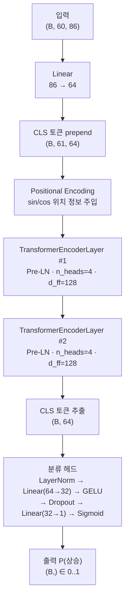

#### Multi-Head Self-Attention 상세

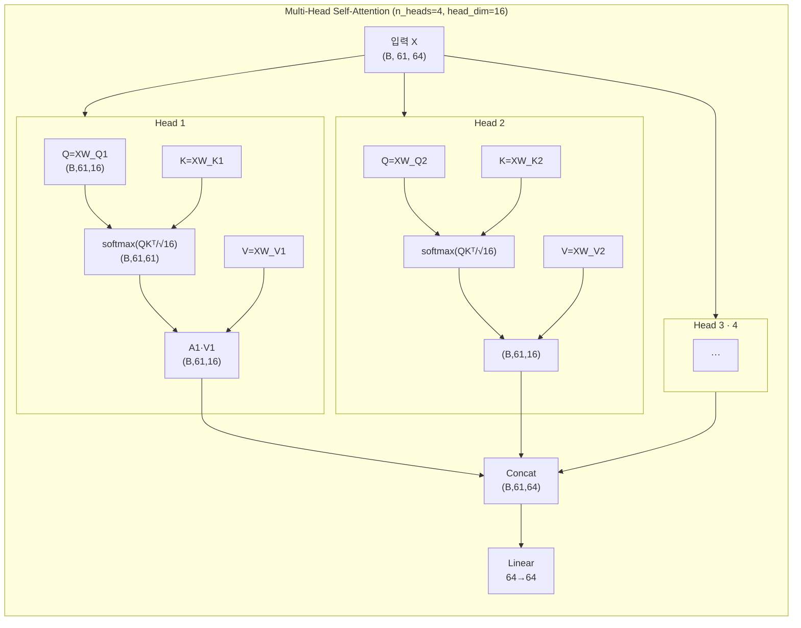

> **각 헤드가 보는 것**: head_dim=16짜리 부분 공간에서 독립적인 attention 패턴을 학습한다.  
> - Head 1 → 단기 모멘텀 패턴  
> - Head 2 → 중기 추세 전환 패턴  
> - Head 3 → 변동성 클러스터  
> - Head 4 → 장거리(오전↔오후) 관계  
> (실제 전문화는 학습 결과에 따라 달라짐)

#### TransformerEncoderLayer 내부 (Pre-LN)

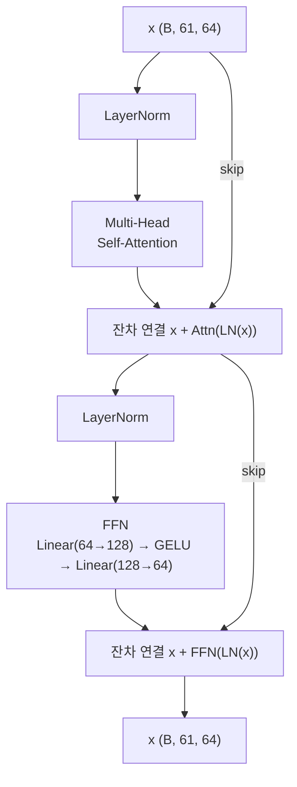

> **Pre-LN (norm_first=True)**: LayerNorm을 attention/FFN **앞**에 적용한다.  
> Post-LN 대비 gradient 흐름이 안정적이어서 learning rate를 높여도 발산하지 않는다.

#### Positional Encoding 수식

```
PE(pos, 2i)   = sin(pos / 10000^(2i/64))
PE(pos, 2i+1) = cos(pos / 10000^(2i/64))

pos: 0 ~ 60 (시퀀스 위치)
  i: 0 ~ 31 (d_model/2 쌍)
```

> 낮은 차원(i≈0): 고주파 → 인접 봉 구별  
> 높은 차원(i≈31): 저주파 → 전체 시퀀스 내 위치 구별

#### Transformer 장단점 요약

| 구분 | 내용 |
|---|---|
| ✅ 안정적 수렴 | Pre-LN + AdamW로 gradient 소실 없이 학습 |
| ✅ 경량 | 파라미터 74,817개. 10k 서브샘플도 소화 |
| ✅ 장거리 의존성 | 임의 두 타임스텝 직접 연결 |
| ❌ O(L²) 비용 | seq_len=120이면 연산량 4배 |
| ❌ 국소 패턴 약 | 1봉=1토큰 → 연속 캔들 군집 명시적 포착 불가 |
| ❌ val_acc 81.6% | PatchTST 대비 낮음 (10k 서브샘플 기준) |

---

### 8.2 PatchTST (`patch_tst_model.py` → `PatchTSTModel`)

#### 패치 토큰화 개념도

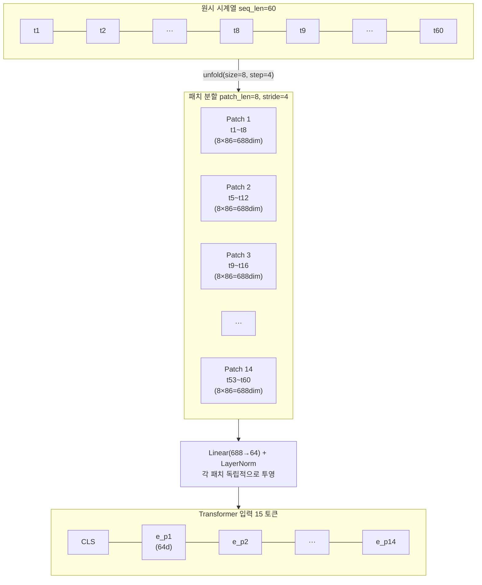

> **50% 겹침(stride=4)**의 역할:  
> `t5~t8`은 Patch 1과 Patch 2 모두에 포함된다.  
> 겹침이 없으면(stride=8) 패치 경계(t8↔t9)에서 연속 패턴이 잘릴 수 있다.

#### PatchTST 전체 아키텍처 흐름

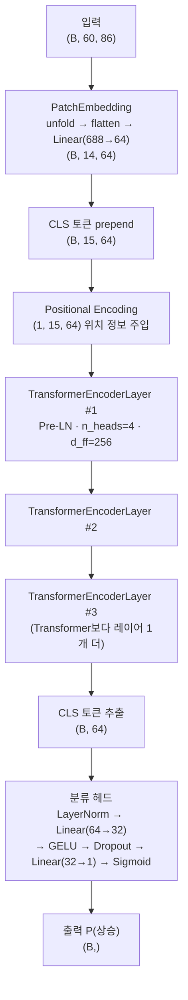

#### PatchEmbedding 내부 연산

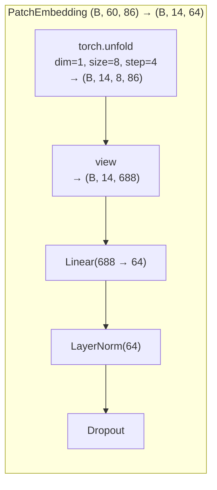

#### Attention 비용 비교

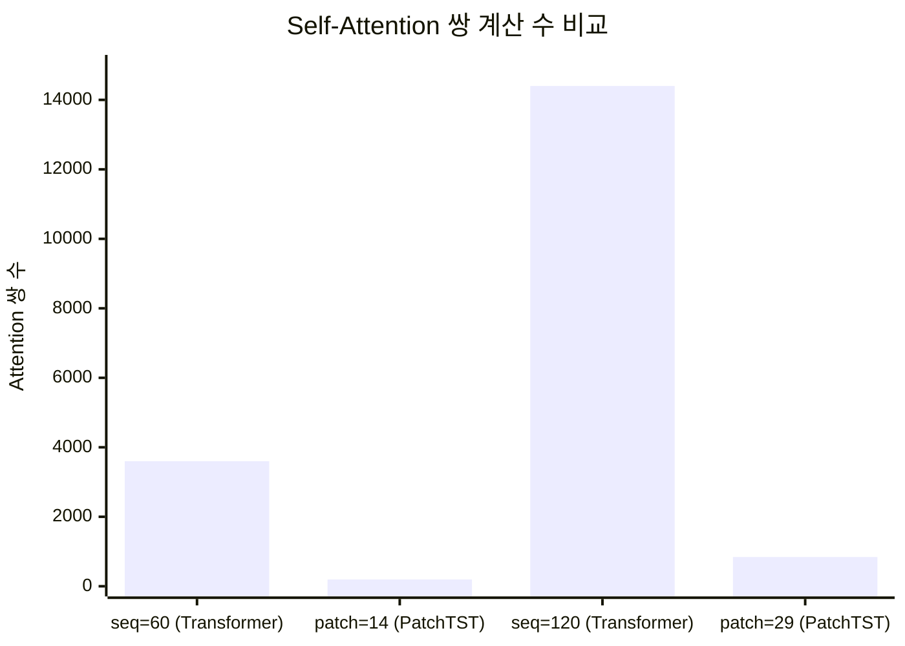

> seq_len=60 기준: Transformer 3,600쌍 vs PatchTST 196쌍 → **18.4배 절감**

#### pooling 방식 비교 (3가지 옵션)

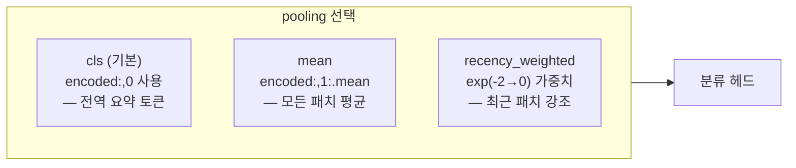

#### PatchTST 장단점 요약

| 구분 | 내용 |
|---|---|
| ✅ 최고 성능 | val_acc 92.2% (10k 서브샘플) |
| ✅ 국소 패턴 | 8분 캔들 군집을 패치로 명시적 포착 |
| ✅ 연산 절감 | O((L/P)²) — seq 확장 시 Transformer 대비 유리 |
| ✅ 노이즈 억제 | 패치 내 스무딩으로 틱 노이즈 감쇄 |
| ❌ 파라미터 多 | 196,481개 — 소규모 데이터 과적합 주의 |
| ❌ 메모리 | batch_size=128 제한 (내부 텐서 大) |
| ❌ 초단기 패턴 | 1~3봉 패턴은 패치 내에서 희석 |

---

### 8.3 TFT (`tft_model.py` → `TemporalFusionTransformer`)

#### 입력 분류 구조

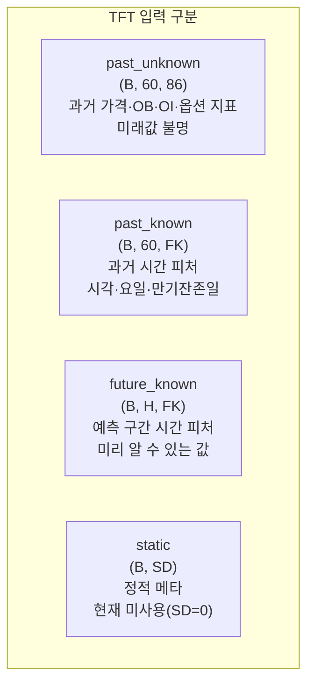

> **왜 입력을 나누는가?**  
> OI나 OB는 미래에 어떻게 변할지 알 수 없는 **과거 미지 변수**지만,  
> "지금이 만기 3일 전 15:00"라는 사실은 예측 구간에도 **미리 알 수 있다**.  
> TFT는 이 차이를 모델 구조에서 명시적으로 분리하여 활용한다.

#### 전체 7단계 forward 흐름

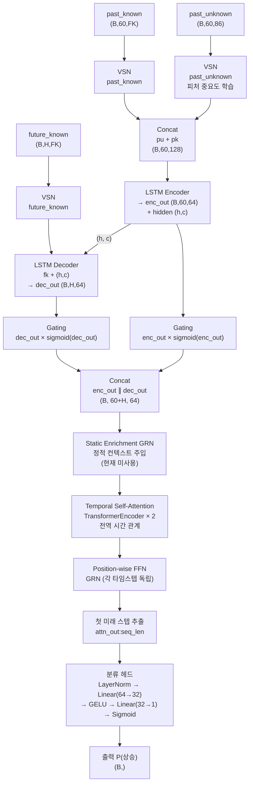

#### Variable Selection Network (VSN) 상세

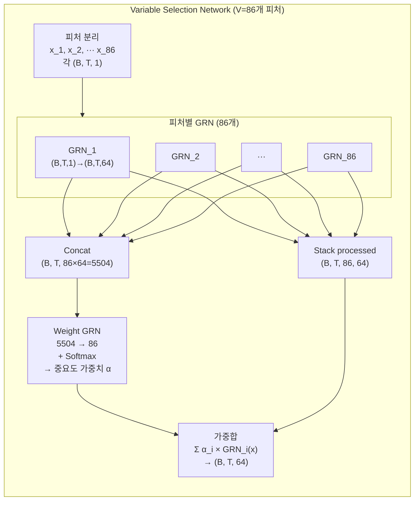

> **α_i (중요도 가중치)**가 학습되면 VSN은 사후에 "이번 예측에서 OI가 얼마나 중요했나"를 수치로 보여준다. 이는 TFT의 핵심 해석 가능성(interpretability)이다.

#### Gated Residual Network (GRN) 상세

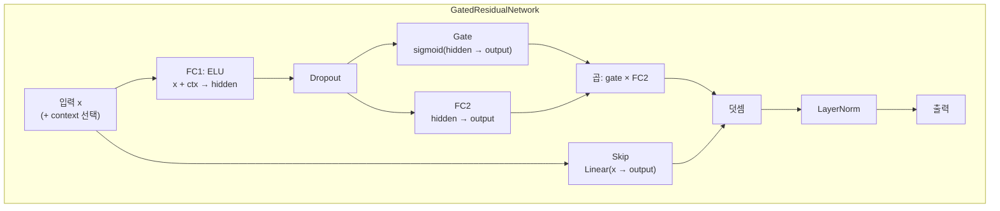

> **gate(sigmoid)**가 0에 가까우면 FC2 출력을 차단하고 skip 경로만 통과시킨다.  
> 금융 피처처럼 노이즈가 많은 입력에서 불필요한 정보를 자동으로 억제하는 핵심 메커니즘이다.

#### LSTM Encoder-Decoder 역할 분담

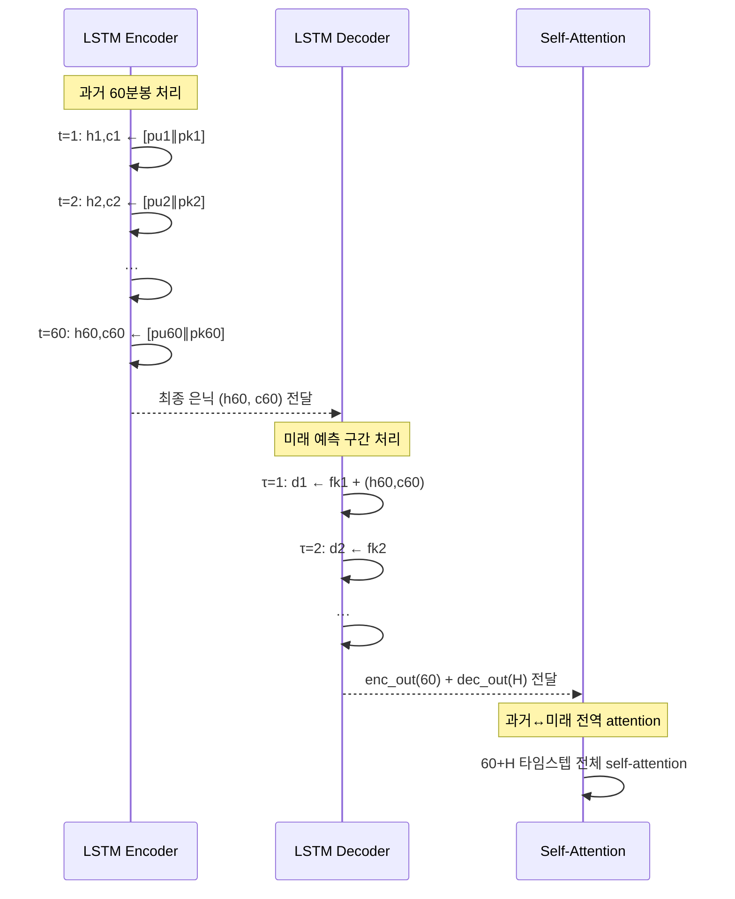

> LSTM이 **단기 순서 패턴**을 포착하고, 이후 Attention이 **전역 장거리 관계**를 추가 처리하는 역할 분담 구조다.

#### TFT 장단점 요약

| 구분 | 내용 |
|---|---|
| ✅ 피처 해석 | VSN 가중치로 기여 피처 사후 분석 가능 |
| ✅ 미래 변수 활용 | future_known(만기일, 시간대)을 디코더에 직접 주입 |
| ✅ 노이즈 강건 | GRN gate가 레이어마다 불필요 정보 차단 |
| ✅ 역할 분담 | LSTM(단기) + Attention(장거리) 이중 구조 |
| ❌ 구조 복잡 | 7단계 + GRN/VSN 중첩 → 디버깅 난이도 高 |
| ❌ 훈련 비용 | 파라미터 多, 훈련 시간 가장 긴 편 |
| ❌ 입력 형식 상이 | past/future/static 3종 분리 필요 → predictor.py 별도 처리 |
| ❌ static 미활성 | 현재 SD=0 → TFT 강점 일부 미사용 |

---

### 8.4 Mamba (`mamba_model.py` → `MambaModel`)

#### SSM 수식 전개

**연속 시간 상태 방정식에서 출발**

```
연속:
  h'(t) = A · h(t) + B · x(t)          # 상태 전이
  y(t)  = C · h(t) + D · x(t)          # 출력

이산화 (ZOH, Zero-Order Hold):
  Ā = exp(Δ · A)                        # 이산 상태 전이
  B̄ = Δ · B                            # 이산 입력 (근사)

재귀식:
  h_t = Ā_t · h_{t-1} + B̄_t · x_t    # 상태 갱신
  y_t = C_t · h_t + D · x_t            # 출력
```

> **핵심 — 선택성(Selectivity)**:  
> 기존 SSM은 A·B·C가 입력과 무관한 고정값이다.  
> Mamba는 A·B·C·Δ가 **입력 x_t에 따라 동적으로 결정**된다.  
> → "지금 이 봉이 중요한가?"를 모델이 스스로 판단하여 기억/망각을 조절한다.

#### Mamba 전체 아키텍처 흐름

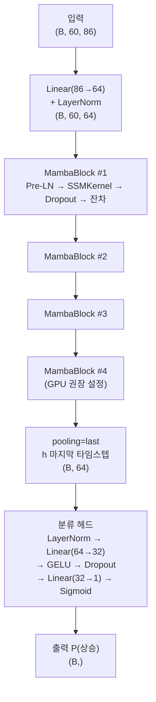

#### MambaBlock 내부

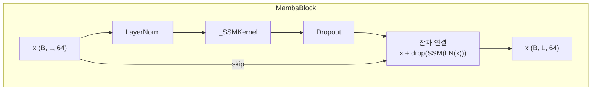

#### _SSMKernel 내부 상세

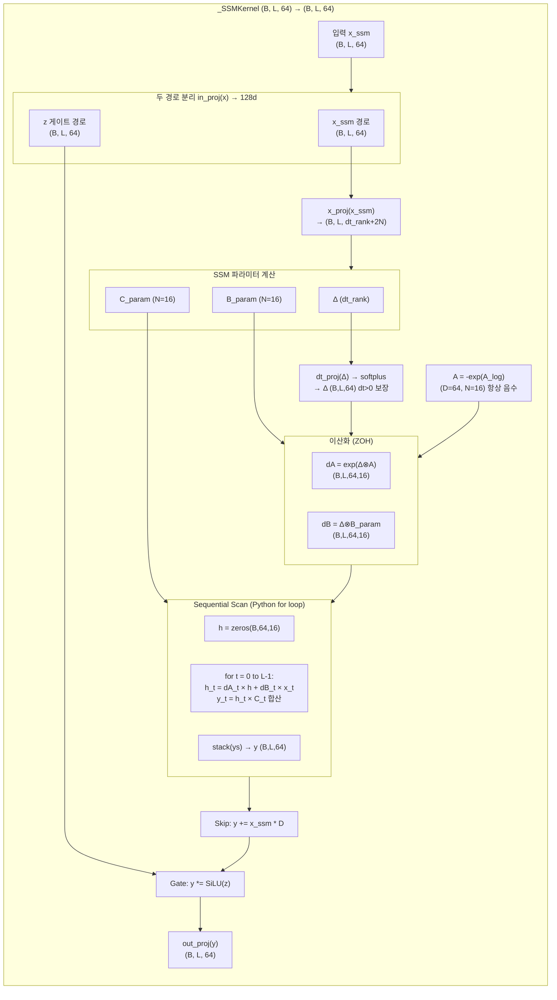

#### Sequential Scan vs Parallel Scan

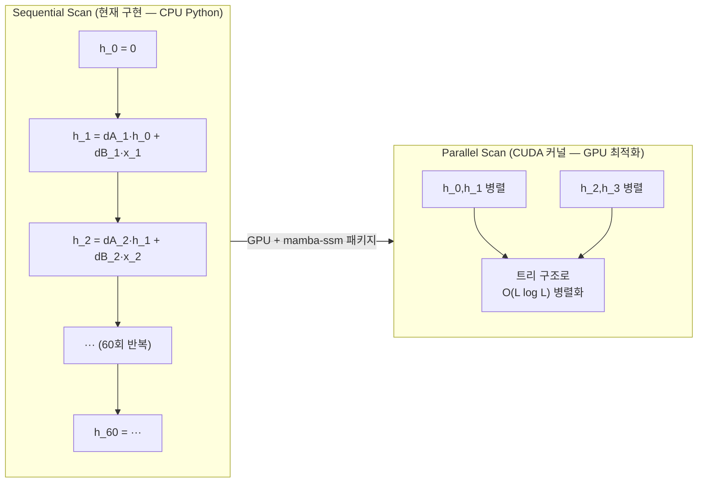

> 현재 구현은 Sequential Scan이므로 **CPU에서 1 epoch = 61초**. GPU + CUDA 커널 사용 시 수십 배 빨라진다.

#### 복잡도 비교

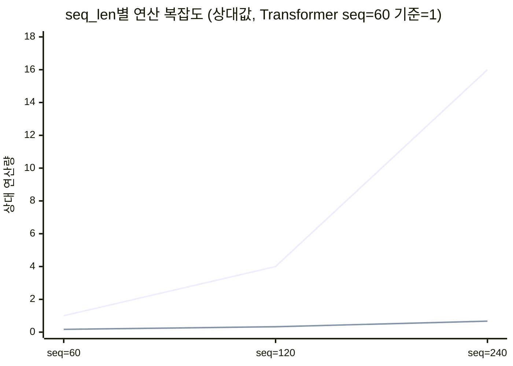

> 위 선: Transformer O(L²)  /  아래 선: Mamba O(L)  
> seq_len=240 기준 Mamba의 연산량은 Transformer의 1/24

#### `pooling=last` 가 자연스러운 이유

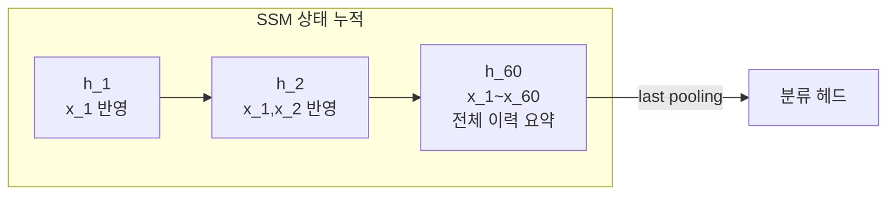

> h_60은 재귀적으로 t=1부터 t=60까지 모든 정보를 누적한 상태다.  
> CLS 토큰이나 평균 풀링 없이도 마지막 상태 하나가 전체 시퀀스를 요약한다.

#### Mamba 장단점 요약

| 구분 | 내용 |
|---|---|
| ✅ O(L) 복잡도 | seq_len=240에서도 선형 비용 |
| ✅ 경량 | 파라미터 72,449개 — 4개 중 가장 적음 |
| ✅ 장기 기억 | 은닉 상태로 4시간(240봉) 이력 압축 가능 |
| ✅ 선택적 기억 | 입력 기반 동적 A·B·C → 중요 시점 자동 강조 |
| ❌ GPU 필수 | Python sequential scan → CPU 1 epoch=61초 |
| ❌ 단방향 | 인과 구조 → bidirectional attention 불가 |
| ❌ 미검증 | 현재 훈련 미완 — 실전 성능 수치 없음 |
| ❌ 디버깅 어려움 | SSM 상태 내부가 블랙박스화 |

---

### 8.5 4개 모델 앙상블 구조

#### 앙상블 흐름

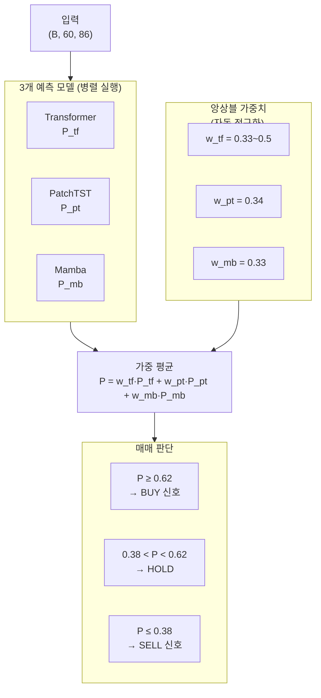

#### 모델별 특화 영역

```mermaid
quadrantChart
    title 모델별 강점 영역
    x-axis "국소 패턴 포착력" --> "전역/장기 패턴"
    y-axis "구조 단순" --> "구조 복잡"
    quadrant-1 복잡·전역
    quadrant-2 복잡·국소
    quadrant-3 단순·국소
    quadrant-4 단순·전역
    Transformer: [0.75, 0.25]
    PatchTST: [0.55, 0.45]
    TFT: [0.65, 0.9]
    Mamba: [0.8, 0.35]
```

#### 종합 비교표

| 항목 | Transformer | PatchTST | TFT | Mamba |
|---|---|---|---|---|
| **기반 기술** | Self-Attention | Patch + Attn | LSTM + VSN + Attn | SSM 재귀 |
| **Attention 복잡도** | O(L²) | O((L/P)²) | O(L²)+O(L) | **O(L)** |
| **파라미터 수** | 74,817 | 196,481 | 중간~대형 | 72,449 |
| **val_acc (10k)** | 81.6% | **92.2%** | 미측정 | 미측정 |
| **국소 캔들 패턴** | 약 | **강** (패치) | 중 (LSTM) | 중 (상태) |
| **장기 의존성** | 강 | 강 | **최강** | 강 |
| **피처 해석** | ✗ | ✗ | **✓ VSN** | ✗ |
| **미래 변수 주입** | ✗ | ✗ | **✓** | ✗ |
| **긴 seq_len** | 불리 | 보통 | 불리 | **최적** |
| **GPU 필요** | 불필요 | 불필요 | 불필요 | **필수** |
| **pooling 방식** | cls | cls/mean/rw | first_future | last |
| **현재 상태** | ✅ 운용 중 | ✅ 최고 성능 | ⚠️ 미훈련 | ⚠️ GPU 필요 |
