# Adaptive ZigZag 피봇 로직 상세 문서

> 대상 코드: `kospi_indicators/kospi_indicators/adaptive_zigzag.py`, `views/charts/UnifiedTA.py`,  
> `views/charts/technical_analysis.py`, `services/kospi_adaptive_zz_confirm.py`, `services/kospi_zz_rth_slice.py`  
> 최종 수정: Patch_TST (FIX-1~8, P-FIX-A/C 포함)

---

## 1. 전체 구조 개요

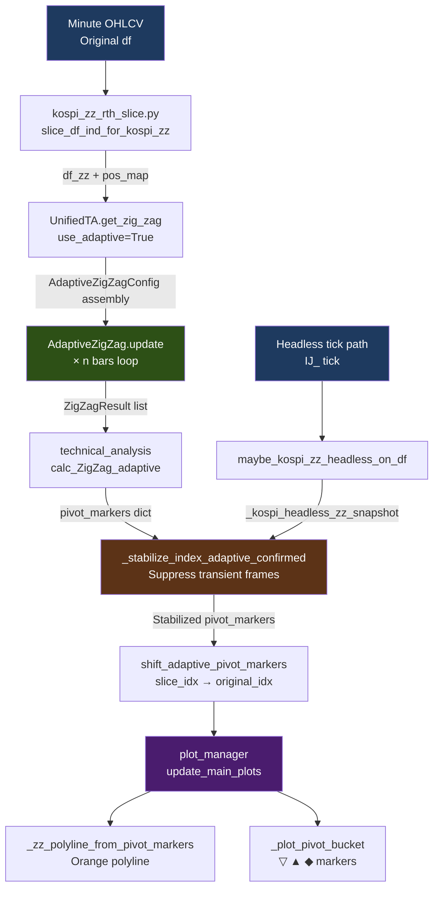

---

## 2. 세션 슬라이스 (`kospi_zz_rth_slice.py`)

ZigZag 엔진은 **정규 거래 시간 구간만** 입력으로 받습니다. 프리마켓·장외 구간을 포함하면 스윙 기준이 왜곡됩니다.

| 종목 | 슬라이스 시작 | 슬라이스 종료 |
|------|-------------|-------------|
| KOSPI (001) | 09:00 KST | 15:30 KST |
| KP200 (선물) | 08:45 KST | 15:30 KST |
| 옵션 | 08:45 KST | 15:30 KST |

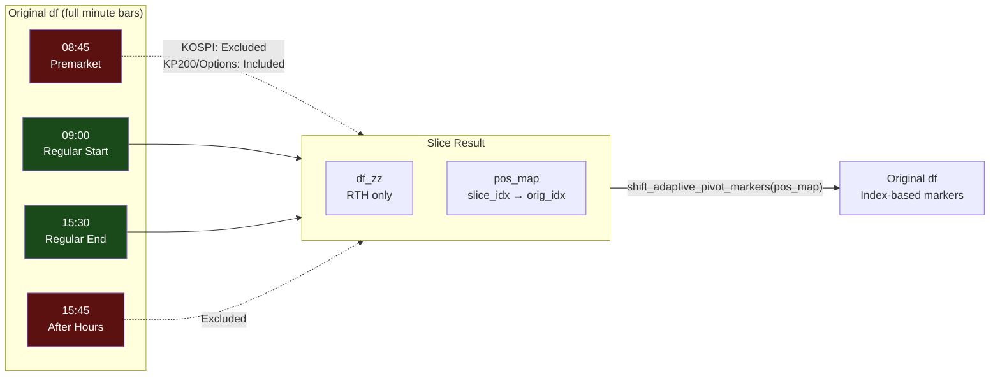

슬라이스 함수 `slice_df_ind_for_kospi_zz()`는 슬라이스된 `df_zz`와 함께 **`pos_map`** (슬라이스 idx → 원본 df idx 매핑 배열)을 반환합니다. 피봇 마커를 차트 전체 인덱스로 다시 변환할 때 이 매핑을 사용합니다 (`shift_adaptive_pivot_markers()`).

> **config.ini 연관 파라미터 없음** — 세션 시간은 하드코딩됨.  
> `MARKET_OPEN_TIME` 설정은 차트 Open 보정(`_fix_index_minute_open`)에만 영향.

---

## 3. 파라미터 상세

### 3-1. `AdaptiveZigZagConfig` (엔진 레벨)

`kospi_indicators/kospi_indicators/adaptive_zigzag.py`에 정의된 dataclass.

| 파라미터 | 기본값 | 역할 |
|----------|--------|------|
| `atr_period` | `14` | ATR 계산 기간 (Wilder RMA). 차트 경로는 `10` 고정. |
| `er_period` | `10` | Efficiency Ratio 계산 기간. ER = `|종가 변화량| / Σ|봉간 변화량|`. 추세 강도 지수. |
| `atr_multiplier` | `1.5` | 기준 ATR 배수. `get_zig_zag()`에서 `atr_mult`로 동적 재산출. |
| `atr_multiplier_min` | `1.0` | ER이 0일 때(횡보) 적용할 최소 ATR 배수. |
| `atr_multiplier_max` | `4.0` | ER이 1일 때(강추세) 적용할 최대 ATR 배수. |
| `pivot_threshold_min_pct` | `0.3` | 피봇 임계값 하한 (%). 아무리 작은 ATR이어도 최소 0.3% 이상이어야 방향 전환을 인정. |
| `pivot_threshold_max_pct` | `3.0` | 피봇 임계값 상한 (%). 아무리 큰 ATR이어도 3% 초과로 올라가지 않음. |
| `confirmation_bars` | `2` | **피봇 확정 대기 봉 수.** `config.ini` → `ADAPTIVE_ZZ_CONFIRMATION_BARS`로 오버라이드. |
| `freeze_on_confirm` | `True` | **확정 대기 중 가격 갱신 차단 여부.** `True`이면 후보 등록 시점 가격이 확정 가격이 됨. `config.ini` → `ADAPTIVE_ZZ_FREEZE_ON_CONFIRM`. |
| `major_swing_ratio` | `2.0` | 이전 스윙 대비 ATR 배수 초과 시 주요 스윙(is_major=True)으로 분류. |
| `max_swings` | `20` | 보관할 최대 스윙 포인트 수. 초과 시 오래된 것부터 삭제. |
| `min_wave_bars` | `5` | 직전 스윙 확정 후 최소 경과 봉 수. 단타 등락에 의한 과도한 스윙 발생 억제. 봉 수 < 80이면 `1`로 완화. |
| `min_wave_pct` | `0.0` | 파동 크기의 최소 % 조건. 0이면 비활성. |
| `max_wait_bars` | `0` | **후보 자동 취소 봉 수.** 0이면 무제한 대기. >0이면 해당 봉 수 경과 후 자동 취소. |
| `structure_lookback_swings` | `8` | 시장 구조(상승/하락/횡보) 분석에 사용할 최근 스윙 수. |
| `structure_points` | `3` | 구조 판단에 필요한 최소 고점/저점 수. |
| `fib_ratios` | `[0.236, 0.382, 0.5, 0.618, 0.786, 1.0, 1.272, 1.618]` | 피보나치 계산 비율 목록. |
| `cluster_tolerance_pct` | `0.3` | S/R 클러스터링 허용 오차 (%, 현재 미사용). |
| `zz_log_chart_key` | `None` | KOSPI 엔진 상세 로그 활성화 키. `"001"` 또는 `"KOSPI"` 설정 시 로그 활성화. |
| `zz_log_fn` | `None` | 로그 출력 콜백 (`view.log_message`). |
| `zz_idx_to_time_fn` | `None` | 봉 idx → HH:MM 변환 함수 (로그용). |
| `zz_status_fn` | `None` | UI 상태바 업데이트 콜백. |

### 3-2. `config.ini` / `settings.py` 제어 파라미터

| config.ini 키 | settings.py 변수 | 기본값 | 유효 범위 | 역할 |
|---------------|-----------------|--------|-----------|------|
| `ADAPTIVE_ZZ_CONFIRMATION_BARS` | `ADAPTIVE_ZZ_CONFIRMATION_BARS` | `1` | `0~10` | 후보 피봇이 확정되기까지 대기할 봉 수. **0이면 즉시 확정** (리페인팅 없음 대신 노이즈 감수). 1~2 권장. |
| `ADAPTIVE_ZZ_FREEZE_ON_CONFIRM` | `ADAPTIVE_ZZ_FREEZE_ON_CONFIRM` | `ON` | `ON/OFF` | `ON`이면 후보 등록 시점 가격으로 확정 (피봇 위치 고정). `OFF`이면 대기 중 신고점/신저점이 오면 가격·인덱스 갱신. |
| `ADAPTIVE_ZZ_EXCLUDE_LAST_BAR_LIVE` | `ADAPTIVE_ZZ_EXCLUDE_LAST_BAR_LIVE` | `ON` | `ON/OFF` | 라이브 모드에서 엔진 입력 끝부분에서 미완성 봉을 제외할지 여부. `ON` 권장. |
| `ADAPTIVE_ZZ_EXCLUDE_LAST_OPEN_BARS` | `ADAPTIVE_ZZ_EXCLUDE_LAST_OPEN_BARS` | `1` | `1~5` | 제외할 봉 수. **1 권장** — 현재 형성 중인 마지막 봉(`N-1`)만 제외. 2 이상은 확정된 완성 봉(`N-2`)까지 제외해 피봇 위치가 1봉 지연되고 `CONFIRMATION_BARS=1`과 충돌하므로 비권장. |

### 3-3. `get_zig_zag()` 내 동적 파라미터 계산

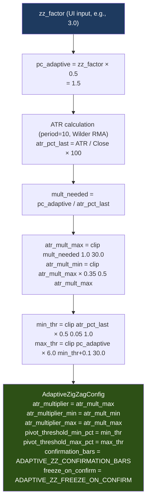

**`zz_factor`가 클수록 스윙 임계값이 커져 피봇 수가 줄어듭니다** (더 큰 파동만 잡음).

---

## 4. 임계값 계산 상세 (`_calc_threshold_pct`)

스윙 방향 전환을 인정하기 위한 최소 가격 변동 비율을 봉마다 동적으로 계산합니다.

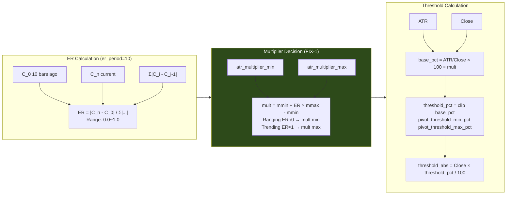

**직관적 해석:**
- 횡보장(ER≈0): mult 최소 → 임계값 낮음 → 작은 파동도 스윙으로 잡음
- 추세장(ER≈1): mult 최대 → 임계값 높음 → 큰 파동만 인정, 노이즈 제거

---

## 5. 피봇 상태 머신 (`update()`)

### 5-1. 매 봉 실행 순서

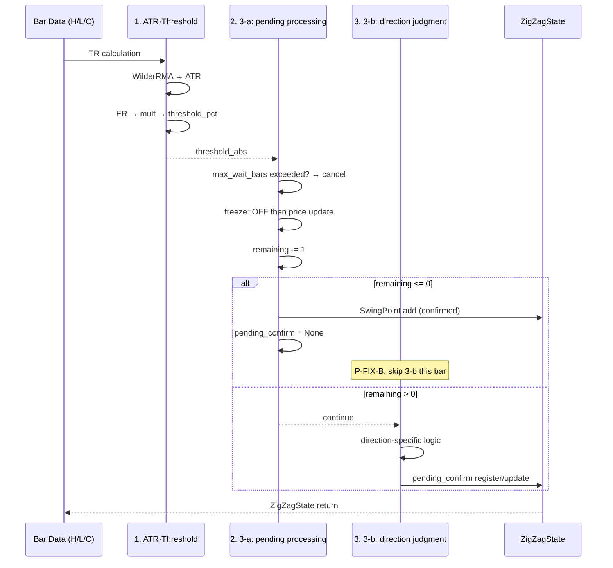

### 5-2. `_pending_confirm` 처리 상세 (3-a)

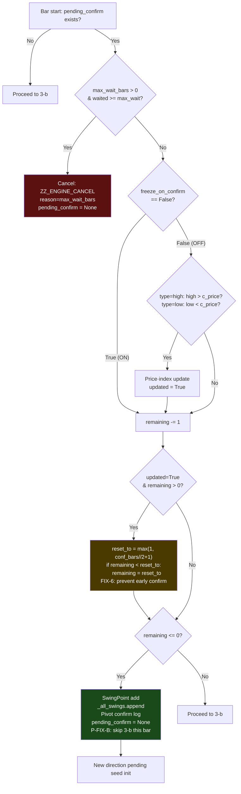

### 5-3. 방향 결정 / 전환 (3-b)

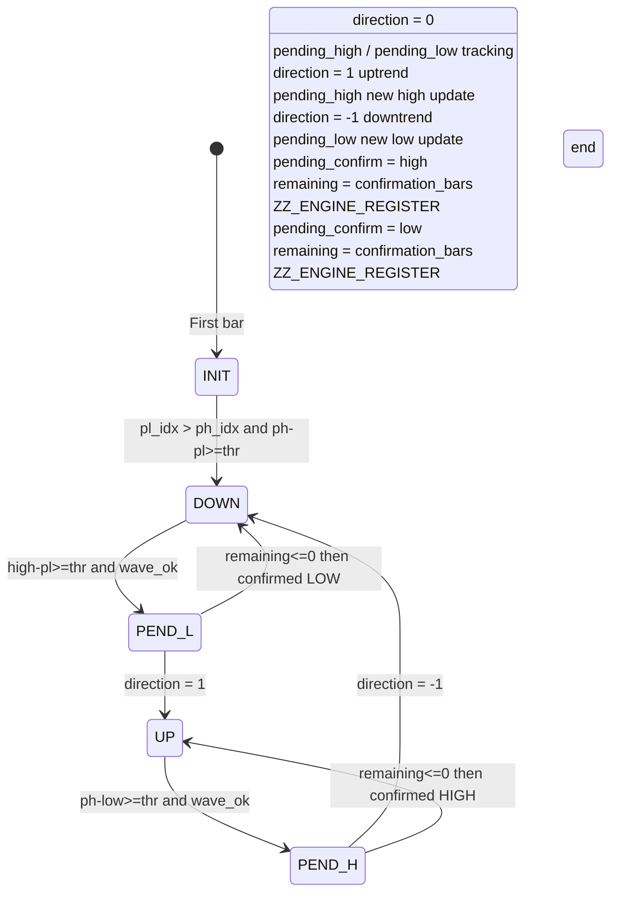

### 5-4. 파동 길이 조건 (`_is_wave_length_ok`)

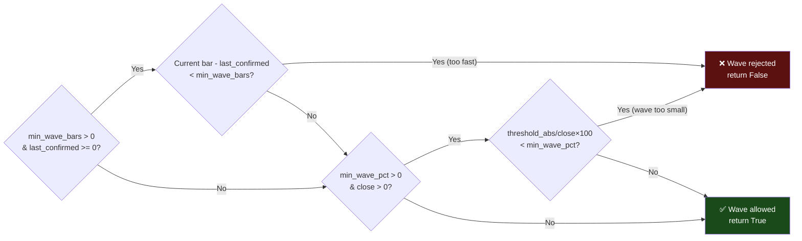

---

## 6. `pivot_markers` 딕셔너리 구조

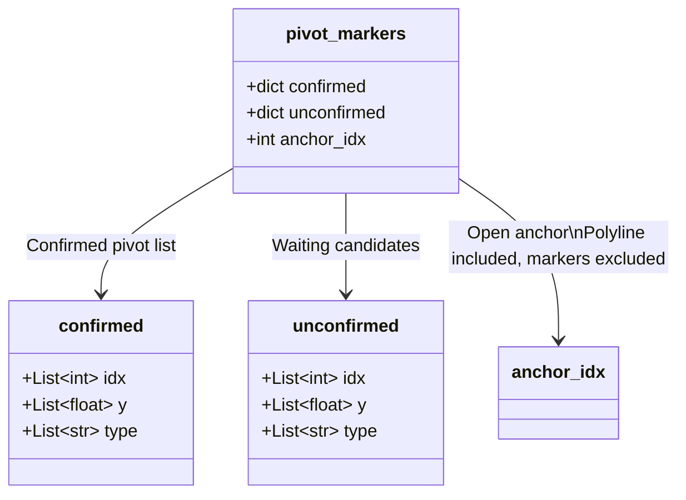

```python
pivot_markers = {
    "confirmed": {
        "idx":  [int, ...],   # 슬라이스된 df 기준 iloc 인덱스
        "y":    [float, ...], # 피봇 가격
        "type": [str, ...],   # "H" 또는 "L"
    },
    "unconfirmed": {
        "idx":  [int, ...],   # 현재 대기 중인 후보 인덱스
        "y":    [float, ...],
        "type": [str, ...],
    },
    "anchor_idx": int,        # 시가 앵커 피봇의 idx
}
```

**`anchor_idx`**: `confirmed` 버킷이 비어있고 `unconfirmed`가 1개뿐일 때 `_inject_open_anchor_pivot()`이 시가를 앵커 피봇으로 주입합니다. 폴리라인 시작점 역할이며, 마커(▽▲)는 표시하지 않습니다.

---

## 7. 피봇 안정화 로직 (`kospi_adaptive_zz_confirm.py`)

### `_stabilize_index_adaptive_confirmed()`

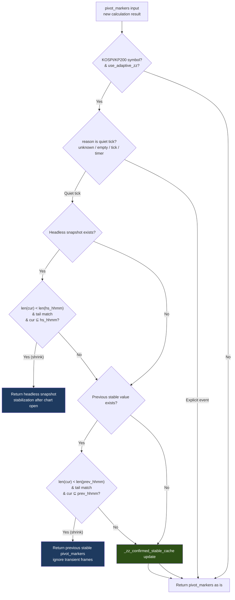

### 헤드리스 ZZ 스냅샷 흐름

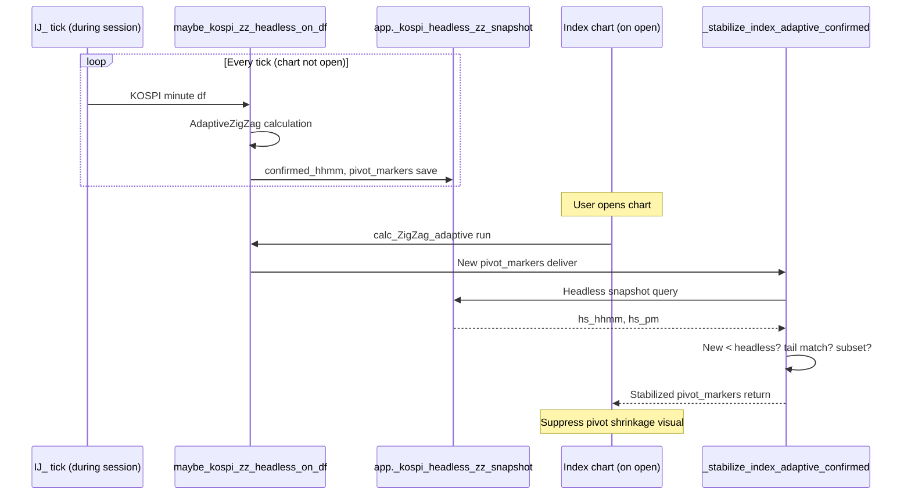

---

## 8. 차트 렌더 흐름 (`plot_manager.py`)

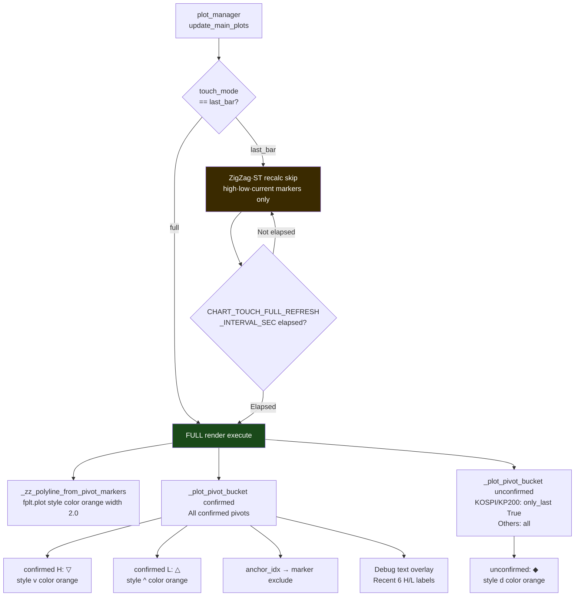

---

## 9. 주요 버그 수정 이력

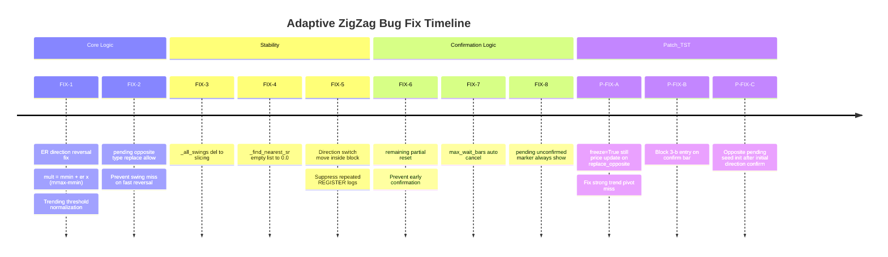

| 코드 | 내용 | 영향 |
|------|------|------|
| **FIX-1** | ER 방향 역전 수정: `mult = mmin + er*(mmax-mmin)` | 추세장에서 임계값이 정상적으로 커짐 |
| **FIX-2** | `pending_confirm` 반대 타입이면 교체 허용 | 빠른 반전 시 스윙 누락 방지 |
| **FIX-3** | `_all_swings` 관리: del → 슬라이싱 재할당 | 코드 명확성 개선 |
| **FIX-4** | `_find_nearest_sr` 빈 리스트 → 0.0 반환 | downstream > 0 체크로 처리 가능 |
| **FIX-5** | 방향 전환·pending 리셋을 신규 후보 등록 블록 안으로 이동 | 동일 타입 반복 REGISTER 로그 억제 |
| **FIX-6** | 신고점/신저점 갱신 시 remaining 부분 리셋 | 마지막 봉 신고점에 의한 조기 확정 방지 |
| **FIX-7** | `max_wait_bars`: 오래된 pending 자동 취소 | 장기 대기 후보 처리 |
| **FIX-8** | `_pending_confirm`이 있으면 항상 unconfirmed 마커 표시 | 워밍업 이후 unconfirmed 마커 누락 수정 |
| **P-FIX-A** | `freeze_on_confirm=True`여도 `replace_opposite` 시 가격 갱신 후 재등록 | 강추세에서 낮은 고점이 확정되는 피봇 누락 수정 |
| **P-FIX-B** | 3-a 확정 봉에서 3-b 진입 차단 | 확정+즉시 재등록 혼재 방지 |
| **P-FIX-C** | 초기 방향 확정 후 반대 방향 pending을 현재 봉 H/L로 초기화 | `_pending_high=0.0`/`_pending_low=inf` 기준 오작동 수정 |

---

## 10. 로그 레퍼런스

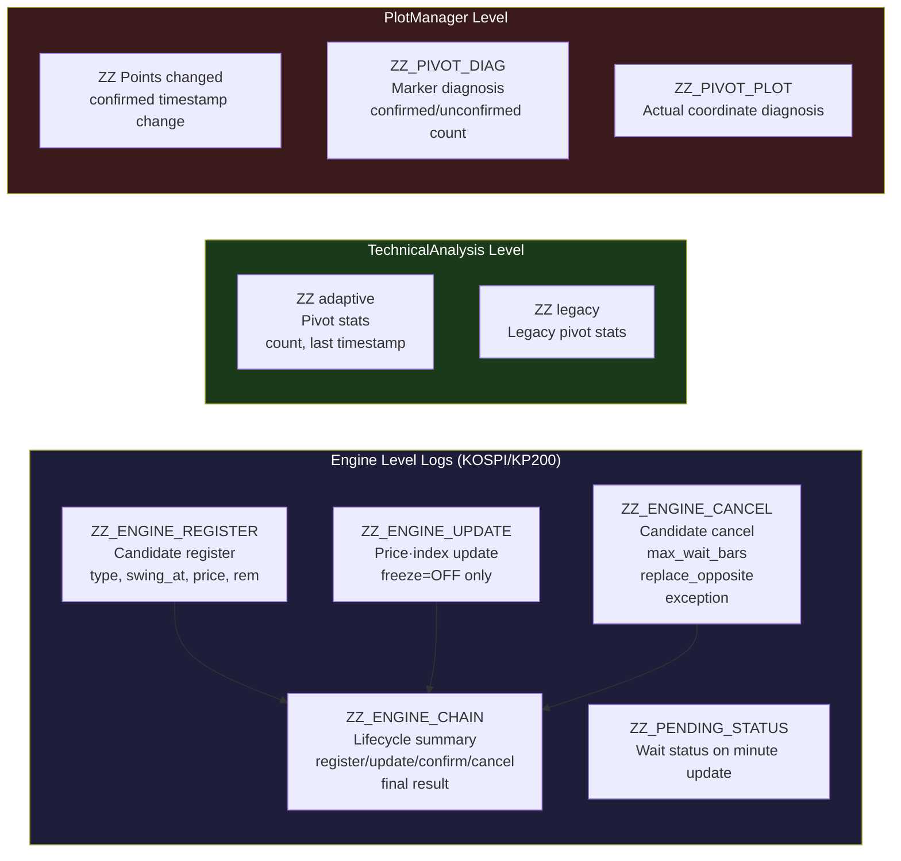

> **KOSPI 엔진 로그 활성화 조건**: `zz_log_chart_key`에 `"001"` 또는 `"KOSPI"` 설정 시. 차트에서는 심볼이 KOSPI/KP200일 때 `_wants_kospi_zz_engine_log()`가 True를 반환하면 활성화.

---

## 11. 설정 권장값 (운영 기준)

```ini
[SETTINGS]
# 확정 대기: 1봉. 0이면 즉시 확정으로 리페인팅 없음
ADAPTIVE_ZZ_CONFIRMATION_BARS = 1

# 후보 등록 시점 가격 고정. ON 권장 (피봇 위치 안정)
ADAPTIVE_ZZ_FREEZE_ON_CONFIRM = ON

# 마지막 미완성 봉 제외. ON 권장
ADAPTIVE_ZZ_EXCLUDE_LAST_BAR_LIVE = ON

# 제외 봉 수. 1 권장 — N-1(형성 중)만 제외. 2 이상은 확정 봉까지 제외해 피봇 1봉 지연 발생.
ADAPTIVE_ZZ_EXCLUDE_LAST_OPEN_BARS = 1
```

| UI `zz_factor` | 특성 | 용도 |
|----------------|------|------|
| 1.0~2.0 | 민감 (피봇 많음) | 단기 스캘핑, 세밀한 파동 추적 |
| 3.0~5.0 | 중간 (권장) | 일반 분봉 차트 |
| 6.0 이상 | 둔감 (피봇 적음) | 장기 추세 파악 |

---

## 12. 전체 데이터 흐름 다이어그램

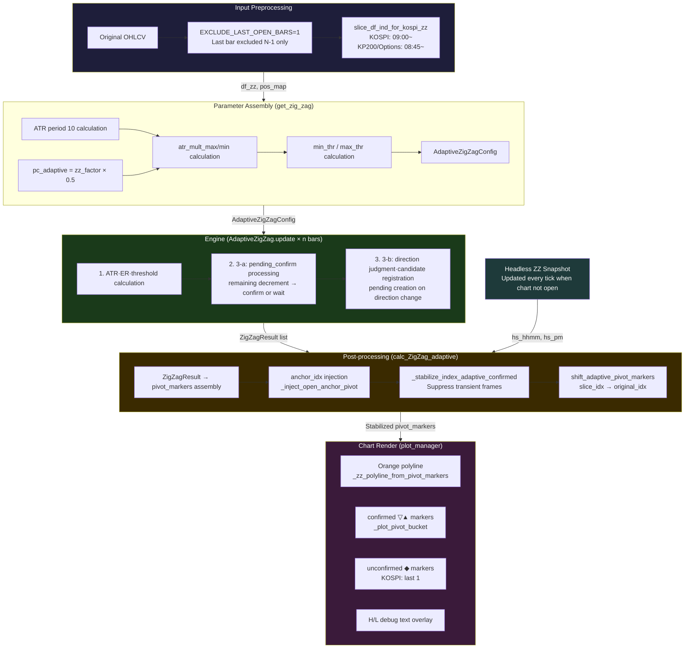
