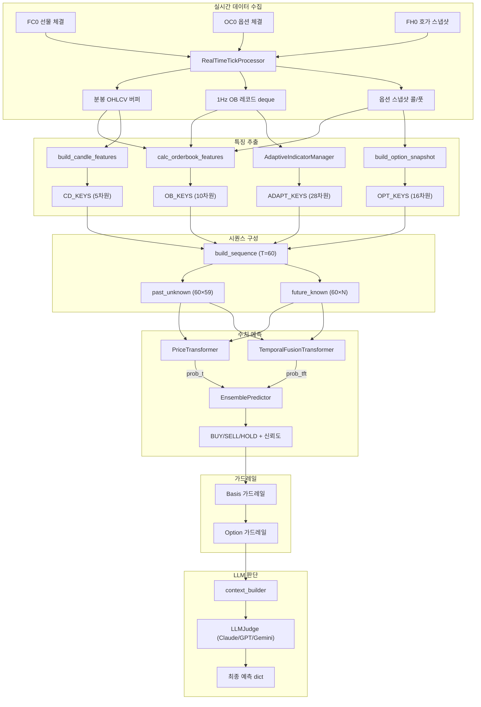
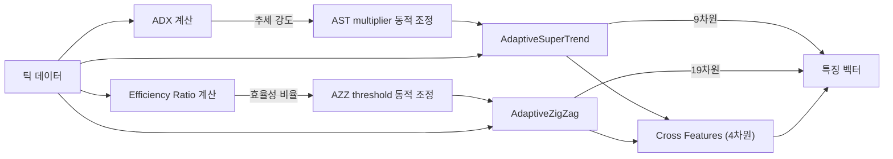
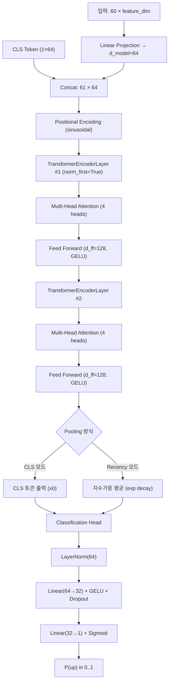
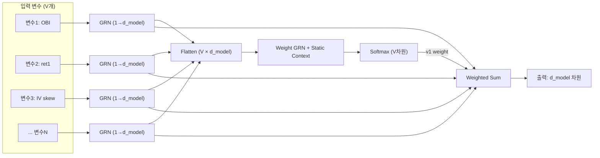
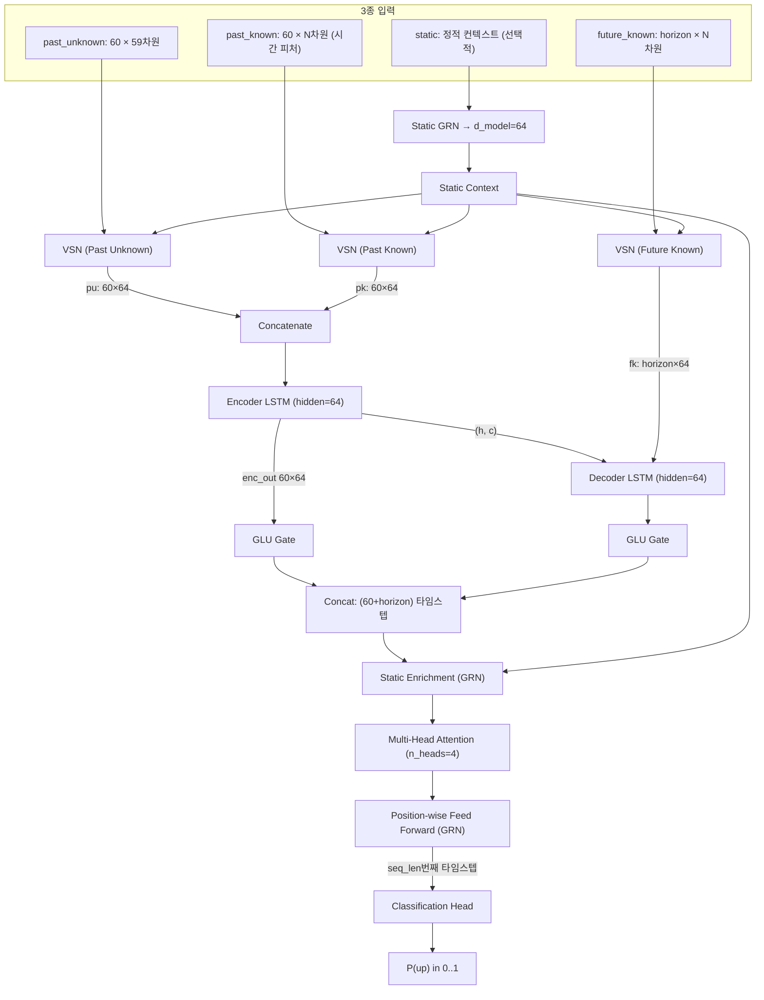
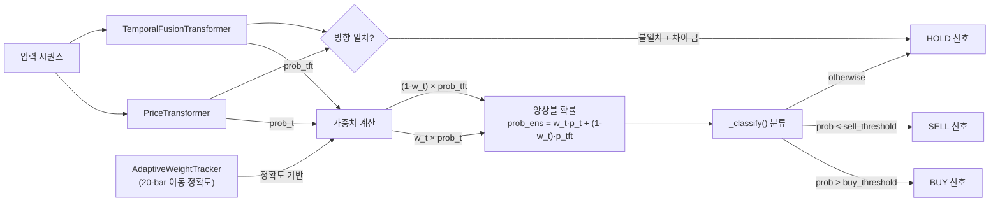
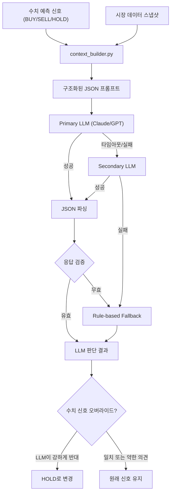
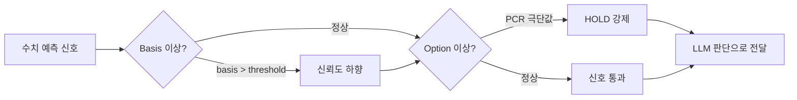
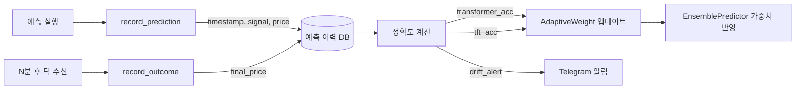

# KP200 Futures Prediction System
## AI 예측 알고리즘 기술 문서

> **버전**: 1.0 | **작성일**: 2026-03-02 | **대상 시스템**: SkyEbest Trading System  
> **범위**: Transformer · Temporal Fusion Transformer · LLM Ensemble

---

## 목차

1. [시스템 개요](#1-시스템-개요)
2. [특징 추출 (Feature Engineering)](#2-특징-추출-feature-engineering)
3. [PriceTransformer 모델](#3-pricetransformer-모델)
4. [Temporal Fusion Transformer (TFT)](#4-temporal-fusion-transformer-tft)
5. [앙상블 예측 시스템](#5-앙상블-예측-시스템)
6. [LLM 판단 시스템](#6-llm-판단-시스템-llmjudge)
7. [가드레일 시스템](#7-가드레일-시스템)
8. [기대 효과 및 성능 목표](#8-기대-효과-및-성능-목표)
9. [현황 및 개선 로드맵](#9-현황-및-개선-로드맵)
10. [예측 품질 모니터링](#10-예측-품질-모니터링)

---

## 1. 시스템 개요

SkyEbest 예측 시스템은 KP200 선물의 단기(5분) 방향성 예측을 목적으로 설계된 실시간 AI 앙상블 예측 플랫폼이다. 실시간 틱 데이터를 수신하여 Transformer 모델, Temporal Fusion Transformer(TFT) 모델, 그리고 대형 언어 모델(LLM) 판단을 통합하여 **BUY / SELL / HOLD** 신호와 신뢰도를 생성한다.

### 1.1 핵심 설계 원칙

| 원칙 | 내용 |
|------|------|
| **실시간성** | 1Hz OB(Order Book) 레코드 기반 실시간 특징 추출 |
| **앙상블** | Transformer + TFT 이중 수치 모델 + LLM 최종 판단 |
| **적응성** | 시장 국면(ADX, ER)에 따라 동적으로 지표 파라미터 조정 |
| **방어성** | Basis/Option 가드레일, Fallback 룰 기반 예측, Stale 데이터 경고 |
| **비용 효율** | LLM 호출 스로틀링, 적응형 앙상블 가중치 추적 |

### 1.2 전체 아키텍처



---

## 2. 특징 추출 (Feature Engineering)

예측 품질은 특징의 품질에 달려 있다. SkyEbest 시스템은 시장 미시구조(Market Microstructure), 기술적 분석(Technical Analysis), 옵션 파생지표의 3대 축을 결합한 다차원 특징 벡터를 구성한다.

### 2.1 특징 벡터 구성

| 블록 | 차원 | 주요 특징 | 역할 |
|------|------|-----------|------|
| **OB_KEYS** | 10 | OBI, spread, level1_ratio, bid/offer slope, totrem | 호가창 유동성 및 수급 불균형 |
| **CD_KEYS** | 5 | ret1, ret3, slope3, vol_accel, range_pct | 가격 모멘텀 및 변동성 |
| **OPT_KEYS_V1/V2** | 7 / 16 | PCR, IV skew, max pain, ATM microstructure (+ v2 micro-movement) | 옵션 시장 내재 정보 |
| **ADAPT_KEYS** | 28 | AST 9차원 + AZZ 19차원 + Cross 4차원 | 적응형 기술 지표 |
| **Time Features** | N | sin/cos 시간 인코딩 | 주기적 시장 패턴 |

> **주의(구현 상태)**:
> - `GEX`는 `build_option_snapshot()`에서 계산되어 옵션 스냅샷에 **추가 필드로 포함**되지만,
>   현재 `OPT_KEYS_V1/V2`에는 포함되어 있지 않아 **모델 입력 차원에는 반영되지 않습니다** (LLM 컨텍스트/모니터링 목적).
> - `OFI(ofi_1s/ofi_5s)` 및 `vwap_dev`는 `PredictionPipeline`에서 FC0 체결 기반으로 계산되어
>   `ModelInput.feature_snapshot`에 **추가 필드로만 포함**되며, 현재 `build_sequence()` 기반 시퀀스 입력에는 포함되지 않습니다.

### 2.2 OBI (Order Book Imbalance)

OBI는 시장의 수급 불균형을 실시간으로 포착하는 핵심 지표다. 5호가 총 매수잔량과 매도잔량의 차이를 전체 잔량으로 정규화하여 -1(완전 매도 우세)에서 +1(완전 매수 우세) 범위로 표현한다.

$$\text{OBI} = \text{clip}\left(\frac{\text{total\_bid} - \text{total\_offer}}{\max(\text{total\_bid} + \text{total\_offer},\ \varepsilon)},\ -1.0,\ 1.0\right)$$

```python
# 구현 예시
total = total_offer + total_bid
obi = np.clip((total_bid - total_offer) / max(total, 1e-9), -1.0, 1.0)
```

> **설계 포인트**: `np.clip` 적용으로 서킷브레이커 발동 시 한쪽 호가만 존재하는 극단 상황에서 +1/-1 포화값 방지

### 2.3 적응형 기술 지표 (Adaptive Indicators)

기존 고정 파라미터 지표의 한계를 극복하기 위해, **ADX**(Average Directional Index)와 **ER**(Efficiency Ratio)를 기반으로 시장 국면을 실시간 감지하고 지표 파라미터를 동적으로 조정한다.



#### 2.3.1 Adaptive SuperTrend (AST)

- ATR 승수(multiplier)를 ADX 기반으로 동적 조정: 강한 추세(ADX↑) → 승수↓(신호 민감도↑)
- 추세/횡보 국면 자동 전환 감지
- **출력 피처 (9차원)**: `direction`, `signal`, `upper_band`, `lower_band`, `trend_strength`, `atr_multiplier`, `adx`, `adx_di_diff`, `regime`

#### 2.3.2 Adaptive ZigZag (AZZ)

- 가격 되돌림 임계값을 Efficiency Ratio(ER)로 동적 조정
- ER↑(추세 강함) → 임계값↑(노이즈 필터 강화), ER↓(횡보) → 임계값↓(세밀한 전환 감지)
- **출력 피처 (19차원)**: peak/valley 레벨, 진폭, 추세 카운터, 피보나치 비율 등
- **Cross 피처 (4차원)**: AST와 AZZ의 상호작용 신호

---

## 3. PriceTransformer 모델

PriceTransformer는 2017년 Google이 제안한 *"Attention Is All You Need"* 아키텍처를 기반으로, 60초 시퀀스의 시장 특징으로부터 **5분 후 가격 상승 확률 P(up)** 을 예측하는 바이너리 분류 모델이다.

### 3.1 동작 원리

#### 3.1.1 Self-Attention 메커니즘

Self-Attention은 시퀀스 내 모든 타임스텝 간의 관계를 병렬로 계산한다. 특정 시점의 호가 불균형이 5초 전의 가격 모멘텀과 어떤 관계인지 자동으로 학습한다.

$$\text{Attention}(Q, K, V) = \text{softmax}\!\left(\frac{QK^\top}{\sqrt{d_k}}\right) V$$

| 기호 | 의미 |
|------|------|
| **Q** (Query) | 현재 타임스텝이 '무엇을 찾는가' |
| **K** (Key) | 각 타임스텝이 '무엇을 제공하는가' |
| **V** (Value) | 실제 정보 내용 |
| **√d_k** | 스케일링 팩터 (gradient 안정화) |

4개 헤드로 다양한 관점의 attention을 병렬 계산하는 **Multi-Head Attention** 구조를 사용한다.

#### 3.1.2 모델 아키텍처



#### 3.1.3 CLS 토큰 풀링

BERT에서 차용한 CLS(Classification) 토큰을 시퀀스 앞에 추가한다. Transformer가 전체 시퀀스 정보를 이 특수 토큰에 집약시키도록 학습되어, CLS 위치의 출력을 분류 헤드의 입력으로 사용한다.

대안으로 **Recency-Weighted Pooling**을 지원하여 최근 타임스텝에 더 높은 가중치(지수 감쇠)를 부여할 수 있다:

```python
# Recency-Weighted Pooling 구현
h = x[:, 1:, :]   # CLS 토큰 제외
t = h.size(1)
weights = torch.exp(torch.linspace(-2.0, 0.0, t, device=h.device))
weights = weights / (weights.sum() + 1e-9)
pooled = (h * weights.view(1, -1, 1)).sum(dim=1)
```

#### 3.1.4 Positional Encoding

Transformer는 순서 정보가 없으므로, sinusoidal 함수로 각 타임스텝의 위치 정보를 인코딩한다.

$$PE_{(pos,\ 2i)} = \sin\!\left(\frac{pos}{10000^{2i/d_{model}}}\right), \quad PE_{(pos,\ 2i+1)} = \cos\!\left(\frac{pos}{10000^{2i/d_{model}}}\right)$$

### 3.2 하이퍼파라미터

| 파라미터 | 값 | 의미 |
|----------|-----|------|
| `feature_dim` | `PAST_UNKNOWN_DIM` | 입력 특징 차원수 (≈59) |
| `d_model` | 64 | Transformer 내부 표현 차원 |
| `n_heads` | 4 | Multi-Head Attention 헤드 수 |
| `n_layers` | 2 | Transformer Encoder 레이어 수 |
| `d_ff` | 128 | Feed-Forward Network 내부 차원 |
| `seq_len` | 60 | 입력 시퀀스 길이 (초) |
| `dropout` | 0.1 | 정규화 드롭아웃 비율 |
| `pooling` | `cls` | 시퀀스 압축 방식 (`cls` / `recency_weighted`) |

---

## 4. Temporal Fusion Transformer (TFT)

TFT는 Google DeepMind가 2019년 발표한 시계열 예측 전용 Transformer 아키텍처로, **변수 선택(Variable Selection)**, **LSTM 시계열 처리**, **Multi-Head Attention**, **Gated Residual Network**를 계층적으로 결합한다. 단순 Transformer 대비 *"어떤 변수가 예측에 중요한가"* 를 해석 가능한 형태로 학습하는 것이 핵심 특징이다.

### 4.1 핵심 구성 요소

#### 4.1.1 Gated Residual Network (GRN)

TFT의 기본 구성 블록. GLU(Gated Linear Unit)로 정보 흐름을 선택적으로 제어하며, 잔차 연결(Skip Connection)로 학습 안정성을 확보한다.

```
h   = ELU( fc1( x ⊕ context ) )      # 비선형 변환
gate = σ( gate_layer(h) )              # 게이팅 (0~1)
out = LayerNorm( gate ⊙ fc2(h) + skip(x) )
```

| 기호 | 의미 |
|------|------|
| ⊕ | 입력과 정적 컨텍스트를 concatenate |
| ⊙ | element-wise 곱 (불필요한 정보 억제) |
| σ | Sigmoid 활성화 |
| skip | 입력/출력 차원 불일치 시 Linear 변환 |

#### 4.1.2 Variable Selection Network (VSN)

각 입력 변수를 독립적인 GRN으로 처리한 후, 전체 변수의 기여도를 Softmax로 정규화하여 가중합을 계산한다. **어떤 특징이 현재 시장 상황에서 예측에 중요한지 자동으로 학습**하며, 가중치는 해석 가능한 형태로 추출할 수 있다.



#### 4.1.3 LSTM Encoder-Decoder

VSN을 통과한 과거 특징을 LSTM Encoder가 처리하여 순차적 패턴을 학습한다. Encoder의 최종 hidden state `(h, c)`가 Decoder(미래 알려진 특징 처리)의 초기 상태로 전달되어 **과거와 미래 정보를 연결**한다.

### 4.2 전체 TFT 아키텍처



> **설계 포인트**: `first_future = attn_out[:, self.seq_len, :]` — 과거 시퀀스 직후(첫 번째 미래 타임스텝)의 표현을 분류에 사용

### 4.3 Transformer vs TFT 비교

| 항목 | PriceTransformer | TemporalFusionTransformer |
|------|-----------------|--------------------------|
| **입력 구조** | 단일 특징 행렬 (60×59) | 과거미지 / 과거기지 / 미래기지 분리 |
| **변수 선택** | 없음 (모든 변수 동일 처리) | VSN으로 변수 중요도 학습 |
| **시계열 처리** | Attention만 사용 | LSTM + Attention 이중 처리 |
| **미래 정보** | 처리 불가 | future_known (시간 피처) 활용 |
| **해석 가능성** | 낮음 | 변수 가중치 추출 가능 |
| **파라미터 수** | 적음 (소형) | 많음 (중형) |
| **학습 속도** | 빠름 | 상대적으로 느림 |
| **과적합 위험** | 낮음 | 높음 (LSTM+Attn 이중) |

---

## 5. 앙상블 예측 시스템

`EnsemblePredictor`는 Transformer와 TFT의 예측 확률을 가중 평균으로 결합하여 최종 수치 신호를 생성한다. 적응형 가중치 추적기가 최근 예측 정확도에 따라 두 모델의 기여도를 동적으로 조정한다.

### 5.1 앙상블 동작 흐름



### 5.2 신호 분류 기준

```
BUY  : prob_ens > buy_threshold          (기본 0.55)
SELL : prob_ens < sell_threshold         (기본 0.45)
HOLD : 그 외 (중립 구간)

신뢰도 (Confidence):
  HIGH : |prob - 0.5| > confidence_high_margin  (기본 0.15)
  MID  : |prob - 0.5| > confidence_mid_margin   (기본 0.08)
  LOW  : 나머지

Disagreement Hold:
  두 모델 방향 불일치 + 확률 차이 ≥ hold_threshold → HOLD / LOW 강제
```

### 5.3 적응형 가중치 추적 (AdaptiveEnsembleWeightTracker)

20-bar 이동 창(Window)에서 각 모델의 방향 정확도를 추적한다.

- Transformer 정확도 > TFT 정확도 → `w_transformer` 상승
- TFT 정확도 > Transformer 정확도 → `w_transformer` 하락
- 실제 정답 레이블을 Pipeline에서 피드백하는 루프 연결 시 동적 적응 활성화

---

## 6. LLM 판단 시스템 (LLMJudge)

수치 모델의 확률적 예측에 더하여, 대형 언어 모델(LLM)이 시장 맥락을 종합적으로 분석하여 최종 신호를 보정한다. **Claude, GPT-4, Gemini Pro** 세 가지 프로바이더를 지원하며 장애 시 자동 Fallback한다.

### 6.1 LLM 판단 흐름



### 6.2 컨텍스트 구성 (context_builder.py)

LLM에게 전달하는 컨텍스트는 JSON + 섹션 태그 형식으로 구조화된다.

| 컨텍스트 섹션 | 내용 | LLM 활용 |
|--------------|------|----------|
| `numeric_prediction` | Transformer/TFT 신호, 확률, 신뢰도 | 수치 모델 근거 파악 |
| `market_snapshot` | 현재가, 분봉 OHLCV, 스프레드 | 가격 수준 및 유동성 판단 |
| `orderbook_features` | OBI, level1_ratio, bid/offer slope | 수급 불균형 분석 |
| `option_features` | PCR, IV skew, max pain, GEX(추가 필드) | 옵션 시장 방향성 파악 |
| `adaptive_indicators` | SuperTrend 방향, ZigZag 국면 | 추세/횡보 국면 확인 |
| `prediction_horizon` | 예측 시간대 (5분) | 시간적 맥락 |

### 6.3 Dual LLM 모드

두 개의 LLM을 `ThreadPoolExecutor`로 병렬 호출하여 합의(Agreement) 기반 신뢰도를 높인다.

- **방향 일치** → 신뢰도 UP, 원래 신호 강화
- **방향 불일치** → HOLD 처리 가능
- HTTP 요청 레벨 timeout 설정으로 zombie 스레드 방지 권장:

```python
self._anthropic = anthropic.Anthropic(
    api_key=self.anthropic_key,
    timeout=self._llm_timeout_sec
)
```

---

## 7. 가드레일 시스템

수치 예측과 LLM 판단에 앞서, 시장 미시구조 이상 신호를 포착하는 두 가지 가드레일이 적용된다. 가드레일은 예측 신호를 **무효화하거나 신뢰도를 낮추는 방향으로만 작동**한다 (신호를 강화하지 않음).



### 7.1 Basis 가드레일

선물-현물 괴리율(Basis)이 비정상적으로 확대되면 시장 급변 또는 차익 거래 불균형 신호로 해석하여 예측 신뢰도를 낮춘다.

### 7.2 Option 가드레일

Put/Call Ratio가 극단값에 도달하거나 IV skew가 급변하는 경우, 옵션 시장의 방어적 포지션 증가로 해석하여 BUY 신호를 HOLD로 전환할 수 있다.

---

## 8. 기대 효과 및 성능 목표

### 8.1 모델/컴포넌트별 기대 효과

| 모델/컴포넌트 | 핵심 강점 | 기대 효과 |
|--------------|----------|----------|
| **PriceTransformer** | 전체 시퀀스 글로벌 패턴 포착, Attention으로 장거리 의존성 학습 | 60초 시퀀스에서 중요 시점 자동 식별, 순서 무관 패턴 학습 |
| **TFT** | 변수 선택으로 노이즈 특징 필터링, LSTM + Attention 이중 처리 | 시장 국면별 중요 변수 동적 선택, 순차 패턴 + 글로벌 관계 동시 학습 |
| **앙상블** | 두 모델의 약점 상호 보완, Disagreement Hold로 불확실 구간 보호 | 단일 모델 대비 안정적 성능, 과신호 방지 |
| **Adaptive Indicators** | 시장 국면 자동 감지 및 파라미터 조정 | 추세장/횡보장 모두 적절한 신호 생성 |
| **LLM Judge** | 텍스트 기반 맥락 이해, 옵션/매크로 정보 통합 해석 | 수치 모델이 놓친 구조적 리스크 보완, 이상 시장 상황 감지 |

### 8.2 성능 목표

| 지표 | 목표값 | 비고 |
|------|--------|------|
| **방향 정확도** | ≥ 55% | 단순 랜덤(50%) 대비 유의미한 우위 |
| **HIGH Confidence 정확도** | ≥ 60% | HIGH 신뢰도 신호만 필터링 시 |
| **BUY/SELL 비율** | 20~35% 각각 | 과신호 방지 기준 |
| **HOLD 비율** | 30~60% | 기회 손실과 과보수 사이 균형 |
| **Brier Score** | ≤ 0.20 | 확률 캘리브레이션 품질 |

### 8.3 리스크 관리 효과

- **Disagreement Hold**: 두 모델이 반대 방향을 가리킬 때 자동으로 거래 보류
- **Basis 가드레일**: 시장 급변 초기 신호 감지 및 신뢰도 하향
- **Option 가드레일**: 파생상품 시장의 방어적 포지션 증가 감지
- **LLM 오버라이드**: 수치 모델이 포착하지 못한 이상 국면에서 신호 차단
- **Stale 데이터 경고**: 호가 데이터 갱신 지연 시 예측 신뢰도 자동 하향

---

## 9. 현황 및 개선 로드맵

### 9.1 Phase 1: 즉시 수정 필요 (Critical Bugs)

| ID | 위치 | 문제 | 심각도 |
|----|------|------|--------|
| **BUG-05** | `pipeline.py` | `ad` 변수 미정의 → `_adaptive_mgr=None` 항상 (적응형 지표 전체 비활성화) | ✅ Fixed |
| **BUG-06** | `pipeline.py` | `_fo0_schema_logged` 속성명 불일치 → `AttributeError` | ✅ Fixed |
| **BUG-07** | `pipeline.py` | `_adaptive_last_features` 초기화 누락 → `AttributeError` | ✅ Fixed |
| **BUG-04** | `predictor.py` | `disagreement_hold` 임계값 방향 반전 → 높은 차이에도 신호 통과 | ✅ Fixed |
| **ARCH-01** | `predictor.py` | `EnsemblePredictor._classify()` confidence 파라미터 미전달 | ✅ Fixed |

> **현 코드 기준 요약**:
> - `BUG-05`: `PredictionPipeline.__init__`에서 `ad = adaptive_indicator if isinstance(adaptive_indicator, dict) else {}`로 정상 정의
> - `BUG-06`: FO0 스키마 로그 플래그는 `_fo0_schema_logged` 단일 속성으로 정리
> - `BUG-07`: `_adaptive_last_features` / `_adaptive_last_context`가 명시적으로 초기화됨
> - `BUG-04`: 불일치 HOLD는 `prob_diff >= threshold`에서 트리거
> - `ARCH-01`: `_classify()` 호출부에 confidence 관련 파라미터 전달이 반영됨

**BUG-05 수정 예시:**
```python
# 수정 전 — ad 변수가 정의되지 않아 NameError 발생
symbol = str(ad.get("symbol") or "KP200 선물")

# 수정 후
ad = adaptive_indicator if isinstance(adaptive_indicator, dict) else {}
symbol = str(ad.get("symbol") or "KP200 선물")
```

**BUG-04 수정 예시:**
```python
# 수정 전 — 차이가 작을 때(< 0.1) HOLD → 의도 반대
if prob_diff < self._disagreement_hold_prob_diff_max:
    signal = "HOLD"

# 수정 후 — 차이가 클 때(≥ threshold) HOLD → 강한 불일치 시 보호
if prob_diff >= self._disagreement_hold_prob_diff_max:
    signal = "HOLD"
    confidence = "LOW"
```

### 9.2 Phase 2: 단기 개선 (1~2주)

| ID | 위치 | 내용 | 기대 효과 |
|----|------|------|-----------|
| **BUG-01** | `features.py` | `bid_slope`/`offer_slope` 계산에 가격 레벨 포함 | 피처 품질 향상 |
| **BUG-02** | `features.py` | OBI `np.clip` 클램핑 추가 | 서킷브레이커 극단값 방지 |
| **BUG-09** | `option_features.py` | IV Skew ATM 허용 오차 (±2.5pt) 추가 | IV skew 정확도 향상 |
| **ARCH-04** | `llm_judge.py` | JSON 추출 강화 (regex fallback) | LLM 파싱 실패율 감소 |
| **FEAT-02** | `predictor.py` | AdaptiveWeight feedback loop 연결 | 앙상블 적응성 활성화 |

### 9.3 Phase 3: 중기 아키텍처 개선 (1개월)

| ID | 위치 | 내용 | 기대 효과 |
|----|------|------|-----------|
| **COST-01** | `pipeline.py` | LLM 호출 스로틀링 (30초 최소 간격) 및 캐싱 | API 비용 절감 |
| **ARCH-02** | `pipeline.py` | `_compute_regime()` 독립 함수/메서드 분리 | 테스트 가능성 향상 |
| **ARCH-03** | `pipeline.py` | `get_prediction()` 단계별 분리 (~250줄 → 단일 책임) | 유지보수성 향상 |
| **FEAT-01** | `features.py` | OFI(Order Flow Imbalance) 피처 추가 | 예측 정확도 향상 |
| **FEAT-05** | `option_features.py` | Gamma Exposure (GEX) 산출 | 변동성 국면 예측 강화 |
| **SEC-01** | 전체 | `config.secrets.json` 버전관리 제외, 환경변수/Vault 전환 | 보안 강화 |

### 9.4 Phase 4: 장기 연구 과제

| ID | 내용 |
|----|------|
| **MODEL-03** | Relative PE / RoPE 적용 실험: KP200 주기적 패턴에 최적화 |
| **MODEL-04/05** | TFT vs Transformer Ablation study; LSTM 단독 vs Attention 단독 비교 |
| **FEAT-03** | 예측 히스토리(최근 3~5회 예측+결과)를 LLM 컨텍스트에 포함 |
| **FEAT-04** | 야간선물 괴리, 전일 종가 대비 변동률 등 거시 맥락 구조화 |
| **ARCH-06** | OOS 정확도 기반 자동 가중치 롤백 메커니즘 |

---

## 10. 예측 품질 모니터링

시스템의 실전 성능을 지속적으로 추적하기 위해 `PredictionTracker` 클래스 도입을 권장한다. 예측 후 N분 뒤 실제 가격 변화를 자동 기록하여 모델 드리프트를 조기에 감지한다.

### 10.1 PredictionTracker 설계

```python
class PredictionTracker:
    """예측 후 N분 뒤 실제 가격 변화를 추적하여 정확도를 계산."""

    def record_prediction(self, signal, confidence, current_price, timestamp):
        """예측 기록."""
        ...

    def record_outcome(self, timestamp, final_price):
        """N분 뒤 결과 기록."""
        ...

    def get_accuracy(self, window=100) -> Dict[str, float]:
        """최근 N회 예측의 방향 정확도, confidence calibration 반환."""
        return {
            "directional_accuracy": ...,      # 방향 맞춤 비율
            "high_confidence_accuracy": ...,  # HIGH confidence만 필터링
            "signal_dist": ...,               # BUY/SELL/HOLD 분포
            "transformer_accuracy": ...,      # Transformer 단독
            "tft_accuracy": ...,              # TFT 단독
        }
```

### 10.2 피드백 루프 아키텍처



### 10.3 추적 지표

| 지표 | 정의 | 활용 |
|------|------|------|
| `directional_accuracy` | 예측 방향 일치 비율 (최근 100회) | 전체 모델 성능 모니터링 |
| `high_confidence_accuracy` | HIGH 신뢰도 예측만의 정확도 | 신뢰도 캘리브레이션 검증 |
| `signal_distribution` | BUY/SELL/HOLD 비율 | 과신호/과보수 감지 |
| `transformer_accuracy` | Transformer 단독 정확도 | AdaptiveWeight 업데이트 소스 |
| `tft_accuracy` | TFT 단독 정확도 | AdaptiveWeight 업데이트 소스 |
| `llm_override_rate` | LLM이 수치 신호를 오버라이드한 비율 | LLM 역할 평가 |

### 10.4 운영 알림 권장사항

| 조건 | 알림 |
|------|------|
| 10분 내 3회 연속 예측 실패 | 🔴 Telegram 즉시 알림 (PipelineTelegramBridge 에러 윈도우/쿨다운 기반) |
| 최근 50회 정확도 ≤ 52% | 🟠 모델 드리프트 경고 |
| 일일 LLM 호출 ≥ 400회 | 🟡 비용 폭증 경고 |
| FH0 호가 30초 이상 미갱신 | 🟡 Stale 데이터 경고 |

---

*© 2026 SkyEbest Trading System — 문서 끝*
