# Transformer + TFT + LLM 예측 파이프라인 상세 동작 알고리즘

> **SkyEbest 프로젝트 — KP200 선물 실시간 예측 시스템**  
> 대상 코드: `prediction/pipeline.py`, `prediction/predictor.py`, `prediction/model.py`, `prediction/tft_model.py`, `adaptive_indicator/`

---

## 1. 시스템 전체 구조 개요

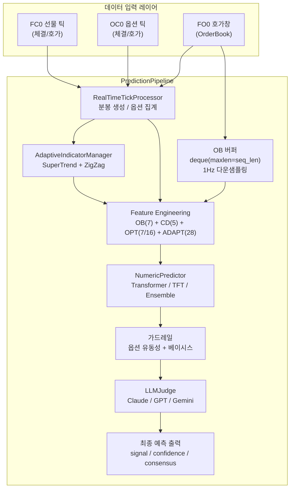

---

## 2. 데이터 수집 및 전처리

### 2-1. 틱 수신 흐름 (`add_realtime_tick`)

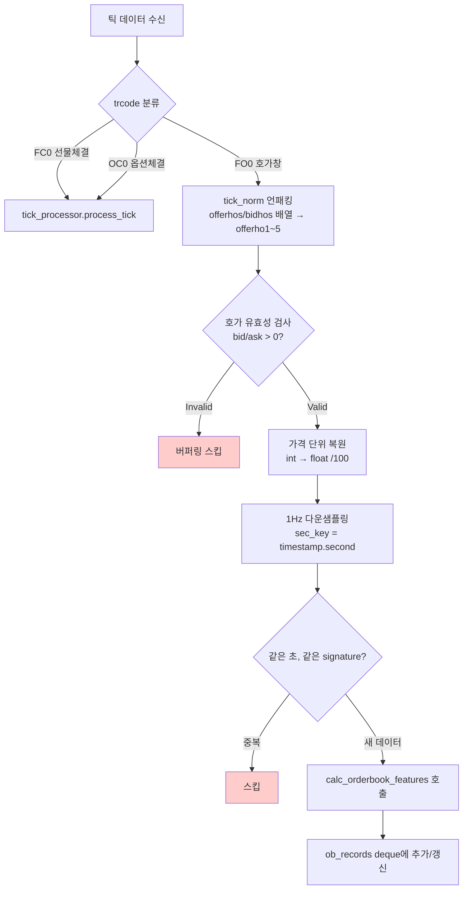

### 2-2. OrderBook 피처 산출 (`calc_orderbook_features`)

| 피처 | 계산식 | 의미 |
|------|--------|------|
| `obi` | `(총매수잔량 - 총매도잔량) / (총매수 + 총매도 + ε)` | 호가 불균형 [-1, 1] |
| `spread` | `ask1 - bid1` | 최우선 스프레드 |
| `level1_ratio` | `bid1잔량 / (bid1 + ask1잔량 + ε)` | L1 비율 |
| `bid_slope` | `Σ(bidrem_i / bidho_i) / 5` | 매수 호가 기울기 |
| `offer_slope` | `Σ(offerrem_i / offerho_i) / 5` | 매도 호가 기울기 |
| `totbidrem` | 총 매수 잔량 | 시장 수요 |
| `totofferrem` | 총 매도 잔량 | 시장 공급 |

---

## 3. 분봉 피처 엔지니어링 (`calc_candle_features`)

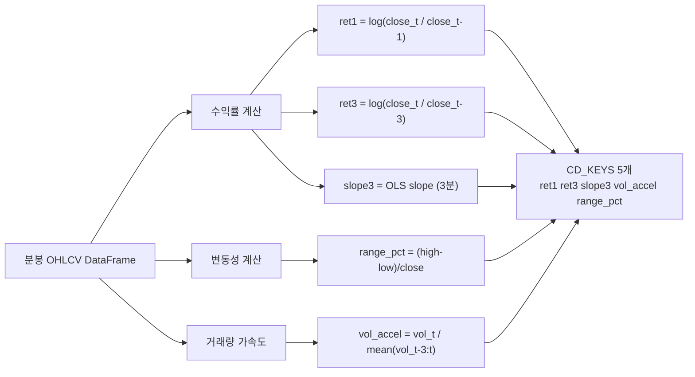

---

## 4. Adaptive Indicator 시스템

### 4-1. AdaptiveIndicatorManager 흐름

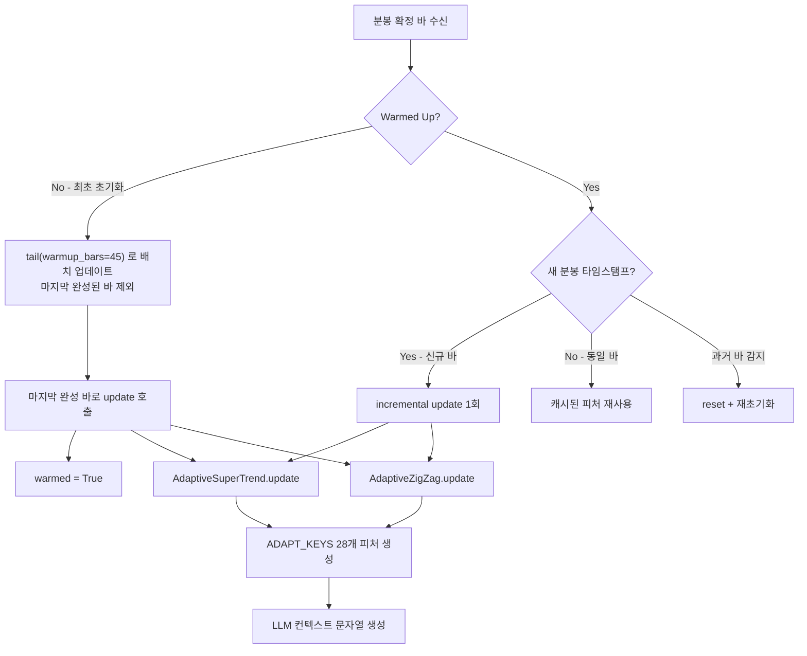

### 4-2. Adaptive SuperTrend 알고리즘

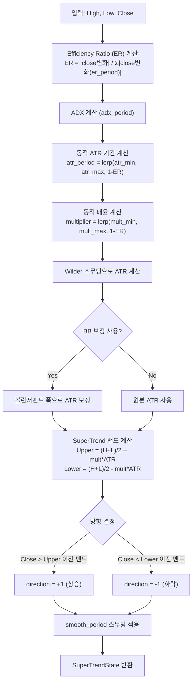

### 4-3. Adaptive ZigZag 알고리즘

```mermaid
flowchart TD
    A["입력: High, Low, Close"] --> B["ER 기반 동적 threshold 계산<br/>thr = lerp(min_thr_pct, max_thr_pct, 1-ER)"]
    B --> C{스윙 방향 감지}
    C -->|High > 이전 저점 * (1+thr)| D["High 스윙 포인트 후보"]
    C -->|Low < 이전 고점 * (1-thr)| E["Low 스윙 포인트 후보"]
    D & E --> F["confirmation_bars 확인<br/>min_wave_bars, min_wave_pct 필터"]
    F --> G["cluster_tolerance_pct 기반<br/>중복 스윙 제거"]
    G --> H["최대 max_swings 개 유지"]
    H --> I["Fib 레벨 계산<br/>fib618, fib382"]
    H --> J["구조 분석<br/>Higher Highs / Lower Lows"]
    I & J --> K[ZigZagState 반환]
```

---

## 5. 시퀀스 피처 빌드 (`build_sequence`)

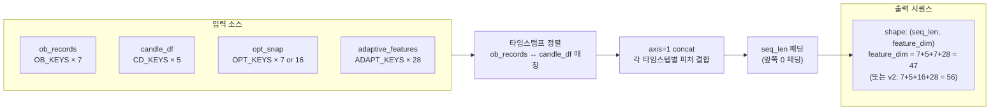

---

## 6. 수치 예측기 (Numeric Predictor)

### 6-1. 예측기 선택 구조

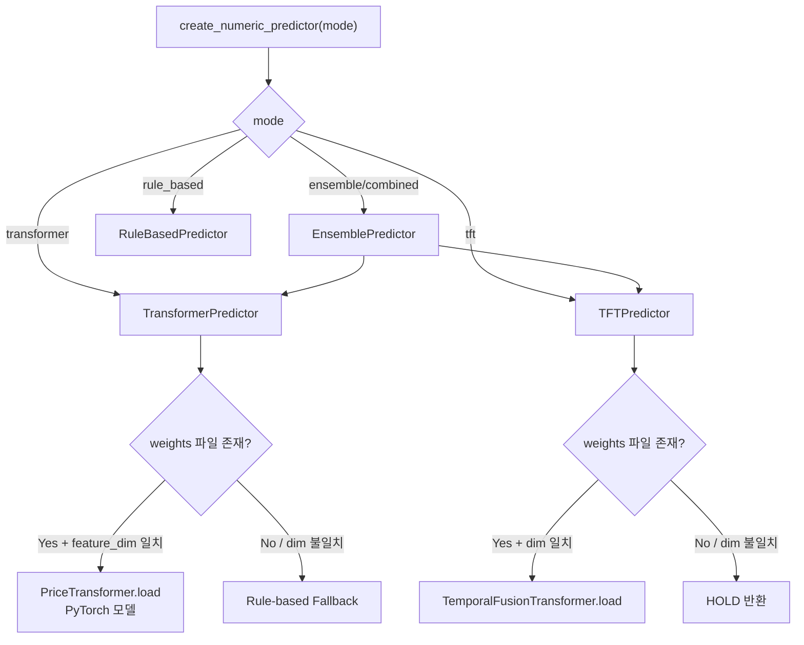

### 6-2. PriceTransformer 아키텍처

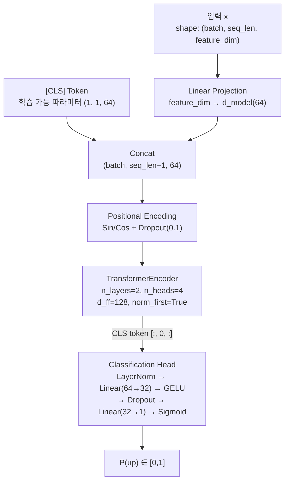

### 6-3. 신호 분류 로직 (`_classify`)

```mermaid
flowchart TD
    A["prob ∈ [0,1]"] --> B{prob ≥ buy_threshold\n(default: 0.62)?}
    B -->|Yes| C["signal = BUY"]
    B -->|No| D{prob ≤ sell_threshold\n(default: 0.38)?}
    D -->|Yes| E["signal = SELL"]
    D -->|No| F["signal = HOLD"]

    A --> G["margin = |prob - 0.5|"]
    G --> H{margin ≥ 0.15 AND\nspread ≤ conf_spread_max?}
    H -->|Yes| I["confidence = HIGH"]
    H -->|No| J{margin ≥ 0.08?}
    J -->|Yes| K["confidence = MEDIUM"]
    J -->|No| L["confidence = LOW"]
```

### 6-4. EnsemblePredictor 합산 흐름

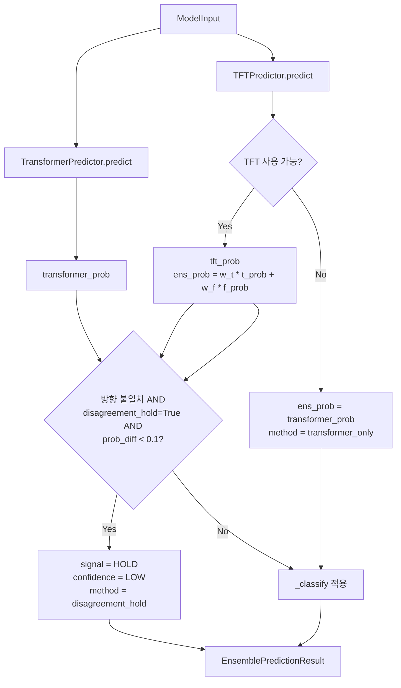

---

## 7. 가드레일 (Guardrail)

### 7-1. 옵션 유동성 가드레일

```mermaid
flowchart TD
    A["opt_snap 검사"] --> B{ATM 옵션 존재\n(call_cnt > 0 or put_cnt > 0)?}
    B -->|No| Z[신호 유지]
    B -->|Yes| C{wide = atm_spread_pct ≥ 1.5%?}
    C --> D{illiq = atm_liq_log ≤ 2.0?}

    C & D --> E{wide AND illiq?}
    E -->|Yes, signal=BUY/SELL| F["→ HOLD, LOW"]
    E -->|No| G{confidence = HIGH?}
    G -->|Yes| H["→ signal, MEDIUM"]
    G -->|No| I{confidence = MEDIUM?}
    I -->|Yes| J["→ signal, LOW"]
    I -->|No| Z
```

### 7-2. 베이시스 가드레일

```mermaid
flowchart TD
    A["IJ 실시간 스냅샷 조회\nbasis = futures_price - spot_index"] --> B{|basis| ≥ 2.5?}
    B -->|Yes, BUY/SELL| C["→ HOLD, LOW"]
    B -->|No| D{|basis| ≥ 1.5?}
    D -->|No| E[신호 유지]
    D -->|Yes| F{confidence = HIGH?}
    F -->|Yes| G["→ signal, MEDIUM"]
    F -->|No| H{confidence = MEDIUM?}
    H -->|Yes| I["→ signal, LOW"]
    H -->|No| E
```

---

## 8. LLM 판단 레이어 (`LLMJudge`)

### 8-1. 단일 LLM 모드

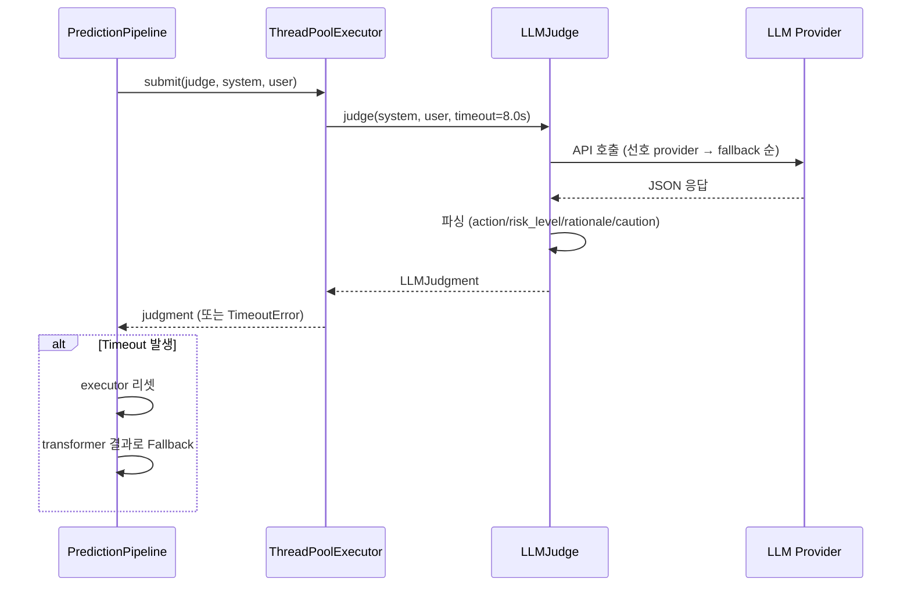

### 8-2. Dual LLM 모드 (GPT + Gemini 병렬)

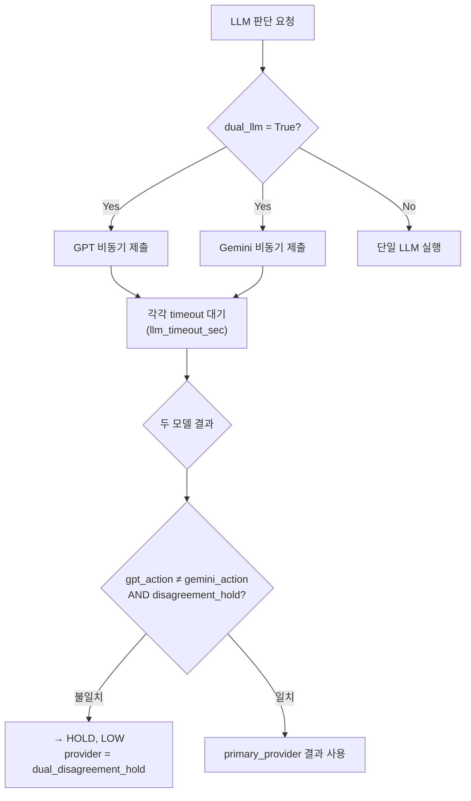

### 8-3. LLM 프롬프트 구조 (`build_llm_context`)

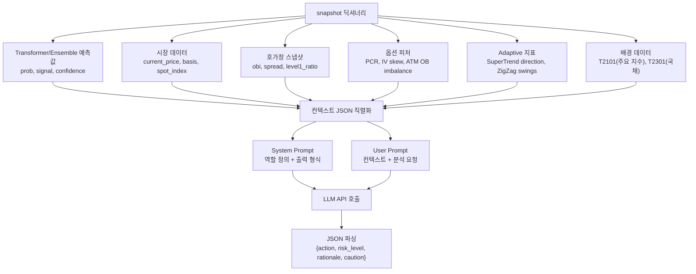

---

## 9. `get_prediction()` 전체 흐름

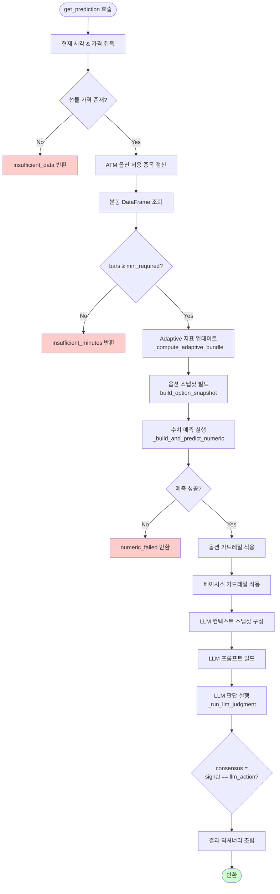

---

## 10. 출력 결과 구조

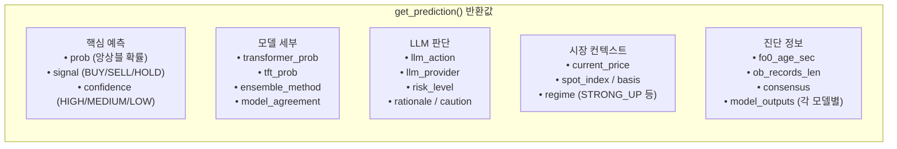

---

## 11. 실시간 Regime 분류

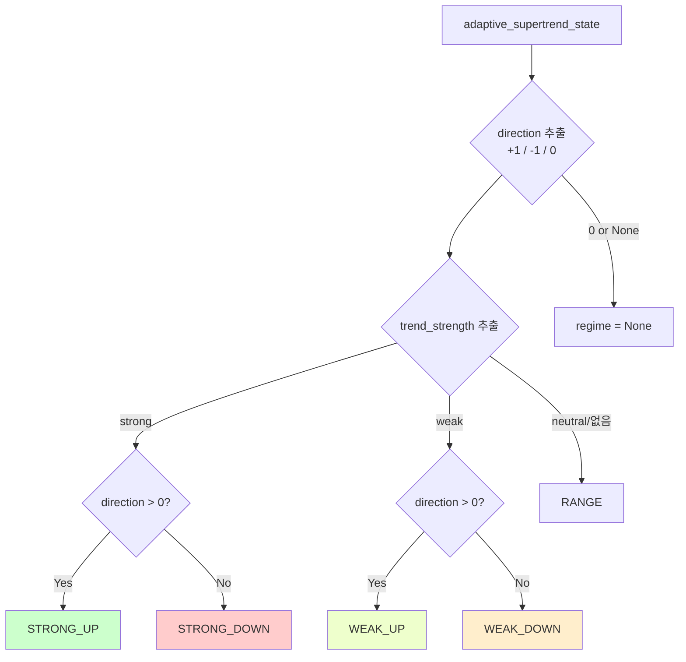

---

## 12. 주요 설정 파라미터 요약

| 파라미터 | 기본값 | 역할 |
|----------|--------|------|
| `seq_len` | 60 | OB 버퍼 길이 (초, 1Hz) |
| `prediction_minutes` | 5 | 예측 지평선 |
| `min_minute_bars_required` | 20 | 최소 분봉 수 |
| `buy_threshold` | 0.62 | BUY 신호 임계값 |
| `sell_threshold` | 0.38 | SELL 신호 임계값 |
| `confidence_high_margin` | 0.15 | HIGH 신뢰도 마진 |
| `llm_timeout_sec` | 8.0 | LLM 응답 제한 시간 |
| `disagreement_hold` | True | 모델 불일치 시 HOLD |
| `disagreement_hold_prob_diff_max` | 0.1 | 불일치 허용 prob 차이 |
| `transformer_weight` | 0.5 | 앙상블 내 Transformer 비중 |
| `fo0_stale_sec` | 10 | FO0 스테일 경고 임계 |
| `guard_basis_hold_thr` | 2.5 | 베이시스 HOLD 임계 |
| `guard_atm_spread_pct_thr` | 1.5 | ATM 스프레드 임계(%) |
| `adaptive_warmup_bars` | 45 | Adaptive 지표 워밍업 분봉 수 |

---

## 13. 피처 차원 구성 요약

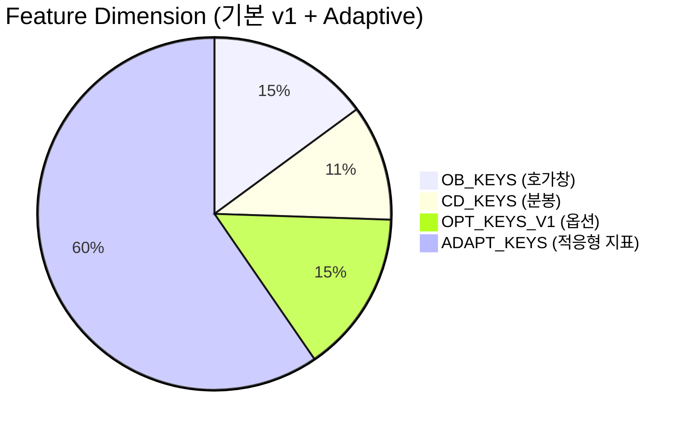

| 그룹 | 키 수 | 내용 |
|------|-------|------|
| OB (OrderBook) | 7 | obi, spread, level1_ratio, bid_slope, offer_slope, totbidrem, totofferrem |
| CD (Candle) | 5 | ret1, ret3, slope3, vol_accel, range_pct |
| OPT v1 | 7 | pcr_volume, iv_skew, max_pain_dist_pct, atm_iv, atm_spread_pct, atm_orderbook_imb, atm_liquidity_log |
| OPT v2 추가 | +9 | optm_call_ret, optm_put_ret, optm_straddle_ret 등 |
| ADAPT | 28 | ast_direction~ast_band_width_pct (9개) + azz_direction~azz_structure_down (19개) + cross (4개) |
| **합계 (v1+Adapt)** | **47** | 기본 운영 차원 |

---

*문서 생성일: 2026-02-28 | SkyEbest Transformer Pipeline v2*
