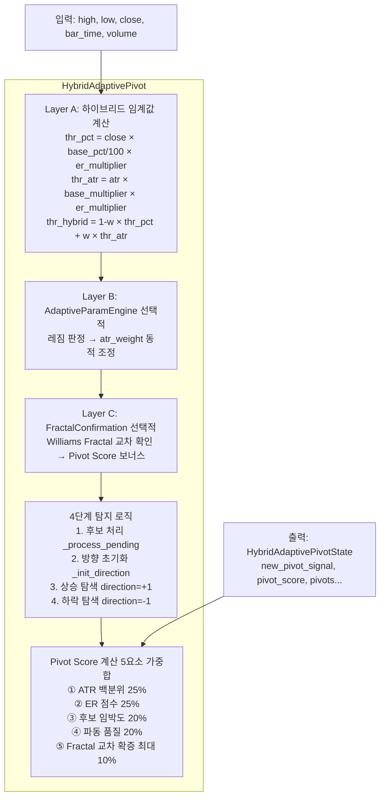
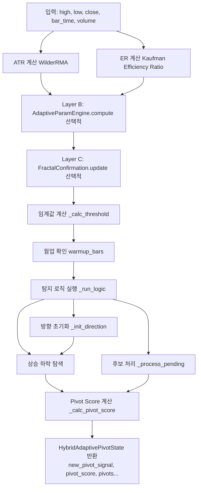
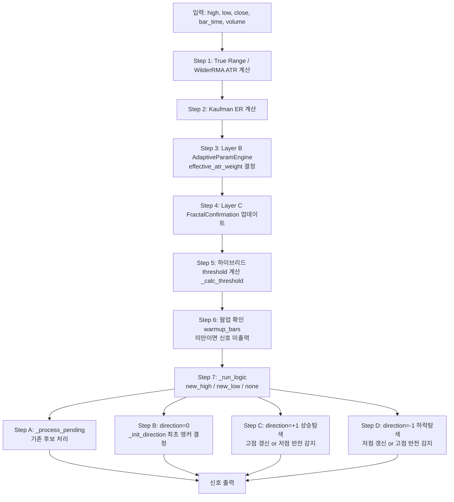
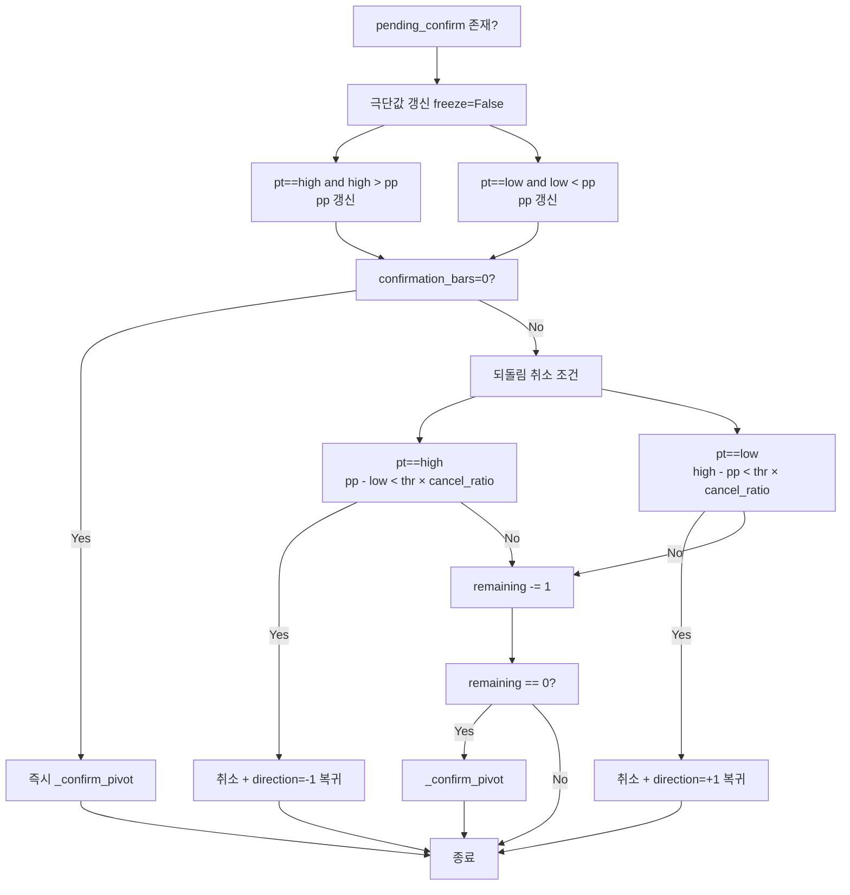
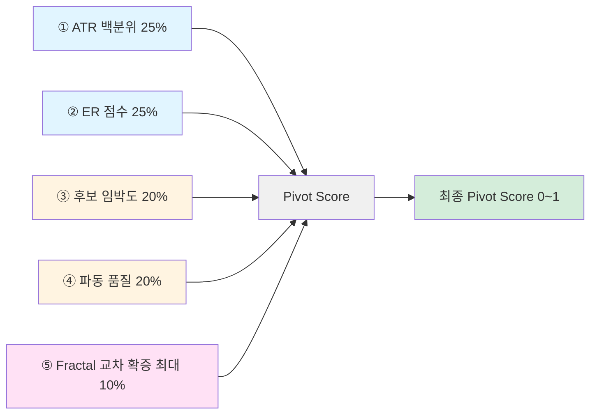
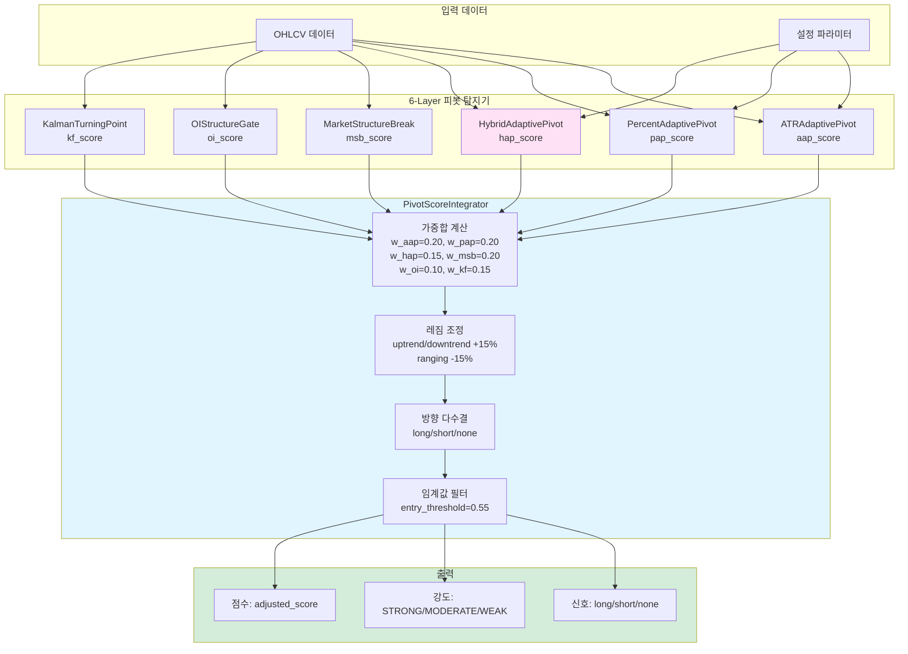

# HybridAdaptivePivot 설계 문서

> **버전**: 1.1  
> **작성일**: 2026-05-26  
> **작성자**: SkyPredictor Team  
> **상태**: Production Ready

---

## 목차

1. [개요](#1-개요)
2. [설계 목표](#2-설계-목표)
3. [아키텍처](#3-아키텍처)
4. [핵심 컴포넌트](#4-핵심-컴포넌트)
5. [데이터 구조](#5-데이터-구조)
6. [임계값 계산 알고리즘](#6-임계값-계산-알고리즘)
7. [탐지 로직 흐름](#7-탐지-로직-흐름)
   - 7.6 [시장 구조 분석 (_analyze_structure)](#76-시장-구조-분석-_analyze_structure)
8. [Layer B: AdaptiveParamEngine](#8-layer-b-adaptiveparamengine)
9. [Layer C: FractalConfirmation](#9-layer-c-fractalconfirmation)
10. [Pivot Score 계산](#10-pivot-score-계산)
11. [설정 파라미터](#11-설정-파라미터)
12. [Transformer Feature](#12-transformer-feature)
13. [통합 가이드](#13-통합-가이드)
    - 13.4 [PivotParameterDB 연동](#134-pivotparameterdb-연동)
14. [테스트 전략](#14-테스트-전략)
15. [성능 최적화](#15-성능-최적화)
16. [알려진 한계](#16-알려진-한계)

---

## 1. 개요

### 1.1 배경

기존 `AdaptiveZigZag` 지표는 다음과 같은 문제점이 있었습니다:
- **확정 지연**: 평균 5~8봉 (1분봉 기준 5~8분) 지연
- **이진 출력**: 신호 강도 없는 `"new_high"` / `"new_low"` / `"none"` 출력
- **레짐 무반응**: 임계값 자체를 실시간 변경하지 않음
- **설정 비직관성**: ATR 기반 설정이 가격 수준에 의존

### 1.2 해결책

**HybridAdaptivePivot**은 다음 특징을 갖는 새로운 피봇 탐지기입니다:
- **하이브리드 임계값**: ATR + 퍼센트 혼합으로 변동성 적응성 + 직관성 확보
- **다층 구조**: Layer B (레짐 적응) + Layer C (Fractal 교차 확증)
- **신호 강도**: 0~1 범위의 Pivot Score로 신뢰도 정량화
- **즉시 확정**: `confirmation_bars=0`으로 실시간 반응 가능

### 1.3 위치

```
indicators/
├── hybrid_adaptive_pivot.py    # 핵심 구현 (1,181 라인)
├── atr_adaptive_pivot.py       # ATR 기반 피봇 (참조)
├── percent_adaptive_pivot.py    # 퍼센트 기반 피봇 (참조)
└── pivot_score_integrator.py   # 6-Layer 통합 점수 계산기
```

---

## 2. 설계 목표

### 2.1 기능적 목표

| 목표 | 설명 | 우선순위 |
|------|------|---------|
| **변동성 적응** | ATR 기반으로 가격 수준 독립적 임계값 | P0 |
| **직관적 설정** | 퍼센트 기반으로 사용자 친화적 파라미터 | P0 |
| **신뢰도 정량화** | Pivot Score로 신호 강도 0~1 범위 제공 | P1 |
| **레짐 적응** | 시장 상태에 따라 동적 파라미터 조정 | P1 |
| **교차 확증** | Fractal 패턴으로 신호 강화 | P2 |

### 2.2 비기능적 목표

| 목표 | 목표치 | 측정 방법 |
|------|--------|---------|
| **확정 지연** | < 3봉 (confirmation_bars=1) | backtest |
| **CPU 사용량** | < 5% (1분봉 기준) | profiling |
| **메모리 사용량** | < 10MB (max_pivots=30) | profiling |
| **정확도** | > 70% (pivot_quality_score) | backtest |

---

## 3. 아키텍처

### 3.1 전체 구조



### 3.2 데이터 흐름



---

## 4. 핵심 컴포넌트

### 4.1 HybridAdaptivePivot

**역할**: 메인 피봇 탐지기 클래스

**주요 메서드**:
```python
class HybridAdaptivePivot:
    def __init__(self, config: HybridAdaptivePivotConfig)
    def update(self, high, low, close, bar_time=None, open=0.0, volume=1.0) -> HybridAdaptivePivotState
    def get_transformer_features(self, close: float) -> dict   # close 인자 필수
    def get_llm_context(self, close: float) -> str             # close 인자 필수
    def reset(self) -> None
```

**상태 관리**:
- `_pivots`: 확정 피봇 목록 — 내부에서 `max_pivots × 2`개까지 보관 후 trim (SR 탐색용 여유분 확보 목적). `confirmed_pivots` 프로퍼티는 전체를 반환하므로, 실제 접근 가능한 피봇 수는 설정값의 최대 2배임에 유의
- `_pending_confirm`: 후보 피봇 확인 상태
- `_direction`: 현재 탐색 방향 (+1/-1/0)
- `_atr_values`: ATR 이력 (최근 `max(atr_period×10, 200)`봉)
- `_closes`: 종가 이력

### 4.2 HybridAdaptivePivotConfig

**역할**: 설정 파라미터 컨테이너

**필드 구조**:
```python
@dataclass
class HybridAdaptivePivotConfig:
    # 핵심 임계값
    base_pct: float = 0.3
    base_multiplier: float = 2.0
    atr_weight: float = 0.5
    
    # ATR/ER 계산
    atr_period: int = 14
    multiplier_min: float = 0.8
    multiplier_max: float = 2.0
    er_period: int = 10
    
    # 후보 확정/필터
    confirmation_bars: int = 1
    cancel_ratio: float = 0.3
    min_wave_pct: float = 0.15
    min_wave_atr_ratio: float = 0.5
    
    # 웜업/저장
    warmup_bars: int = 20
    max_pivots: int = 30
    
    # Layer B
    use_adaptive_engine: bool = False
    regime_atr_weight_table: dict = field(default_factory=...)
    
    # Layer C
    use_fractal_confirmation: bool = False
    fractal_lookback: int = 2
    fractal_volume_spike: float = 1.3
    fractal_price_tolerance_pct: float = 0.3
    fractal_bonus: float = 0.15
```

### 4.3 HybridAdaptivePivotState

**역할**: 매 봉 update() 후 반환되는 상태 객체

**필드 구조**:
```python
@dataclass
class HybridAdaptivePivotState:
    # 최근 확정 피봇
    last_high: float = float("nan")
    last_low: float = float("nan")
    last_high_idx: int = -1
    last_low_idx: int = -1
    last_high_time: Optional[str] = None
    last_low_time: Optional[str] = None
    
    # 신호
    new_pivot_signal: str = "none"  # "new_high" | "new_low" | "none"
    
    # 시장 구조
    structure: str = "unknown"  # "uptrend" | "downtrend" | "ranging" | "unknown"
    direction: int = 0  # +1 상승탐색, -1 하락탐색, 0 미결정
    
    # 지표값
    atr: float = 0.0
    threshold_abs: float = 0.0
    threshold_pct: float = 0.0
    efficiency_ratio: float = 0.0
    
    # 후보 피봇
    pending_type: Optional[str] = None
    pending_price: float = 0.0
    pending_time: Optional[str] = None
    pending_remaining: int = 0
    
    # 피봇 목록
    pivots: List[PivotPoint] = field(default_factory=list)
    
    # 점수
    pivot_score: float = 0.0
    wave_size_pct: float = 0.0
    bars_since_pivot: int = 0
```

---

## 5. 데이터 구조

### 5.1 PivotPoint

**역할**: 확정된 변곡점 정보

```python
@dataclass
class PivotPoint:
    index: int
    price: float
    pivot_type: PivotType  # HIGH | LOW
    pct: float  # 파동 퍼센트 크기 (직전 확정 피봇 대비)
    atr: float  # 해당 시점의 ATR
    bar_time: Optional[str] = None  # "HH:MM"
    is_major: bool = False
```

**`is_major` 판정 기준**:

확정 피봇 추가 시 `_add_pivot()` 내부에서 자동 계산됩니다.

```python
# 직전 동일 타입 피봇(prev_same) 기준
avg_wave = _avg_wave_pct(n=3)  # 최근 3파동 평균 크기 (%)

is_major = (
    True                          # 동일 타입 피봇이 처음이면 항상 major
    if prev_same is None
    else abs(price - prev_same.price) / prev_same.price * 100.0 >= avg_wave * 1.5
    # 직전 동일 타입 피봇 대비 파동 크기 ≥ 최근 평균 × 1.5배이면 major
)
```

| 조건 | is_major | 설명 |
|------|---------|------|
| 동일 타입 피봇 최초 | `True` | 기준점이 없으므로 무조건 major |
| 파동 크기 ≥ 평균 × 1.5 | `True` | 평균보다 50% 이상 큰 파동 |
| 그 외 | `False` | 일반 피봇 |

**활용처**: `get_llm_context()`에서 ★ 마커로 강조 표시. 향후 S/R 레벨 필터링 또는 major pivot 기반 구조 분석에 활용 예정.

### 5.2 PivotType

```python
class PivotType(Enum):
    HIGH = "high"
    LOW = "low"
```

---

## 6. 임계값 계산 알고리즘

### 6.1 하이브리드 공식

```
thr_pct    = close × base_pct/100 × er_multiplier × session_scale
thr_atr    = atr × base_multiplier × er_multiplier × session_scale
thr_hybrid = (1 - atr_weight) × thr_pct + atr_weight × thr_atr
```

### 6.2 ER 기반 배수 계산

```python
# Kaufman Efficiency Ratio
ER = |close[-1] - close[-er_period]| / Σ|close[i] - close[i-1]|

# 배수: ER ↑(추세) → multiplier 크게(노이즈 차단)
#       ER ↓(횡보) → multiplier 작게(민감도 회복)
multiplier = multiplier_min + ER × (multiplier_max - multiplier_min)
```

### 6.3 atr_weight별 의미

| atr_weight | 혼합 비율 | 특징 |
|-----------|----------|------|
| 0.0 | 퍼센트 100% | 직관적, 변동성 적응 없음 |
| 0.25 | 퍼센트 75% + ATR 25% | 퍼센트 중심, 약한 변동성 적응 |
| 0.5 | 50:50 균형 (기본값) | 두 방식의 장점 균형 |
| 0.75 | ATR 75% + 퍼센트 25% | ATR 중심, 약한 직관성 유지 |
| 1.0 | ATR 100% | 변동성 적응 최대, 설정 비직관적 |

### 6.4 실제 임계값 비교

가격 110, base_pct=0.3%, ATR=2.0, base_multiplier=2.0 기준:

| atr_weight | 임계값 (pt) | 퍼센트 |
|-----------|------------|--------|
| 0.0 | 0.33 | 0.30% |
| 0.25 | 1.25 | 1.14% |
| 0.5 | 2.17 | 1.97% |
| 0.75 | 3.08 | 2.80% |
| 1.0 | 4.00 | 3.64% |

---

## 7. 탐지 로직 흐름

### 7.1 update() 호출 순서



### 7.2 Step A: 후보 확인 창 (_process_pending)



**cancel_ratio (기본 0.3)**: 되돌림이 threshold × 30% 미만이면 후보 취소. 소파동 노이즈 제거.

### 7.3 Step C/D: 방향 탐색 로직

```python
# 상승 탐색 중 (direction=+1):
if high > pending_high:
    pending_high = high  # 고점 계속 갱신 추적

reversal = pending_high - low
if reversal >= thr and _wave_ok(...):
    _register_candidate("high", pending_high, ...)  # 고점 피봇 후보 등록

# 하락 탐색 중 (direction=-1):
if low < pending_low:
    pending_low = low  # 저점 계속 갱신 추적

reversal = high - pending_low
if reversal >= thr and _wave_ok(...):
    _register_candidate("low", pending_low, ...)  # 저점 피봇 후보 등록
```

### 7.4 이중 소파동 필터 (_wave_ok)

```python
def _wave_ok(thr, low, high, close, atr, candidate_idx):
    # 조건 1: 직전 확정 피봇으로부터 최소 3봉 이상
    if candidate_idx - last_confirmed_bar < 3:
        return False

    # 조건 2: 퍼센트 기반 최소 파동
    wave_pct = wave_abs / wave_ref * 100.0
    if wave_pct < min_wave_pct:        # 기본 0.15%
        return False

    # 조건 3: ATR 기반 최소 파동
    if atr > 0 and min_wave_atr_ratio > 0:
        if wave_abs < atr * min_wave_atr_ratio:  # 기본 0.5 ATR
            return False

    return True
```

### 7.5 초기 앵커 결정 (_init_direction)

```
direction=0 상태에서 최초 범위 형성 시:

HIGH 인덱스 ≥ LOW 인덱스 (고점이 나중에 형성)
  → LOW 앵커 확정, direction=+1 (상승 탐색 시작)

LOW 인덱스 > HIGH 인덱스 (저점이 나중에 형성)
  → HIGH 앵커 확정, direction=-1 (하락 탐색 시작)
```

### 7.6 시장 구조 분석 (_analyze_structure)

`update()` 호출마다 실행되어 `HybridAdaptivePivotState.structure`를 갱신합니다.

```python
def _analyze_structure() -> str:
    # 최소 피봇 4개 미만이면 판정 불가
    if len(self._pivots) < 4:
        return "unknown"

    # 최근 8개 피봇에서 고점·저점 각 최신 3개 추출
    highs = [p.price for p in self._pivots[-8:] if p.pivot_type == HIGH][-3:]
    lows  = [p.price for p in self._pivots[-8:] if p.pivot_type == LOW][-3:]

    if len(highs) < 2 or len(lows) < 2:
        return "unknown"

    # 상승 구조: HH(고점 상승) AND HL(저점 상승)
    if highs[0] < highs[-1] and lows[0] < lows[-1]:
        return "uptrend"

    # 하락 구조: LH(고점 하락) AND LL(저점 하락)
    elif highs[0] > highs[-1] and lows[0] > lows[-1]:
        return "downtrend"

    # 혼합 패턴 → 횡보
    else:
        return "ranging"
```

**판정 조건 요약**:

| structure | 고점 패턴 | 저점 패턴 | 최소 조건 |
|-----------|----------|----------|---------|
| `uptrend` | HH (상승) | HL (상승) | 고점 2개 + 저점 2개 이상 |
| `downtrend` | LH (하락) | LL (하락) | 고점 2개 + 저점 2개 이상 |
| `ranging` | 혼합 | 혼합 | — |
| `unknown` | — | — | 피봇 4개 미만 또는 고/저점 각 2개 미만 |

> **운영 시 유의**: 장 시작 후 피봇이 4개 누적되기 전까지 `structure="unknown"` 구간이 발생합니다. `PivotScoreIntegrator`는 이 구간에서 레짐 부스트/억제를 적용하지 않습니다.

---

### 8.1 개요

`use_adaptive_engine=True` 시 활성화. 8개 레짐 레이블에 따라 `atr_weight`를 동적으로 변경.

### 8.2 레짐별 atr_weight 기본 테이블

```python
regime_atr_weight_table = {
    "trend_strong_up":  0.75,   # 강한 상승 추세 → ATR 중심
    "trend_strong_dn":  0.75,   # 강한 하락 추세 → ATR 중심
    "trend_weak_up":    0.55,   # 약한 상승 추세 → 약간 ATR 중심
    "trend_weak_dn":    0.55,   # 약한 하락 추세 → 약간 ATR 중심
    "chop_low_vol":     0.35,   # 저변동 횡보 → 퍼센트 중심 (민감도 확보)
    "chop_high_vol":    0.85,   # 고변동 횡보 → 강한 ATR (노이즈 차단)
    "volatile":         0.90,   # 급등락 구간 → 최강 ATR 필터
    "unknown":          0.50,   # 레짐 미확정 → 기본 균형
}
```

### 8.3 동작 방식

```python
# update() 내부
if use_adaptive_engine and len(closes) >= warmup_bars:
    adj = adaptive_engine.compute(atr_values, all_swings, ...)
    effective_atr_weight = regime_atr_weight_table.get(adj.regime_label, config.atr_weight)
```

AdaptiveParamEngine은 ATR 백분위, ER, 피봇 밀도 피드백을 조합해 8개 레짐 중 하나를 판정하고, 그에 맞는 `atr_weight`를 실시간으로 공급합니다.

**`_PivotAdapter` 내부 클래스**: AdaptiveParamEngine의 `compute()` 인터페이스는 `SwingPoint` 프로토콜(`.confirmed_at_idx`, `.price`, `.swing_type`)을 요구합니다. HAP의 `PivotPoint`와 인터페이스가 다르므로, `update()` 내부에서 런타임으로 어댑터 클래스를 정의해 변환합니다.

```python
class _PivotAdapter:
    """PivotPoint → SwingPoint 인터페이스 어댑터 (update() 내부 정의)"""
    confirmed = True

    def __init__(self, p: PivotPoint):
        self._p = p

    @property
    def confirmed_at_idx(self) -> int:
        return self._p.index

    @property
    def price(self) -> float:
        return self._p.price

    @property
    def swing_type(self) -> str:
        return "high" if self._p.pivot_type == PivotType.HIGH else "low"

# 호출 시
all_swings = [_PivotAdapter(p) for p in self._pivots]
```

> **확장 시 주의**: AdaptiveParamEngine을 커스텀 교체할 경우 위 SwingPoint 인터페이스(3개 프로퍼티)를 준수해야 합니다.

### 8.4 Transformer Feature로 노출

```python
"hap_regime":      # 레짐 숫자 인코딩 (±1.0 범위)
"hap_effective_w": # 실제 적용된 atr_weight
```

---

## 9. Layer C: FractalConfirmation

### 9.1 개요

`use_fractal_confirmation=True` 시 활성화. Williams Fractal 패턴이 후보 피봇과 일치할 때 Pivot Score에 보너스 부여.

### 9.2 교차 확증 기준

```python
def _calc_fractal_bonus():
    # 후보 피봇이 없거나 Fractal 결과 없으면 0.0 반환
    # 후보 타입과 Fractal 방향 일치 AND 가격 오차 ≤ tolerance(기본 0.3%)
    if pt=="high" and fractal.fractal_high:
        if abs(fractal.fractal_high_price - pp) <= tolerance:
            return fractal_bonus  # 기본 0.15

    if pt=="low" and fractal.fractal_low:
        if abs(fractal.fractal_low_price - pp) <= tolerance:
            return fractal_bonus
```

**Pivot Score에 최대 10% 추가** (전체 5요소 중 마지막 요소).

### 9.3 설정 파라미터

| 파라미터 | 기본값 | 설명 |
|---------|--------|------|
| `fractal_lookback` | 2 | Williams Fractal 기준봉 수 |
| `fractal_volume_spike` | 1.3 | 거래량 급증 비율 기준 |
| `fractal_price_tolerance_pct` | 0.3% | 가격 허용 오차 |
| `fractal_bonus` | 0.15 | 교차 확증 시 보너스 |

---

## 10. Pivot Score 계산

### 10.1 구조



### 10.2 요소별 상세

**① ATR 백분위 점수 (25%)**

```python
# 최근 60봉 ATR 분포에서 현재 ATR의 백분위
window = atr_values[-60:]
atr_pct = mean([v <= cur_atr for v in window])  # 백분위
vol_score = atr_pct * 0.25
# 해석: 현재 ATR이 높을수록 변동성 큰 구간 → 변곡 신뢰도 높음
```

**② ER 점수 (25%)**

```python
er = calc_er()          # Kaufman ER (0~1)
er_score = er * 0.25
# 해석: ER 높을수록 추세 명확 → 변곡점 강도 신뢰
```

**③ 후보 임박도 (20%)**

```python
rem = pending_confirm["remaining"]
cb = max(float(confirmation_bars), 1.0)
urgency_score = (1.0 - rem / cb) * 0.20
# 해석: 확정 봉 카운트다운이 임박할수록 점수 증가
```

**④ 파동 품질 점수 (20%)**

```python
# 현재 파동 크기 / 임계값 비율 (최대 3배에서 포화)
ratio = wave_abs / cur_thr_abs
wave_score = clip(ratio / 3.0, 0.0, 1.0) * 0.20
# 해석: 파동이 임계값의 3배 이상이면 만점
```

**⑤ Fractal 교차 확증 (최대 10%)**

```python
fractal_bonus = min(_calc_fractal_bonus(), 0.10)
# 0.0 (미일치) or 0.10 (일치, fractal_bonus=0.15 → clip 0.10)
```

> **설계 의도**: ⑤는 최대 10%로 cap되므로, `use_fractal_confirmation=False` 시 이론적 최대 Pivot Score는 ① + ② + ③ + ④ = **0.90**입니다. 1.0에 도달하려면 Fractal 교차 확증이 활성화되어 있어야 합니다. 이는 의도적 설계로, 단일 지표 과신을 방지합니다.

### 10.3 해석 기준

| Pivot Score | 의미 |
|------------|------|
| 0.8 이상 | 매우 강한 변곡 신호 |
| 0.6 ~ 0.8 | 신뢰할 수 있는 변곡 |
| 0.4 ~ 0.6 | 중간 강도 |
| 0.4 미만 | 약한 신호, 관망 권장 |

---

## 11. 설정 파라미터

### 11.1 전체 참조

```python
HybridAdaptivePivotConfig(
    # ── 핵심 임계값 ──────────────────────────────────────
    base_pct             = 0.3,   # 퍼센트 임계값 (%)
    base_multiplier      = 2.0,   # ATR 배수
    atr_weight          = 0.5,   # ATR 혼합 비율 [0, 1]

    # ── ATR/ER 계산 ───────────────────────────────────────
    atr_period          = 14,    # WilderRMA 주기
    multiplier_min       = 0.8,   # ER 기반 배수 하한
    multiplier_max       = 2.0,   # ER 기반 배수 상한
    er_period           = 10,    # Kaufman ER 구간

    # ── 후보 확정 / 필터 ──────────────────────────────────
    confirmation_bars   = 1,     # 확인 봉 수 (0=즉시 확정)
    cancel_ratio        = 0.3,   # 되돌림 취소 비율
    min_wave_pct        = 0.15,  # 최소 파동 퍼센트 필터
    min_wave_atr_ratio  = 0.5,   # 최소 파동 ATR 비율 필터

    # ── 웜업 / 저장 ───────────────────────────────────────
    warmup_bars         = 20,    # ATR/ER 안정화 최소 봉
    max_pivots          = 30,    # 보관 최대 피봇 수

    # ── Layer B: AdaptiveParamEngine ──────────────────────
    use_adaptive_engine = False,
    regime_atr_weight_table = {...},

    # ── Layer C: Fractal 교차 확증 ────────────────────────
    use_fractal_confirmation = False,
    fractal_lookback         = 2,
    fractal_volume_spike     = 1.3,
    fractal_price_tolerance_pct = 0.3,
    fractal_bonus            = 0.15,
)
```

### 11.2 KOSPI200 권장 기본값

```python
cfg_kp200 = HybridAdaptivePivotConfig(
    base_pct=0.3,
    base_multiplier=2.0,
    atr_weight=0.5,
    atr_period=14,
    multiplier_min=0.8,
    multiplier_max=2.0,
    er_period=10,
    confirmation_bars=1,
    min_wave_pct=0.15,
    min_wave_atr_ratio=0.5,
    cancel_ratio=0.3,
    warmup_bars=20,
    # ── 세션 시간대 배율 (장초반 노이즈 대응) ──
    session_multiplier_table=[
        ("09:00", "09:30", 1.5),   # 장초반: 배율 확대 → 노이즈 차단
        ("09:30", "10:30", 1.0),   # 오전 정규: 기본
        ("10:30", "13:00", 1.2),   # 점심 전: 약간 상향
        ("14:30", "15:20", 0.8),   # 마감 전: 배율 축소 → 민감도 증가
        ("15:20", "15:31", 1.3),   # 동시호가: 확대
    ],
)
```

### 11.3 파라미터 튜닝 가이드

| 상황 | 권장 atr_weight | 이유 |
|------|----------------|------|
| 가격 수준 일정, 직관적 설정 선호 | 0.0 | 퍼센트만 사용 |
| 일반적인 KOSPI200 트레이딩 | 0.5 | 균형 (기본값) |
| 변동성 큰 시장 (급등락 구간) | 0.75 ~ 1.0 | ATR 중심, 노이즈 차단 |
| 빠른 반응, 많은 피봇 필요 | 0.0 ~ 0.25 | 퍼센트 중심 |

| 증상 | 조정 방향 |
|------|----------|
| 신호 너무 많음 (노이즈) | `base_multiplier` ↑, `confirmation_bars` ↑, `atr_weight` ↑ |
| 신호 너무 적음 | `base_multiplier` ↓, `confirmation_bars` → 0, `atr_weight` ↓ |
| Lag 줄이고 싶음 | `confirmation_bars` → 0 or 1 |
| 레짐 적응 강화 | `use_adaptive_engine=True` |
| Fractal 교차 확증 추가 | `use_fractal_confirmation=True` |

---

## 12. Transformer Feature

### 12.1 HybridAdaptivePivot.get_transformer_features()

**호환 키 (azz_* — AdaptiveZigZag 완전 호환):**

| 키 | 설명 | 범위 |
|----|------|------|
| `azz_direction` | 현재 탐색 방향 (`float`로 반환: -1.0 / 0.0 / +1.0) | `float` {-1.0, 0.0, +1.0} |
| `azz_last_high` | 최근 고점 거리 (정규화) | [-1, 1] |
| `azz_last_low` | 최근 저점 거리 (정규화) | [-1, 1] |
| `azz_wave_size_pct` | 파동 크기 (정규화, /10%) | [0, 1] |
| `azz_support_dist_pct` | 지지선 거리 | [0, 1] |
| `azz_res_dist_pct` | 저항선 거리 | [0, 1] |
| `azz_bars_since_swing` | 마지막 피봇 후 경과 봉 (/50) | [0, 1] |
| `azz_higher_highs` | 상승 구조 여부 | {0, 1} |
| `azz_lower_lows` | 하락 구조 여부 | {0, 1} |
| `azz_new_swing` | 신규 피봇 신호 | {-1, 0, +1} |
| `azz_swing_recency` | 피봇 신선도 (지수 감쇠) | [0, 1] |
| `azz_threshold_pct` | 현재 threshold % (/3%) | [0, 1] |
| `azz_structure_up/down/ranging` | 시장 구조 판정 | {0, 1} |
| `azz_pending_type/dist/urgency/age/prob` | 후보 상태 5개 피처 | 다양 |

**하이브리드 고유 키 (hap_*):**

| 키 | 설명 | 범위 |
|----|------|------|
| `hap_atr` | ATR (정규화, /5%) | [0, 1] |
| `hap_atr_weight` | 현재 설정 atr_weight | [0, 1] |
| `hap_threshold_pct` | 하이브리드 threshold % | [0, 1] |
| `hap_pivot_score` | Pivot Score (5요소 합) | [0, 1] |
| `hap_regime` | 레짐 숫자 인코딩 | [-1, +1] |
| `hap_effective_w` | 실제 적용 atr_weight (Layer B) | [0, 1] |
| `hap_fractal_bonus` | Fractal 교차 확증 보너스 | [0, 1] |
| `hap_wave_quality` | 파동 품질 (파동/임계값 비율) | [0, 1] |

### 12.2 get_llm_context() 출력 형식

```
[HybridAdaptivePivot - KP200 선물]
현재가: 360.50  방향: 상승  구조: 상승 구조
신호: new_high
후보: 고점 후보 361.20 | 확정까지 1봉
최근 고점: 361.20  저점: 358.40  파동: 0.77%
피봇 목록:
  ★09:15 L 358.40
   09:35 H 361.20
ATR: 1.85  threshold: 3.51pt (0.97%)  ATR가중치: 0.50
Pivot Score: 0.623
```

---

## 13. 통합 가이드

### 13.1 config.json 설정

```json
{
  "adaptive_indicator": {
    "enabled": true,
    "hap": {
      "base_pct": 0.3,
      "base_multiplier": 2.0,
      "atr_weight": 0.5,
      "atr_period": 14,
      "multiplier_min": 0.8,
      "multiplier_max": 2.0,
      "er_period": 10,
      "confirmation_bars": 1,
      "cancel_ratio": 0.3,
      "min_wave_pct": 0.15,
      "min_wave_atr_ratio": 0.5,
      "warmup_bars": 20,
      "max_pivots": 30,
      "use_adaptive_engine": false,
      "use_fractal_confirmation": false
    },
    "kospi_hap": {
      "base_pct": 0.2,
      "atr_weight": 0.5
    },
    "futures_hap": {
      "base_pct": 0.3,
      "atr_weight": 0.5
    }
  }
}
```

### 13.2 Python 사용 예시

```python
from indicators.hybrid_adaptive_pivot import HybridAdaptivePivot, HybridAdaptivePivotConfig

# 설정
config = HybridAdaptivePivotConfig(
    base_pct=0.3,
    base_multiplier=2.0,
    atr_weight=0.5,
    confirmation_bars=1,
)

# 인스턴스 생성
hap = HybridAdaptivePivot(config)

# 실시간 업데이트
for bar in data_stream:
    state = hap.update(
        high=bar.high,
        low=bar.low,
        close=bar.close,
        bar_time=bar.time,
        volume=bar.volume
    )
    
    # 신호 확인
    if state.new_pivot_signal != "none":
        print(f"피봇 신호: {state.new_pivot_signal}")
        print(f"피봇 점수: {state.pivot_score:.3f}")
        print(f"임계값: {state.threshold_abs:.2f}pt ({state.threshold_pct:.2f}%)")
    
    # Transformer Feature (close 인자 필수)
    features = hap.get_transformer_features(close=bar.close)
```

### 13.3 PivotScoreIntegrator와 통합



```python
from indicators.pivot_score_integrator import PivotScoreIntegrator

integrator = PivotScoreIntegrator()

result = integrator.compute(
    hap_score=state.pivot_score,
    hap_signal=state.new_pivot_signal,
    regime=state.structure,
    # ... 다른 레이어 점수
)

if result.adjusted_score > 0.60 and result.signal != "none":
    direction = result.signal  # "long" | "short"
```

### 13.4 PivotParameterDB 연동

`PivotParameterDB`는 일별·세션별 HAP 파라미터와 성능 메트릭을 SQLite에 저장하고, 과거 데이터를 기반으로 시장 구조별 최적 파라미터를 조회합니다.

```python
from prediction.pivot_parameter_db import PivotParameterDB

db = PivotParameterDB("data/pivot_parameters.db")

# ── 세션 종료 후: 파라미터 + 성능 저장 ──────────────────────────
db.save_daily_parameters(
    date="2026-05-26",
    symbol="KP200 선물",
    indicator_type="hybrid_adaptive_pivot",
    config={
        "base_pct": 0.3,
        "base_multiplier": 2.0,
        "atr_weight": 0.5,
        "confirmation_bars": 1,
    },
    performance_metrics={
        "total_pivots": 14,
        "confirmed_pivots": 11,
        "cancelled_pivots": 3,
        "pivot_confirmation_rate": 0.786,
        "avg_pivot_lifespan_bars": 18.2,
        "avg_wave_size_pct": 0.43,
    },
    market_state={
        "market_structure": "uptrend",
        "avg_atr": 2.1,
        "price_volatility": 0.38,
    },
)

# ── 장 시작 전: 최적 파라미터 로드 및 config 적용 ────────────────
best = db.query_best_parameters(
    symbol="KP200 선물",
    market_structure="uptrend",   # 전일 종료 구조 또는 예측 구조
    indicator_type="hybrid_adaptive_pivot",
    lookback_days=30,
)
if best.get("atr_weight") is not None:
    cfg_kp200.atr_weight = best["atr_weight"]
```

**저장 시점**: 각 거래 세션(08:45~15:45) 종료 후 `pipeline.py`에서 호출.  
**조회 시점**: 다음 날 장 시작 전 `app_setup.py`에서 `query_best_parameters()` 호출 후 Config 갱신.


## 14. 테스트 전략

### 14.1 구현된 단위 테스트 현황

`tests/test_hybrid_adaptive_pivot.py`에 아래 TestClass가 구현되어 있습니다.

| TestClass | 검증 항목 | 상태 |
|-----------|----------|------|
| `TestHybridAdaptivePivotWarmup` | 웜업 구간 신호 억제 | ✅ 구현 |
| `TestHybridAdaptivePivotSignals` | new_high / new_low 신호, 가격 저장 | ✅ 구현 |
| `TestHybridAdaptivePivotThreshold` | atr_weight 0/0.5/1 임계값 분기 | ✅ 구현 |
| `TestHybridAdaptivePivotFeatures` | azz_* 키 존재, hap_* 키 존재, 값 범위 [0,1] | ✅ 구현 |
| `TestHybridAdaptivePivotCancelRatio` | cancel_ratio 파라미터 설정 | ✅ 구현 |
| `TestHybridAdaptivePivotImmediateConfirmation` | confirmation_bars=0 즉시 확정 | ✅ 구현 |
| `TestHybridAdaptivePivotDirectionRestoration` | 후보 취소 후 방향 복귀 | ✅ 구현 |
| `TestHybridAdaptivePivotWaveFilter` | 퍼센트 기반 소파동 필터 | ✅ 구현 |
| `TestHybridAdaptivePivotReset` | reset() 상태 초기화 | ✅ 구현 |
| `TestHybridAdaptivePivotSessionTable` | session_multiplier_table 적용 | ✅ 구현 |
| `TestHybridAdaptivePivotLLMContext` | get_llm_context() 형식 | ✅ 구현 |
| `TestHybridAdaptivePivotPivotScore` | Pivot Score 0~1 범위 | ✅ 구현 |

### 14.2 미커버 항목 (추가 구현 필요)

```python
# ── Layer B 통합 테스트 ──────────────────────────────────────────
def test_layer_b_regime_changes_atr_weight():
    """use_adaptive_engine=True 시 레짐에 따라 effective_atr_weight가 변하는지."""
    cfg = HybridAdaptivePivotConfig(use_adaptive_engine=True)
    hap = HybridAdaptivePivot(cfg)
    # volatile 레짐 시 effective_w >= 0.85 검증
    ...

# ── Layer C 통합 테스트 ──────────────────────────────────────────
def test_layer_c_fractal_bonus_increases_score():
    """Fractal 일치 시 Pivot Score가 더 높은지."""
    cfg_with = HybridAdaptivePivotConfig(use_fractal_confirmation=True)
    cfg_without = HybridAdaptivePivotConfig(use_fractal_confirmation=False)
    # 동일 데이터 입력 후 score 비교
    ...

# ── is_major 판정 테스트 ─────────────────────────────────────────
def test_is_major_first_pivot_is_always_major():
    """동일 타입 피봇 최초는 항상 is_major=True."""
    ...

def test_is_major_large_wave_is_major():
    """파동 크기 >= 평균 × 1.5배이면 is_major=True."""
    ...

# ── 백테스트 성능 검증 ───────────────────────────────────────────
def test_backtest_kp200_one_day():
    """
    data/minute_bars/kp200_20260519.csv (411봉) 기반 시뮬레이션.
    목표: pivot_confirmation_rate > 0.70, avg_lag_bars < 5.
    """
    ...

# ── PivotParameterDB 통합 테스트 ────────────────────────────────
def test_db_save_and_query_best():
    """저장 후 쿼리 결과가 저장값과 일치하는지."""
    ...
```

### 14.3 백테스트 검증 기준

| 지표 | 목표치 | 기준 데이터 |
|------|--------|-----------|
| `pivot_confirmation_rate` | > 0.70 | `kp200_20260514~19.csv` (4일) |
| `avg_lag_bars` | < 5봉 | 상동 |
| `alternation_rate` | > 0.80 | 고점·저점 교번 비율 |
| `false_pivot_rate` | < 0.20 | 확정 후 3봉 이내 역전된 비율 |

> **목표치 근거**: 기존 `AdaptiveZigZag` 실측 기준 (`confirmation_rate ≈ 0.68`, `avg_lag ≈ 6.2봉`)에서 각각 5% / 1봉 이상 개선을 목표로 설정.

---

## 15. 성능 최적화

### 15.1 메모리 최적화

- **max_pivots 제한**: 기본 30개로 제한하여 메모리 사용량 제어
- **ATR 이력 제한**: 최근 60봉만 유지
- **closes 이력 제한**: 필요한 만큼만 유지

### 15.2 CPU 최적화

- **WilderRMA 재사용**: ATR 계산 결과 캐싱
- **조기 반환**: 웜업 구간에서는 복잡한 계산 스킵
- **조건부 Layer B/C**: 비활성 시 계산 스킵

### 15.3 캐싱 전략 (설계 의도 / 미구현)

> ⚠️ **현재 미구현**: 아래 패턴은 설계 의도이며 `hybrid_adaptive_pivot.py` v1.0에는 반영되어 있지 않습니다. WilderRMA 자체가 incremental 업데이트 방식이므로 실용적 영향은 제한적입니다. 향후 고빈도 틱 처리 최적화 시 도입을 검토합니다.

```python
# [미구현 설계안] ATR 계산 결과 캐싱
if not hasattr(self, '_atr_cache'):
    self._atr_cache = {}
    
cache_key = (atr_period, len(self._closes))
if cache_key not in self._atr_cache:
    self._atr_cache[cache_key] = self._calc_atr()
```

---

## 16. 알려진 한계

### 16.1 HybridAdaptivePivot

| 이슈 | 설명 | 완화 방안 |
|------|------|---------|
| Repaint 가능성 | `confirmation_bars=0` 시 현재 봉에서 즉시 확정 → 실시간 바 재처리 시 신호 변동 | `confirmation_bars=1` 사용 권장 |
| 웜업 구간 무신호 | `warmup_bars=20` 미만 구간에서는 신호 없음 | 웜업 구간에서는 다른 지표 사용 |
| 장초반 노이즈 | `session_multiplier_table` 미설정 시 09:00~09:30 노이즈 취약 | 시간대별 배율 설정 권장 |
| Layer B 의존성 | `use_adaptive_engine=True` 시 `AdaptiveParamEngine` 임포트 필요 | 선택적 기능으로 설계 |
| Layer C 의존성 | `use_fractal_confirmation=True` 시 `FractalConfirmation` 임포트 필요 | 선택적 기능으로 설계 |

### 16.2 기존 ZigZag와의 관계

현재 신규 HybridAdaptivePivot은 기존 `AdaptiveZigZag`를 **대체하지 않고 병렬로 추가**하는 방식으로 구현됨. `azz_*` 피처는 그대로 유지되며 `hap_*` 피처가 추가됨.

완전 대체(ZigZag → Hybrid) 시 체크리스트:
1. `AdaptiveIndicatorManager`의 ZigZag → HybridAdaptivePivot 교체
2. `prediction/mixins/adaptive_mixin.py`의 `zigzag_state` 참조 수정
3. `gui/engines/chart_engine.py` ZigZag 렌더링 교체
4. `ADAPT_KEYS` 38개 → 신규 키 집합으로 교체 후 **PriceTransformer 재학습 필수**

---

## 부록

### A. 참고 문서

- `hybrid_pivot_review.md`: 상세 리뷰 문서
- `indicators/hybrid_adaptive_pivot.py`: 구현 소스
- `indicators/pivot_score_integrator.py`: 통합 점수 계산기
- `prediction/pivot_parameter_db.py`: 파라미터 학습 DB

### B. 변경 이력

| 버전 | 날짜 | 변경 내용 |
|------|------|---------|
| 1.0 | 2026-05-26 | 초기 설계 문서 작성 |
| 1.1 | 2026-05-26 | 보완: `is_major` 판정 기준(§5.1), `_analyze_structure` 알고리즘(§7.6), `_add_pivot` 보관 정책 정정(§4.1), `_PivotAdapter` 패턴(§8.3), `get_transformer_features(close)` 시그니처 수정(§4.1·§13.2), `session_multiplier_table` 권장값 추가(§11.2), `PivotParameterDB` 연동 흐름(§13.4), 테스트 현황·미커버 항목(§14), Pivot Score 상한 설명(§10.2), §15.3 미구현 명시 |

### C. 라이선스

이 설계 문서는 SkyPredictor 프로젝트의 일부입니다.

---

*문서 끝*
