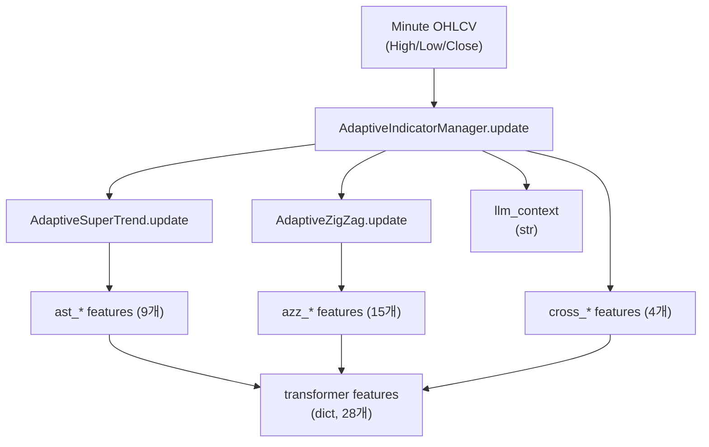
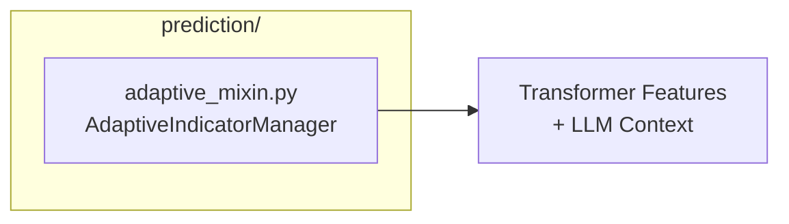
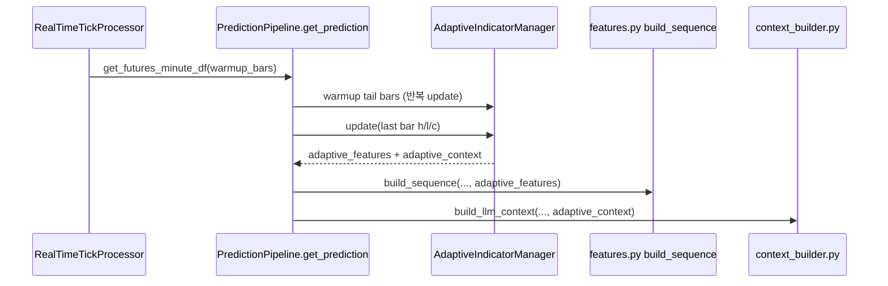

# Adaptive Indicator Guide

이 문서는 `prediction/adaptive_mixin.py` 모듈(Adaptive SuperTrend + Adaptive ZigZag + 통합 매니저)의 목적, 설정, 출력(Transformer 피처/LLM 컨텍스트), 런타임/오프라인 학습 파이프라인과의 연결 지점, 그리고 내부 알고리즘을 정리합니다.

---

## 목차

1. [목적](#1-목적)
2. [모듈 구성](#2-모듈-구성)
3. [설정(Configurations)](#3-설정configurations)
4. [내부 알고리즘](#4-내부-알고리즘)
5. [출력(Output) 및 피처 명세](#5-출력output-및-피처-명세)
6. [런타임 통합(실시간 예측 파이프라인)](#6-런타임-통합실시간-예측-파이프라인)
7. [오프라인 학습 통합](#7-오프라인-학습-통합)
8. [빠른 사용 예시](#8-빠른-사용-예시)
9. [트러블슈팅](#9-트러블슈팅)

---

## 1. 목적

`prediction/adaptive_mixin.py`는 분봉 OHLCV(High/Low/Close)를 입력으로 받아 다음을 생성합니다.

- **Transformer/TFT 입력용 수치 피처** (28개, `ADAPT_KEYS` 기준)
- **LLM 프롬프트용 텍스트 컨텍스트** (지표 상태 요약)

핵심 목표는 "시장 상태(추세/변동성/구조)"를 **고정 파라미터 지표가 아닌 적응형(Adaptive) 지표로 안정적으로 수치화**하는 것입니다.



---

## 2. 모듈 구성

```
prediction/
├── adaptive_mixin.py         # AdaptiveIndicatorManager, AdaptiveMixin
├── option_mixin.py           # 옵션 관련 기능
├── prediction_mixin.py       # 예측 관련 기능
└── pipeline.py               # 파이프라인 통합
```

| 파일 | 주요 클래스 | 역할 |
|------|------------|------|
| `adaptive_mixin.py` | `AdaptiveIndicatorManager`, `AdaptiveMixin` | 두 지표 통합, Transformer 피처 + LLM 컨텍스트 단일 출력 |



---

## 3. 설정(Configurations)

통합 매니저는 `IndicatorManagerConfig`를 받습니다.

```python
@dataclass
class IndicatorManagerConfig:
    supertrend: AdaptiveSuperTrendConfig = None  # 기본값 자동 생성
    zigzag:     AdaptiveZigZagConfig     = None  # 기본값 자동 생성
    symbol:     str = "KP200 선물"            # LLM 컨텍스트 표시용
```

### 3.1 AdaptiveSuperTrendConfig

| 필드 | 기본값 | 설명 |
|------|--------|------|
| `atr_min_period` | `7` | ATR 기간 최솟값 (강한 추세 시 사용) |
| `atr_max_period` | `21` | ATR 기간 최댓값 (횡보 시 사용) |
| `multiplier_min` | `1.5` | 멀티플라이어 최솟값 (강한 추세 → 타이트한 밴드) |
| `multiplier_max` | `4.0` | 멀티플라이어 최댓값 (횡보 → 넓은 밴드) |
| `er_period` | `10` | Kaufman Efficiency Ratio 계산 기간 |
| `adx_period` | `14` | Wilder ADX 계산 기간 |
| `use_bb_correction` | `True` | 볼린저 밴드 폭 기반 멀티플라이어 보정 여부 |
| `bb_period` | `20` | 볼린저 밴드 기간 |
| `bb_std` | `2.0` | 볼린저 밴드 표준편차 배수 |
| `adx_mult_norm_cap` | `60.0` | 멀티플라이어 계산용 ADX 정규화 캡 (`adx / cap`) |
| `bb_correction_floor` | `0.7` | BB 보정 시 multiplier 최소 스케일 |
| `bb_correction_ref_pct` | `0.05` | BB 폭 정규화 기준(현재가 대비 %) |
| `smooth_period` | `3` | SuperTrend 라인 EMA 스무딩 기간 |

### 3.2 AdaptiveZigZagConfig

| 필드 | 기본값 | 설명 |
|------|--------|------|
| `atr_multiplier` | `1.5` | 전환 임계값 계산의 기본 배수(ER 워밍업 구간에서 중간값 역할) |
| `er_period` | `10` | Efficiency Ratio(ER) 계산 기간 |
| `atr_multiplier_min` | `1.0` | ER 기반 동적 multiplier의 하한 |
| `atr_multiplier_max` | `4.0` | ER 기반 동적 multiplier의 상한 |
| `atr_period` | `14` | ATR 계산 기간 |
| `pivot_threshold_min_pct` | `0.3` | 피봇 임계값 하한 (% 기준, 최소 0.3%) |
| `pivot_threshold_max_pct` | `3.0` | 피봇 임계값 상한 (% 기준, 최대 3%) |
| `major_swing_ratio` | `2.0` | `prev_size ≥ atr × ratio`이면 major 스윙 |
| `max_swings` | `20` | 유지할 최근 스윙 최대 개수 |
| `confirmation_bars` | `2` | 스윙 확정 지연 봉 수 (노이즈 방지) |
| `freeze_on_confirm` | `True` | repainting 완화 옵션. confirmation 윈도우가 열린 뒤에는 후보 스윙 price/idx를 고정(기본값 권장) |
| `min_wave_bars` | `5` | 스윙 확정 전 최소 파동 길이(봉 수) |
| `min_wave_pct` | `0.0` | 스윙 확정 전 최소 파동 길이(%). 0이면 비활성 |
| `cluster_tolerance_pct` | `0.3` | 지지/저항 클러스터 허용 오차 (%) |
| `structure_lookback_swings` | `8` | 구조 분석(상승/하락/횡보) 시 참조할 최근 스윙 개수 |
| `structure_points` | `3` | 구조 분석에 사용할 HIGH/LOW 샘플 개수(최근 N개 HIGH/LOW 비교) |

### 3.3 멀티스케일 기능 (Multi-timeframe)

Adaptive Indicator는 상위 타임프레임(5분봉, 15분봉) 데이터를 활용하여 Rule-based 매매 신호 품질을 개선합니다.

| 기능 | 설명 |
|------|------|
| **SuperTrend 멀티스케일 ATR** | 1분봉 ATR + 5분봉 ATR + 15분봉 ATR 가중 평균 (50%, 30%, 20%) |
| **ZigZag 피봇 필터링** | 상위 타임프레임 피봇 방향과 불일치하는 신호 제거 |

#### 설정 방법

**GUI:**
- **Adaptive indicators** 섹션에서 체크박스 제어
  - `5m`: 5분봉 피처 활성화 (기본 체크)
  - `15m`: 15분봉 피처 활성화 (기본 체크 해제)

**Config:**
```json
{
  "prediction": {
    "multiscale_5m": true,
    "multiscale_enabled": true,
    "multiscale_time_scales": [1, 5]
  }
}
```

#### 기대 효과 (현재 65% 승률 기준)

| 설정 | 예상 승률 | 신호 감소 |
|------|----------|-----------|
| 5분봉만 | 68~70% | 30~40% |
| 15분봉 추가 | 70~72% | 추가 20~30% |

**추천:** 현재 65% 승률에 5분봉만 활성화 (승률 68~70%, 신호 9~12회/일)

#### 상세 동작

**SuperTrend:**
- `AdaptiveIndicatorManager.update()` 호출 후 멀티스케일 ATR 자동 적용
- 가중 평균 ATR로 더 안정적인 추선 계산

**ZigZag:**
- `should_filter_zigzag_signal()` 메서드로 신호 필터링
- 5분봉 피봇 방향과 불일치 시 해당 신호 제거
- 15분봉 피봇 방향과 불일치 시 해당 신호 제거 (더 강력한 필터)

---

## 4. 내부 알고리즘

### 4.1 AdaptiveSuperTrend

SuperTrend의 ATR 기간과 멀티플라이어를 시장 상태에 따라 동적으로 조정합니다.

#### 최근 개선사항(정확성/유지보수)

- `AdaptiveSuperTrend.update()`의 방향 결정 로직은 **final band 연속성 + flip 규칙**(표준 SuperTrend 패턴)으로 정리되어,
  같은 변수를 여러 번 덮어쓰는 형태를 제거했습니다.
- 최소 플립(상승↔하락 전환) 회귀 방지용 smoke 테스트가 추가되어, 방향 전환 로직 변경 시 의도치 않은 회귀를 줄입니다.

#### 계산 순서 (매 봉 `update` 호출 시)

```
1. True Range(TR) 계산
   TR = max(high-low, |high-prev_close|, |low-prev_close|)

2. Efficiency Ratio(ER) 계산 — Kaufman
   ER = |closes[-1] - closes[-er_period]| / sum(|closes[i] - closes[i-1]|)
   범위: 0(완전 횡보) ~ 1(완전 추세)

3. 적응형 ATR 기간 결정
   adaptive_period = atr_max_period - ER × (atr_max_period - atr_min_period)
   → ER 높을수록(강한 추세) 짧은 기간 → 민감한 ATR

4. ATR 계산 (단순 평균, adaptive_period 사용)
   ATR = mean(TR[-adaptive_period:])

5. ADX 계산 — Wilder 스무딩
   plus_dm, minus_dm → smoothed_TR, smoothed_+DM, smoothed_-DM (alpha = 1/adx_period)
   +DI = 100 × smoothed_+DM / smoothed_TR
   -DI = 100 × smoothed_-DM / smoothed_TR
   DX  = 100 × |+DI - -DI| / (+DI + -DI)
   ADX = EMA(DX, alpha)

6. 적응형 멀티플라이어 결정
   adx_norm = min(ADX / adx_mult_norm_cap, 1.0)
   adaptive_mult = multiplier_max - adx_norm × (multiplier_max - multiplier_min)
   → ADX 높을수록(강한 추세) 작은 멀티플라이어 → 타이트한 밴드

   [선택] BB 폭 보정 (use_bb_correction=True):
   bb_norm = min(BB_width / (close × bb_correction_ref_pct), 1.0)
   adaptive_mult × = (bb_correction_floor + (1 - bb_correction_floor) × bb_norm)
   → BB 폭 좁을수록(저변동성) 멀티플라이어 축소

7. 밴드 계산
   hl2        = (high + low) / 2
   upper_band = hl2 + adaptive_mult × ATR
   lower_band = hl2 - adaptive_mult × ATR
   밴드 연속성 유지: 이전 밴드보다 나빠지지 않도록 클램핑

8. 방향 결정
   prev_dir == 1(상승): close ≤ lower_band → -1(하락), 그 외 1(상승)
   prev_dir == -1(하락): close ≥ upper_band → 1(상승), 그 외 -1(하락)

9. SuperTrend 값 + EMA 스무딩
   st_value = lower_band (direction=1) or upper_band (direction=-1)
   [smooth_period > 1]: EMA(st_value, alpha = 2/(smooth_period+1))

10. 신호 생성
    direction 전환 -1→1: signal = "buy"
    direction 전환 1→-1: signal = "sell"
    그 외: signal = "hold"

11. 추세 강도 분류
    ADX < 20: "weak" | 20~40: "neutral" | > 40: "strong"
```

#### SuperTrendState 필드

| 필드 | 타입 | 설명 |
|------|------|------|
| `value` | `float` | 현재 SuperTrend 라인 값 |
| `direction` | `int` | `1`: 상승, `-1`: 하락 |
| `upper_band` | `float` | 상단 밴드 |
| `lower_band` | `float` | 하단 밴드 |
| `atr` | `float` | 현재 ATR |
| `adaptive_atr_period` | `float` | 현재 적응형 ATR 기간 |
| `adaptive_multiplier` | `float` | 현재 적응형 멀티플라이어 |
| `efficiency_ratio` | `float` | 현재 ER (0~1) |
| `adx` | `float` | 현재 ADX (0~100) |
| `trend_strength` | `str` | `"weak"` / `"neutral"` / `"strong"` |
| `signal` | `str` | `"buy"` / `"sell"` / `"hold"` |
| `bars_in_trend` | `int` | 현재 방향 유지 봉 수 |
| `last_flip_price` | `float` | 마지막 방향 전환 시 가격 |

---

### 4.2 AdaptiveZigZag

스윙 전환 임계값을 고정 %가 아닌 ATR/ER 기반으로 동적 결정합니다.

#### Repainting 완화 (pending_confirm)

`confirmation_bars > 0` 인 경우 전환을 감지하면 즉시 스윙을 확정하지 않고, `pending_confirm` 윈도우를 열어
`confirmation_bars` 봉 이후에 스윙을 확정합니다.

- `freeze_on_confirm=True` (기본): 윈도우가 열린 뒤에는 후보 스윙(price/idx)을 고정하여 소급 변경(repainting) 위험을 줄입니다.
- `freeze_on_confirm=False`: 윈도우 동안에도 더 극단값이 나오면 후보를 갱신합니다(더 민감하지만 repainting 위험 증가).

#### 계산 순서 (매 봉 `update` 호출 시)

```
1. True Range & ATR 계산 (단순 평균, atr_period 사용)

2. Efficiency Ratio(ER) 계산
   ER = |closes[-1] - closes[-er_period]| / sum(|closes[i] - closes[i-1]|)
   범위: 0(완전 횡보) ~ 1(완전 추세)

3. 적응형 임계값 결정(ER 기반 multiplier)
   - 워밍업 구간에서는 `atr_multiplier_min/max`의 중간값을 사용
   - 충분한 바 이후에는 ER에 따라 multiplier를 `[atr_multiplier_min, atr_multiplier_max]`에서 동적으로 선택
     - ER이 높을수록(추세) `atr_multiplier_max`에 가까워져 threshold가 커지고(노이즈 필터),
       ER이 낮을수록(횡보) `atr_multiplier_min`에 가까워져 threshold가 작아집니다(스윙 더 자주).
   threshold_pct = (ATR / close) × 100 × multiplier
   threshold_pct = clip(threshold_pct, pivot_threshold_min_pct, pivot_threshold_max_pct)
   threshold_abs = close × threshold_pct / 100

4. ZigZag 로직
   [초기화 단계] current_direction == 0:
     pending_high 및 pending_low를 추적
     (pending_high - pending_low) ≥ threshold_abs이면 방향 결정
     - pending_high_idx > pending_low_idx → direction = 1(상승)
     - pending_high_idx < pending_low_idx → direction = -1(하락)
   
   [상승 추세] current_direction == 1:
     high > pending_high이면 pending_high 갱신
     (pending_high - low) ≥ threshold_abs → 새 스윙 고점 확정 → 방향 -1 전환
   
   [하락 추세] current_direction == -1:
     low < pending_low이면 pending_low 갱신
     (high - pending_low) ≥ threshold_abs → 새 스윙 저점 확정 → 방향 1 전환

5. 최소 파동 길이 필터(노이즈 억제)
   - `min_wave_bars`: 직전 확정 스윙 이후 최소 봉 수
   - `min_wave_pct`: threshold_abs를 close 대비 %로 환산했을 때 최소 % 미만이면 확정 스킵

6. 스윙 포인트 분류 (_add_swing)
   prev_size = |price - prev_same_type_swing.price|
   is_major = (prev_size ≥ atr × major_swing_ratio)
   최대 max_swings × 2 개 유지 후 오래된 것 제거

7. 피보나치 레벨 계산 (_calc_fibonacci)
   상승 파동: fib[ratio] = last_swing_high - diff × ratio  (되돌림 = 아래로)
   하락 파동: fib[ratio] = last_swing_low  + diff × ratio  (되돌림 = 위로)
   기본 비율: [0.236, 0.382, 0.5, 0.618, 0.786, 1.0, 1.272, 1.618]

8. 지지/저항 탐색 (_find_nearest_sr)
   resistance = min(swing highs above close)
   support    = max(swing lows  below close)

9. 시장 구조 분석 (_analyze_structure, 최소 4개 스윙 필요)
   최근 3개 고점: 모두 상승 → HH
   최근 3개 저점: 모두 상승 → HL
   HH & HL → "uptrend"
   LH & LL → "downtrend"
   그 외    → "ranging"
```

#### ZigZagState 주요 필드

| 필드 | 타입 | 설명 |
|------|------|------|
| `current_direction` | `int` | `1`: 상승, `-1`: 하락, `0`: 미결정 |
| `last_swing_high` | `float` | 가장 최근 확정된 스윙 고점 |
| `last_swing_low` | `float` | 가장 최근 확정된 스윙 저점 |
| `wave_size` | `float` | 현재 파동 크기 (절대값) |
| `wave_size_pct` | `float` | 현재 파동 크기 (%). `(last_high - last_low) / ((last_high + last_low)/2)` 기준 |
| `fib_levels` | `Dict[str, float]` | `{"fib_382": 430.5, "fib_618": 428.3, "0.382": 430.5, "0.618": 428.3, ...}` |
| `nearest_resistance` | `float` | 현재가 위 가장 가까운 저항 |
| `nearest_support` | `float` | 현재가 아래 가장 가까운 지지 |
| `resistance_dist_pct` | `float` | 저항까지 거리 (%) |
| `support_dist_pct` | `float` | 지지까지 거리 (%) |
| `is_making_higher_highs` | `bool` | 고점 연속 상승 여부 |
| `is_making_lower_lows` | `bool` | 저점 연속 하락 여부 |
| `structure` | `str` | `"uptrend"` / `"downtrend"` / `"ranging"` / `"unknown"` |
| `adaptive_threshold_pct` | `float` | 현재 적응형 전환 임계값 (%) |
| `new_swing_signal` | `str` | `"new_high"` / `"new_low"` / `"none"` |
| `bars_since_last_swing` | `int` | 마지막 스윙이 **확정된 봉 시점** 기준 경과 봉 수 |
| `recent_swings` | `List[SwingPoint]` | 최근 스윙 목록 (최대 10개) |

#### SwingPoint 필드

| 필드 | 타입 | 설명 |
|------|------|------|
| `index` | `int` | 봉 인덱스 |
| `price` | `float` | 스윙 가격 |
| `swing_type` | `SwingType` | `SwingType.HIGH` / `SwingType.LOW` |
| `atr_at_swing` | `float` | 스윙 발생 시점의 ATR |
| `is_major` | `bool` | `True`: 주요 스윙, `False`: 부차 스윙 |
| `confirmed` | `bool` | 확정 여부 (항상 `True`) |

---

## 5. 출력(Output) 및 피처 명세

### 5.1 AdaptiveIndicatorManager.update() 반환값

```python
{
    "transformer":       Dict[str, float],   # 정규화된 수치 피처 28개
    "llm_context":       str,                # LLM 프롬프트용 텍스트
    "supertrend_state":  SuperTrendState,    # SuperTrend 내부 상태
    "zigzag_state":      ZigZagState,        # ZigZag 내부 상태
    "bar_count":         int                 # 처리된 총 봉 수
}
```
### 5.2 Transformer 피처 전체 명세 (28개)

> `prediction/features.py`의 `ADAPT_KEYS` 순서가 **정본(ordering)** 입니다.

#### ast_* — AdaptiveSuperTrend (9개)

| 키 | 범위 | 계산 방법 | 의미 |
|----|------|-----------|------|
| `ast_direction` | `-1, 1` | `state.direction` | 추세 방향 |
| `ast_dist_pct` | ~`[-0.1, 0.1]` | `(close - st_value) / st_value` | 가격-SuperTrend 거리 비율 |
| `ast_atr_pct` | `[0, ~0.05]` | `atr / close` | ATR / 현재가 (상대적 변동성) |
| `ast_efficiency_ratio` | `[0, 1]` | Kaufman ER | 추세 효율성 (0=횡보, 1=완전 추세) |
| `ast_adx_norm` | `[0, 1]` | `min(ADX / 100, 1)` | 정규화된 ADX |
| `ast_mult_norm` | `[0, 1]` | `(mult - mult_min) / (mult_max - mult_min)` | 정규화된 적응형 멀티플라이어 |
| `ast_trend_duration` | `[0, 1]` | `min(bars_in_trend / 50, 1)` | 현재 추세 지속 시간 (50봉 캡) |
| `ast_signal` | `-1, 0, 1` | buy=1 / sell=-1 / hold=0 | 방향 전환 신호 |
| `ast_band_width_pct` | `[0, ~0.1]` | `(upper - lower) / close` | 밴드 폭 / 현재가 |

#### azz_* — AdaptiveZigZag (19개)

| 키 | 범위 | 계산 방법 | 의미 |
|----|------|-----------|------|
| `azz_direction` | `-1, 0, 1` | `state.current_direction` | 파동 방향 |
| `azz_wave_size_pct` | `[0, 1]` | `min(wave_size_pct / 10, 1)` | 파동 크기 (10% = 1.0으로 정규화) |
| `azz_support_dist_pct` | `[0, 1]` | `min(support_dist_pct / 5, 1)` | 지지까지 거리 (5% = 1.0) |
| `azz_res_dist_pct` | `[0, 1]` | `min(resistance_dist_pct / 5, 1)` | 저항까지 거리 (5% = 1.0) |
| `azz_bars_since_swing` | `[0, 1]` | `min(bars_since_last_swing / 50, 1)` | 마지막 스윙 이후 경과 봉 |
| `azz_fib618_dist` | `[-1, 1]` | `clip(fib618_dist, -0.1, 0.1) / 0.1` | Fib 61.8% 레벨 대비 거리 |
| `azz_fib382_dist` | `[-1, 1]` | `clip(fib382_dist, -0.1, 0.1) / 0.1` | Fib 38.2% 레벨 대비 거리 |
| `azz_higher_highs` | `0, 1` | `int(is_making_higher_highs)` | 고점 연속 상승 여부 |
| `azz_lower_lows` | `0, 1` | `int(is_making_lower_lows)` | 저점 연속 하락 여부 |
| `azz_new_swing` | `-1, 0, 1` | new_high=1 / new_low=-1 / none=0 | 신규 스윙 확정 신호 |
| `azz_swing_recency` | `[0, 1]` | `min(1 / (1 + bars_since_last_swing), 1)` | 최근 스윙 발생 "신선도" (최근일수록 1에 가까움) |
| `azz_threshold_pct` | `[0, 1]` | `clip(threshold_pct / 3, 0, 1)` | 동적 임계값 (3% = 1.0) |
| `azz_structure_up` | `0, 1` | `int(structure == "uptrend")` | 상승 구조 여부 |
| `azz_structure_down` | `0, 1` | `int(structure == "downtrend")` | 하락 구조 여부 |
| `azz_structure_ranging` | `0, 1` | `int(structure == "ranging")` | 횡보 구조 여부 |
| `azz_micro_up` | `0, 1` | `int(micro_structure == "uptrend")` | 단기 상승 구조 여부 |
| `azz_micro_down` | `0, 1` | `int(micro_structure == "downtrend")` | 단기 하락 구조 여부 |
| `azz_micro_ranging` | `0, 1` | `int(micro_structure == "ranging")` | 단기 횡보 구조 여부 |
| `azz_structure_conf` | `[0, 1]` | `structure_confidence` | 구조 판정 신뢰도 |
| `azz_pend_sr_dist` | `[-1, 1]` | `clip((pending_sr - close)/close, -0.05, 0.05)/0.05` | 잠정 지지/저항 거리 |
| `azz_pending_type` | `-1, 0, 1` | high=1 / low=-1 / none=0 | 후보 타입 |
| `azz_pending_dist` | `[-1, 1]` | `clip((pending_price - close)/close, -0.05, 0.05)/0.05` | 후보 가격 거리 |
| `azz_pending_urgency` | `[0, 1]` | `1 - remaining / confirmation_bars` | 확정 긴급도 |
| `azz_pending_age` | `[0, 1]` | `exp(-waited / 5)` | 후보 연령 (지수衰减) |
| `azz_pending_prob` | `[0, 1]` | `get_pending_confirmation_probability()` | **후보 확정 확률 (heuristic)** |

#### cross_* — 결합 피처 (4개)

| 키 | 범위 | 계산 방법 | 의미 |
|----|------|-----------|------|
| `cross_trend_agreement` | `-1, 0, 1` | ST.direction == ZZ.current_direction → 1, else -1 | 두 지표 방향 일치도 |
| `cross_at_support` | `[0, 1]` | ZZ 지지선 0.5% 이내 근접도 | 지지선 근접 강도 |
| `cross_at_resistance` | `[0, 1]` | ZZ 저항선 0.5% 이내 근접도 | 저항선 근접 강도 |
| `cross_breakout_potential` | `[-1, 1]` | ER × 저항(or 지지) 근접도, 방향 부호 | 돌파 잠재력 |

> **피처 총계:** 9 (ast) + 19 (azz) + 4 (cross) = **32개**

### 5.3 LLM 컨텍스트(str) 구조

`llm_context`는 세 블록으로 구성됩니다:

```
============================================================
[통합 지표 분석 요약 - KP200 선물]
현재가: 430.50 | 봉 수: 95
현재 신호: SuperTrend BUY 플립 | ZigZag 새 스윙 고점 확정
방향 일치: ✅ 일치
종합 판단: 두 지표 모두 상승 방향을 강하게 지지합니다.
============================================================

[Adaptive SuperTrend 분석 - KP200 선물]
현재가: 430.50
SuperTrend 라인: 428.30 (+2.20, +0.5%)
추세 방향: 상승(Bullish)
추세 강도: 강한(ADX>40) (ADX=43.2)
신호: ⚡ 방금 매수 신호 발생 (전환가: 429.80)
...

[Adaptive ZigZag 분석 - KP200 선물]
현재가: 430.50
파동 방향: 상승
시장 구조: 상승 구조 (고점·저점 모두 상승)
신호: ⚡ 새로운 스윙 고점 확정: 430.50
...
```

런타임에서는 `prediction/context_builder.py`가 `adaptive_context`를 받으면
프롬프트 컨텍스트에 `[ADAPTIVE_INDICATORS]` 블록으로 삽입합니다.

---

## 6. 런타임 통합(실시간 예측 파이프라인)

### 6.1 입력 데이터

실시간 시스템에서는 분봉 OHLCV가 필요합니다.

- `RealTimeTickProcessor.get_futures_minute_df(...)` → 분봉 DataFrame
- 지표 업데이트 입력: `(high, low, close)` 스칼라 또는 DataFrame 행

### 6.2 PredictionPipeline에서의 동작 위치

`prediction/pipeline.py`의 `PredictionPipeline.get_prediction()` 내부에서:

1. warmup(`adaptive_indicator.warmup_bars`) 구간으로 지표 상태를 안정화
2. 마지막 분봉을 반영하여 최신 `adaptive_features` / `adaptive_context` 생성
3. `build_sequence(..., adaptive_features=adaptive_features)` 호출

추가로, 분봉 OHLCV DataFrame이 리셋/되감기되는 상황(예: tick_processor 내부 state reset, replay 재시작 등)을 감지하기 위해
**"마지막 완성 분봉 timestamp"**를 저장/비교합니다.

- 마지막 완성 분봉 ts가 이전보다 작아지면(되감기) adaptive manager를 `reset()`하고 다시 warmup을 수행합니다.
- 목적: adaptive indicator 내부 상태가 stale하게 남아 잘못된 피처/컨텍스트를 내는 상황을 방지

또한, adaptive indicator가 활성화된 경우 `model_outputs.heuristic`을 구성하여
로그의 `[HEURISTIC]` 블록 및 `[DIR_SUMMARY]`의 HEURISTIC 방향 요약에 반영합니다.

### 6.2.2 예측 결과 JSON의 `regime` 라벨

`PredictionPipeline.get_prediction()`은 adaptive indicator가 활성화되고 관련 state/feature를 확보할 수 있는 경우,
예측 결과 dict(JSON)에 `regime` 필드를 추가합니다.

`regime`는 **Adaptive SuperTrend의 방향(direction) + 추세강도(trend_strength)** 기반의 단순한 시장 국면 라벨입니다.

- **가능한 값**
  - `STRONG_UP`
  - `WEAK_UP`
  - `RANGE`
  - `WEAK_DOWN`
  - `STRONG_DOWN`
  - (state/feature가 부족하면) `null`

- **계산 규칙(정책)**
  - 방향(`direction`)
    - 1순위: `supertrend_state.direction`
    - 2순위: `adaptive_features["ast_direction"]`
  - 강도(`trend_strength`)
    - 1순위: `supertrend_state.trend_strength` (`weak|neutral|strong`)
    - 2순위: `adaptive_features["ast_adx_norm"]`로 역산한 ADX 구간
  - **중요 정책:** `neutral`은 항상 `RANGE`로 취급합니다.

- **라벨 매핑**
  - `direction > 0`
    - `strong`  -> `STRONG_UP`
    - `weak`    -> `WEAK_UP`
    - `neutral` -> `RANGE`
  - `direction < 0`
    - `strong`  -> `STRONG_DOWN`
    - `weak`    -> `WEAK_DOWN`
    - `neutral` -> `RANGE`

이 라벨은 모델 입력(feature)과는 별개로 **서빙 출력의 해석 편의성을 위한 파생 값**이며,
학습/서빙의 `feature_dim`(19/47)에는 영향을 주지 않습니다.

### 6.2.1 warmup_bars 권장 규칙

`adaptive_indicator.warmup_bars`는 지표 내부에서 사용하는 기간(윈도우)이 “최소 1회 이상” 안정적으로 채워진 뒤에
피처/컨텍스트를 사용하도록 하기 위한 값입니다.

권장 계산 규칙(실전용):

```
base = max(supertrend.atr_max_period, supertrend.bb_period, supertrend.adx_period)

warmup_min       = base + 5
warmup_recommend = base + 10
warmup_stable    = 2 * base
```

현재 기본 파라미터(atr_max_period=21, bb_period=20, adx_period=14) 기준:

- `base = 21`
- `warmup_min = 26`
- `warmup_recommend = 31`
- `warmup_stable = 42`

### 6.3 feature_dim (중요)

`prediction/features.py build_sequence()`는 `adaptive_features` 인자에 따라 출력 차원이 달라집니다.

`feature_dim`은 다음 두 설정의 조합으로 결정됩니다:

- `prediction.option_feature_set` (`v1` 또는 `v2`)
- `adaptive_indicator.enabled` (true/false)

| option_feature_set | adaptive_indicator.enabled | 출력 shape | 구성 |
|---|---:|---|---|
| `v1` | false | `(seq_len, 19)` | OB(7) + CD(5) + OPT(7) |
| `v1` | true  | `(seq_len, 47)` | OB(7) + CD(5) + OPT(7) + ADAPT(28) |
| `v2` | false | `(seq_len, 28)` | OB(7) + CD(5) + OPT(16) |
| `v2` | true  | `(seq_len, 56)` | OB(7) + CD(5) + OPT(16) + ADAPT(28) |

> ⚠️ **`adaptive_indicator.enabled` 설정과 dataset/학습/서빙의 입력 차원이 반드시 일치해야 합니다.**



---

## 7. 오프라인 학습 통합

### 7.1 dataset 생성 (`data_builder.py`)

```bash
python data_builder.py --config config.json
```

`config.json`의 `adaptive_indicator.enabled`:

- **`true`**: 분봉 OHLCV를 재구성하여 `AdaptiveIndicatorManager`를 오프라인으로 실행, ADAPT(28) 계산 후 dataset `X`에 포함
- **`false`**: ADAPT 없이 19차원 dataset 생성

> ⚠️ `--config` 미전달 시 기본값 `false`로 동작하여 ADAPT 피처가 모두 0이 됩니다.

### 7.2 학습 스크립트

```bash
python train.py     --config config.json
python train_tft.py --config config.json
```

두 스크립트 모두 `adaptive_indicator.enabled`에 따라:

- 기대 `feature_dim` 계산 (option_feature_set + adaptive_indicator.enabled 조합에 따라 19/28/47/56)
- `dataset X.shape[-1]` 검증
- `seq_len` / `horizon` 정합성 확인

또한 dataset npz에는 feature schema metadata가 함께 저장되며, 학습 스크립트는 이를 파싱하여
`option_feature_set`, `adaptive_enabled`, `feature_dim`, `seq_len`, `horizon` 등의 불일치를
학습 시작 전에 감지합니다.

---

## 8. 빠른 사용 예시

### 8.1 기본 실시간 업데이트

```python
from prediction.adaptive_mixin import AdaptiveIndicatorManager, IndicatorManagerConfig

# 기본값으로 초기화 (config 생략 가능)
mgr = AdaptiveIndicatorManager()

# 매 분봉마다 호출
result = mgr.update(high=430.8, low=429.9, close=430.5)

adaptive_features = result["transformer"]   # Dict[str, float], 28개
adaptive_context  = result["llm_context"]   # str
st_state          = result["supertrend_state"]
zz_state          = result["zigzag_state"]
```

### 8.2 커스텀 설정

```python
from prediction.adaptive_mixin import (
    AdaptiveIndicatorManager,
    IndicatorManagerConfig,
    AdaptiveSuperTrendConfig,
    AdaptiveZigZagConfig,
)

config = IndicatorManagerConfig(
    supertrend=AdaptiveSuperTrendConfig(
        atr_min_period=7,
        atr_max_period=21,
        multiplier_min=1.5,
        multiplier_max=4.0,
    ),
    zigzag=AdaptiveZigZagConfig(
        atr_multiplier=1.5,
        pivot_threshold_min_pct=0.3,
        pivot_threshold_max_pct=3.0,
    ),
    symbol="KP200 선물"
)
mgr = AdaptiveIndicatorManager(config)
```

### 8.3 DataFrame 배치 처리 (학습 데이터 생성)

```python
import pandas as pd

mgr = AdaptiveIndicatorManager()
df_with_features = mgr.compute_from_df(df)  # df: high/low/close 컬럼 포함

# Transformer 학습 입력 배열 추출
feature_cols = [c for c in df_with_features.columns
                if c.startswith(('ast_', 'azz_', 'cross_'))]
X = df_with_features[feature_cols].fillna(0).values
# shape: (n_bars, 28)
```

#### 배치 처리 일관성(중요)

`compute_from_df()`는 SuperTrend/ZigZag의 배치 계산 후 `cross_*` 피처를 추가하는데,
이때 `cross_*`는 **각 행 시점의 지표 state를 따라가며(row-wise) 계산**되도록 구현되어 있습니다.

즉, 동일한 OHLCV 시퀀스에 대해:

- `update()`를 순차 호출하며 얻는 `cross_*` 시퀀스
- `compute_from_df()` 결과의 `cross_*` 컬럼

이 두 결과가 시간축으로 일관되게 나오도록 보장합니다(회귀 방지 테스트 포함).

### 8.4 피처 이름 목록 확인

```python
mgr = AdaptiveIndicatorManager()
names = mgr.get_transformer_feature_names()
# → 28개 피처 이름 리스트 반환
print(f"총 피처 수: {mgr.feature_count}")   # 28
```

### 8.5 상태 초기화

```python
mgr.reset()  # SuperTrend + ZigZag + bar_count 모두 초기화
```

### 8.6 config.json 설정 예시

```json
{
  "adaptive_indicator": {
    "enabled": true,
    "warmup_bars": 50,
    "supertrend": {
      "atr_min_period": 7,
      "atr_max_period": 21,
      "multiplier_min": 1.5,
      "multiplier_max": 4.0,
      "er_period": 10,
      "adx_period": 14,
      "use_bb_correction": true,
      "adx_mult_norm_cap": 60.0,
      "bb_correction_floor": 0.7,
      "bb_correction_ref_pct": 0.05
    },
    "zigzag": {
      "atr_multiplier": 1.5,
      "er_period": 10,
      "atr_multiplier_min": 1.0,
      "atr_multiplier_max": 4.0,
      "atr_period": 14,
      "pivot_threshold_min_pct": 0.3,
      "pivot_threshold_max_pct": 3.0,
      "major_swing_ratio": 2.0,
      "max_swings": 20,
      "confirmation_bars": 2,
      "freeze_on_confirm": true,
      "min_wave_bars": 5,
      "min_wave_pct": 0.0,
      "cluster_tolerance_pct": 0.3,
      "structure_lookback_swings": 30,
      "structure_points": 4
    }
  }
}
```

### 8.7 만기주(Expiry week) 파라미터 추천 프리셋

옵션 만기주(보통 **두 번째 목요일이 포함된 주**)에는 시장 미세구조/옵션 수급 변화로 인해
평시 대비 **노이즈성 스윙/휩쏘(whipsaw)** 가 늘고, 같은 설정에서도 지표가 더 민감하게 반응할 수 있습니다.

이 프로젝트는 만기주에 대해 weights 선택 측면에서 freeze 운영이 존재하지만(별도 문서 참조),
indicator 측면에서는 다음 프리셋을 **시작점(starting point)** 으로 권장합니다.

- **중요**
  - 아래 값들은 “정답”이 아니라 운영 튜닝을 위한 권장 시작점입니다.
  - 실제 적용 전/후에는 `Replay`로 최소 1회 이상 스모크(예: 최근 1~2일 tick 리플레이)로 확인하세요.

#### 8.7.1 목표

- **만기주**
  - 과민 반응 억제(불필요한 flip/스윙 확정 감소)
  - repainting 리스크 최소화(기본 `freeze_on_confirm=true` 유지)

#### 8.7.2 Adaptive SuperTrend (AST) 추천

- **추천 방향**
  - `multiplier_min/max`를 약간 상향하여 band를 넓혀 휩쏘를 완화
  - `smooth_period`를 3~5로 올려 line 노이즈를 완화
  - (선택) `atr_max_period`를 약간 늘려 횡보 구간에서 ATR을 안정화

```json
{
  "adaptive_indicator": {
    "supertrend": {
      "multiplier_min": 2.0,
      "multiplier_max": 4.5,
      "atr_min_period": 7,
      "atr_max_period": 21,
      "smooth_period": 5
    }
  }
}
```

#### 8.7.3 Adaptive ZigZag (AZZ) 추천

- **추천 방향**
  - 스윙 확정 필터 강화: `confirmation_bars`, `min_wave_bars`를 증가
  - threshold 하한을 소폭 올려 작은 흔들림을 스윙으로 확정하지 않도록 조정
  - `atr_multiplier_min/max` 범위를 넓히되, 만기주/횡보 구간에서는 대체로 **mmin 쪽이 자주 선택**될 수 있으므로
    결과가 지나치게 민감해지지 않는지 확인

```json
{
  "adaptive_indicator": {
    "zigzag": {
      "confirmation_bars": 3,
      "freeze_on_confirm": true,
      "min_wave_bars": 8,

      "pivot_threshold_min_pct": 0.5,
      "pivot_threshold_max_pct": 4.0,

      "er_period": 10,
      "atr_multiplier_min": 1.2,
      "atr_multiplier_max": 4.5,

      "cluster_tolerance_pct": 0.4,
      "structure_lookback_swings": 12,
      "structure_points": 3
    }
  }
}
```

#### 8.7.4 적용 방법

- **`config.json`로 적용**
  - 위 JSON을 `adaptive_indicator.supertrend` / `adaptive_indicator.zigzag` 섹션에 병합
- **GUI로 적용**
  - GUI에서 해당 필드를 입력 후 `Start` 또는 `Replay` 실행
  - 실행 시 GUI 값이 `config.json`에 저장되므로, 만기주 운영 전에 미리 값을 세팅해 둘 수 있습니다.

---

## 9. 트러블슈팅

| 증상 | 원인 | 해결 방법 |
|------|------|-----------|
| `feature_dim mismatch` 오류 | `adaptive_indicator.enabled` 설정과 dataset 생성 옵션 불일치 | `data_builder.py`, `train.py`, `pipeline.py` 모두 동일한 `config.json`으로 실행 |
| ADAPT 값이 모두 0 | (1) warmup 봉 수 부족, (2) `--config` 미전달로 비활성화 | `warmup_bars ≥ max(atr_max_period, bb_period, adx_period) + 10` 권장, `--config config.json` 명시 |
| `ast_adx_norm` 값이 항상 0.25로 고정 | ADX 초기화 중 (`n < adx_period`) — 기본값 25 반환 중 | warmup 구간이 `adx_period` 이상인지 확인 |
| ZigZag 스윙이 잡히지 않음 | ATR 대비 `atr_multiplier`가 너무 크거나 `pivot_threshold_min_pct`가 높음 | `atr_multiplier` 낮추거나 `pivot_threshold_min_pct` 조정 |
| `cross_breakout_potential`이 항상 0 | ZZ 지지/저항이 미계산 (스윙 4개 미만) | warmup 봉 충분히 공급, `pivot_threshold_min_pct` 낮춰 더 많은 스윙 감지 허용 |
| `azz_structure_*` 전부 0 | `_all_swings < 4` → `structure = "unknown"` | warmup 충분히 제공 또는 `major_swing_ratio` 낮춰 스윙 인식 완화 |
| LLM 컨텍스트 인코딩 오류 | 비ASCII 문자(한글) 포함 시 UTF-8 미지정 | `context_builder.py`에서 `encode("utf-8")` 처리 확인 |

### 9.2 HEURISTIC 로그가 기대와 다름

런타임 로그에는 `[GPT]`, `[GEMINI]` 외에 `[HEURISTIC]` 블록이 함께 출력될 수 있습니다.

- `[HEURISTIC]`는 adaptive indicator가 활성화된 경우(`adaptive_indicator.enabled=true`)에 생성됩니다.
- 지표가 warmup 중이거나 피처가 아직 준비되지 않은 경우에도 `[HEURISTIC]`는 출력될 수 있으며,
  이때는 `is_ready=false`, `reason=adaptive_not_ready_or_missing_features` 형태로 표시되고 `action`은 기본적으로 `HOLD`가 됩니다.
- 지표 피처가 준비된 경우 `ast_signal`(flip) 또는 `ast_direction` 기반으로 `BUY/SELL/HOLD`가 산출됩니다.

### 9.1 알려진 제약/정책(초기 구간)

초기 warmup 구간에서는 일부 내부 지표(예: ADX, BB 폭 등)가 충분한 표본을 갖기 전까지
상수에 가까운 값 또는 계산상 불안정한 값이 나올 수 있습니다.

- `warmup_bars`는 `max(atr_max_period, bb_period, adx_period) + 10` 이상을 권장합니다.
- 초기 구간의 NaN/상수 처리 정책(예: `is_ready` 도입 여부)은 향후 안정성 개선 항목으로 남아 있습니다.

----

**문서 버전**: 2.0  
**작성일**: 2026-04-25  
**마지막 수정**: 2026-05-03 (v2/v3 코드 리뷰 수정 반영)

*마지막 업데이트: v2/v3 코드 리뷰 수정 (17개 이슈), deque 인덱스 변환, direction 복원, 성능 개선, 코드 중복 제거 등. 자세한 내용은 `docs/adaptive_zigzag_fixes.md` 참조.*

*이전 업데이트: 멀티스케일 기능 추가, 런타임 rewind/reset 감지(Adaptive reset/rewarm), option_feature_set(v1/v2)별 feature_dim 표, dataset metadata 검증 반영*
